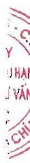
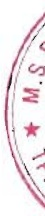

# BẢN THUYẾT MINH BÁO CÁO TÀI CHÍNH HỢP NHÁT Cho năm tài chính kết thúc ngày 31 tháng 12 năm 2023

I. ĐẠC ĐIỂM HOẠT ĐỘNG

1. Hình thức sở hữu vốn

Công ty Cổ phần Nam Việt (sau đây gọi tắt là "Công ty" hay "Công ty mẹ") là công ty cổ phần.

### 2. Lĩnh vực kinh doanh

Lĩnh vực kinh doanh của Công ty là sản xuất, chế biến và thương mại.

### 3. Ngành nghề kinh doanh

Hoạt động kinh doanh chính của Công ty là: Nuôi cá; Sản xuất bao bì giấy; In bao bì các loại; Sản xuất, chế biến và bảo quản thủy sản; Chế biến dầu cá và bột cá; Mua bán cá, thủy sản; Sản xuất thức ăn thủy sản; Sản xuất điện năng lượng mặt trời; Lắp đặt hệ thống điện; Xây dựng công trình.

### 4. Chu kỳ sản xuất, kinh doanh thông thường

4. Chu kỳ san xuất, k

Đặc điểm hoạt động của Tập đoàn trong năm có ảnh hưởng đến Báo cáo tài chính hợp nhất

Tình hình kinh tế trong năm khó khăn ảnh hưởng đến lĩnh vực xuất khẩu cá da tron, giá bán xuất khẩu

giảm trong khi giá nguyên vật liệu thức ăn thụy sản tăng, làm cho doanh thu và lợi nhuận của Tập

đoàn năm nay giảm đáng kể so với năm trước.

### 6. Cấu trúc Tập đoàn

Tập đoàn bao gồm Công ty mẹ và 07 công ty con chịu sự kiểm soát của Công ty mẹ (đầu năm có 08 công ty con). Toàn bộ các công ty con được hợp nhất trong Báo cáo tài chính hợp nhất này.

6a. Thông tin về tài cấu trúc Tập đoàn

Trong năm, Tập đoàn đã quyết định giải thế Công ty TNHH MTV Bất động sản Nam Việt theo Biên bản hợp Hội đồng quản trị số 67/BBH-HĐQT ngày 03 tháng 4 năm 2023 do không còn nhu cầu hoạt động kinh doanh.

6b. Danh sách các Công ty con được hợp nhất

<table border=1 style='margin: auto; word-wrap: break-word;'><tr><td style='text-align: center; word-wrap: break-word;'></td><td style='text-align: center; word-wrap: break-word;'></td><td style='text-align: center; word-wrap: break-word;'>Hoạt động kinh doanh chính</td><td style='text-align: center; word-wrap: break-word;'>Số cuối năm</td><td style='text-align: center; word-wrap: break-word;'>Số cấu năm</td><td style='text-align: center; word-wrap: break-word;'>Số cấu năm</td><td style='text-align: center; word-wrap: break-word;'>Số dầu năm</td></tr><tr><td style='text-align: center; word-wrap: break-word;'>Tên công ty</td><td style='text-align: center; word-wrap: break-word;'>Địa chỉ trụ sở chính</td><td style='text-align: center; word-wrap: break-word;'>Gia công chế biến thủy sản, mua bán thực phẩm</td><td style='text-align: center; word-wrap: break-word;'>100%</td><td style='text-align: center; word-wrap: break-word;'>100%</td><td style='text-align: center; word-wrap: break-word;'>100%</td><td style='text-align: center; word-wrap: break-word;'>100%</td></tr><tr><td style='text-align: center; word-wrap: break-word;'>Công ty TNHH MTV Ân Độ Dương</td><td style='text-align: center; word-wrap: break-word;'>Khu công nghiệp Thốt Nốt, Phường Thới Thuận, Quận Thốt Nốt, TP. Cần Tho</td><td style='text-align: center; word-wrap: break-word;'>Nuoi trồng thủy sản nội địa</td><td style='text-align: center; word-wrap: break-word;'>100%</td><td style='text-align: center; word-wrap: break-word;'>100%</td><td style='text-align: center; word-wrap: break-word;'>100%</td><td style='text-align: center; word-wrap: break-word;'>100%</td></tr><tr><td style='text-align: center; word-wrap: break-word;'>Công ty TNHH MTV</td><td style='text-align: center; word-wrap: break-word;'>19D Trần Hưng Đạo,</td><td style='text-align: center; word-wrap: break-word;'>Sản xuất điện</td><td style='text-align: center; word-wrap: break-word;'>100%</td><td style='text-align: center; word-wrap: break-word;'>100%</td><td style='text-align: center; word-wrap: break-word;'>100%</td><td style='text-align: center; word-wrap: break-word;'>100%</td></tr><tr><td style='text-align: center; word-wrap: break-word;'>Nuoi trồng Thủy sản Nam</td><td style='text-align: center; word-wrap: break-word;'>Phường Mỹ Quý, TP. Long</td><td style='text-align: center; word-wrap: break-word;'>năng lượng mặt</td><td style='text-align: center; word-wrap: break-word;'>100%</td><td style='text-align: center; word-wrap: break-word;'>100%</td><td style='text-align: center; word-wrap: break-word;'>100%</td><td style='text-align: center; word-wrap: break-word;'>100%</td></tr><tr><td style='text-align: center; word-wrap: break-word;'>Việt Bình Phú</td><td style='text-align: center; word-wrap: break-word;'>Xuyên, Tinh An Giang</td><td style='text-align: center; word-wrap: break-word;'>trời</td><td style='text-align: center; word-wrap: break-word;'>100%</td><td style='text-align: center; word-wrap: break-word;'>100%</td><td style='text-align: center; word-wrap: break-word;'>100%</td><td style='text-align: center; word-wrap: break-word;'>100%</td></tr><tr><td style='text-align: center; word-wrap: break-word;'>Công ty TNHH MTV</td><td style='text-align: center; word-wrap: break-word;'>19D Trần Hưng Đạo,</td><td style='text-align: center; word-wrap: break-word;'>Sản xuất điện</td><td style='text-align: center; word-wrap: break-word;'>100%</td><td style='text-align: center; word-wrap: break-word;'>100%</td><td style='text-align: center; word-wrap: break-word;'>100%</td><td style='text-align: center; word-wrap: break-word;'>100%</td></tr><tr><td style='text-align: center; word-wrap: break-word;'>Nam Việt Solar</td><td style='text-align: center; word-wrap: break-word;'>Phường Mỹ Quý, TP. Long</td><td style='text-align: center; word-wrap: break-word;'>năng lượng mặt</td><td style='text-align: center; word-wrap: break-word;'>100%</td><td style='text-align: center; word-wrap: break-word;'>100%</td><td style='text-align: center; word-wrap: break-word;'>100%</td><td style='text-align: center; word-wrap: break-word;'>100%</td></tr><tr><td style='text-align: center; word-wrap: break-word;'>Công ty TNHH MTV Ân Độ Dương Solar</td><td style='text-align: center; word-wrap: break-word;'>Phường Mỹ Quý, TP. Long</td><td style='text-align: center; word-wrap: break-word;'>trời</td><td style='text-align: center; word-wrap: break-word;'>100%</td><td style='text-align: center; word-wrap: break-word;'>100%</td><td style='text-align: center; word-wrap: break-word;'>100%</td><td style='text-align: center; word-wrap: break-word;'>100%</td></tr><tr><td style='text-align: center; word-wrap: break-word;'>Công ty TNHH MTV Đại Tây Dương Solar</td><td style='text-align: center; word-wrap: break-word;'>19D Trần Hưng Đạo,</td><td style='text-align: center; word-wrap: break-word;'>Sản xuất điện</td><td style='text-align: center; word-wrap: break-word;'>100%</td><td style='text-align: center; word-wrap: break-word;'>100%</td><td style='text-align: center; word-wrap: break-word;'>100%</td><td style='text-align: center; word-wrap: break-word;'>100%</td></tr><tr><td style='text-align: center; word-wrap: break-word;'>Công ty TNHH MTV</td><td style='text-align: center; word-wrap: break-word;'>19D Trần Hưng Đạo,</td><td style='text-align: center; word-wrap: break-word;'>Sản xuất điện</td><td style='text-align: center; word-wrap: break-word;'>100%</td><td style='text-align: center; word-wrap: break-word;'>100%</td><td style='text-align: center; word-wrap: break-word;'>100%</td><td style='text-align: center; word-wrap: break-word;'>100%</td></tr><tr><td style='text-align: center; word-wrap: break-word;'>Phần bón Hữu cơ Nam Việt</td><td style='text-align: center; word-wrap: break-word;'>Phường Mỹ Quý, TP. Long</td><td style='text-align: center; word-wrap: break-word;'>bón và hợp chất ni to</td><td style='text-align: center; word-wrap: break-word;'>100%</td><td style='text-align: center; word-wrap: break-word;'>100%</td><td style='text-align: center; word-wrap: break-word;'>100%</td><td style='text-align: center; word-wrap: break-word;'>100%</td></tr></table>

