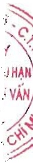
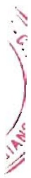

Dự phòng giảm giá hàng tồn kho được lập cho từng mặt hàng tồn kho có giá gốc lớn hơn giá trị thuần có thể thực hiện được. Tăng, giảm số dư dự phòng giảm giá hàng tồn kho cần phải trích lập tại ngày kết thúc năm tài chính được ghi nhận vào giá vốn hàng bán.

### 8. Chi phí trả trước

Chỉ phí trả trước bao gồm các chi phí thực tế đã phát sinh nhưng có liên quan đến kết quả hoạt động sản xuất kinh doanh của nhiều kỳ kế toán. Chi phí trả trước của Tập đoàn chủ yếu là công cụ, dụng cụ, tiền thuê đất, chi phí sửa chữa và khoản lỗ của tài sản cố định bán và thuê lại là thuê tài chính. Các chi phí trả trước này được phân bổ trong khoảng thời gian trả trước hoặc thời gian các lợi ích kinh tế tương ứng được tạo ra từ các chi phí này.

##### Công cụ, dụng cụ

Các công cụ, dụng cụ đã đưa vào sử dụng được phân bổ vào chi phí theo phương pháp đường thẳng với thời gian phân bổ không quá 02 năm.

##### Tiền thuê đất

Tiền thuê đất trả trước thế hiện khoản tiền thuê đất đã trả cho phần đất Tập đoàn đang sử dụng. Tiền thuê đất trả trước được phân bổ vào chi phí theo phương pháp đường thẳng tương ứng với thời gian thuê.

##### Chi phí sửa chữa

Chỉ phí sửa chữa lớn tài sản cố định thế hiện các khoản chỉ phí liên quan đến việc sửa chữa nhà xưởng, máy móc thiết bị. Chỉ phí sửa chữa lớn tài sản cố định được phân bổ theo phương pháp đường thẳng với thời gian phân bổ không quá 03 năm.

##### Khoản lỗ của tài sản cổ định bán và thuê lại là thuê tài chính

Khoản chênh lệch giá bán nhỏ hơn giá trị còn lại của tài sản cố định trong trường hợp bán và thuê lại là thuê tài chính được phân bổ vào chi phí theo thời gian thuê lại tài sản.

### 9. Tài sản thuê hoạt động

Thuê tài sản được phân loại là thuê hoạt động nếu phần lớn rủi ro và lợi ích gắn liền với quyền sở hữu tài sản thuộc về người cho thuê. Chỉ phí thuê hoạt động được phân ánh vào chi phí theo phương pháp đường thẳng cho suốt thời hạn thuê tài sản, không phụ thuộc vào phương thức thanh toán tiền thuê.

### 10. Tài sản có định hữu hình

Tài sản cố định hữu hình được thể hiện theo nguyên giá trừ hao mòn lũy kế. Nguyên giá tài sản cố định hữu hình bao gồm toàn bộ các chi phí mà Tập đoàn phải bỏ ra để có được tài sản cố định tính đến thời điểm đưa tài sản đó vào trạng thái sẵn sàng sử dụng. Các chi phí phát sinh sau ghi nhận ban đầu chỉ được ghi tăng nguyên giá tài sản cố định nếu các chi phí này chắc chắn làm tăng lợi ích kinh tế trong tương lai do sử dụng tài sản đó. Các chi phí phát sinh không thỏa mãn điều kiện trên được ghi nhận là chi phí sản xuất, kinh doanh trong năm.

Khi tài sản cố định hữu hình được bán hay thanh lý, nguyên giá và giá trị hao mòn lũy kế được xóa sở và lãi, lỗ phát sinh do thanh lý được ghi nhận vào thu nhập hay chỉ phí trong năm.

Tài sản cố định hữu hình được khấu hao theo phương pháp đường thẳng dựa trên thời gian hữu dụng ước tính. Số năm khấu hao của các loại tài sản cố định hữu hình như sau:

<table border=1 style='margin: auto; word-wrap: break-word;'><tr><td style='text-align: center; word-wrap: break-word;'>Loại tài sản cổ đỉnh</td><td style='text-align: center; word-wrap: break-word;'>Số năm</td></tr><tr><td style='text-align: center; word-wrap: break-word;'>Nhà cửa, vật kiến trúc</td><td style='text-align: center; word-wrap: break-word;'>05 - 25</td></tr><tr><td style='text-align: center; word-wrap: break-word;'>Máy móc và thiết bị</td><td style='text-align: center; word-wrap: break-word;'>03 - 16</td></tr><tr><td style='text-align: center; word-wrap: break-word;'>Phương tiện vận tải, truyền dẫn</td><td style='text-align: center; word-wrap: break-word;'>03 - 10</td></tr><tr><td style='text-align: center; word-wrap: break-word;'>Thiết bị, dụng cụ quản lý</td><td style='text-align: center; word-wrap: break-word;'>03 - 08</td></tr><tr><td style='text-align: center; word-wrap: break-word;'>Tài sản cổ định hữu hình khác</td><td style='text-align: center; word-wrap: break-word;'>04 - 18</td></tr></table>

