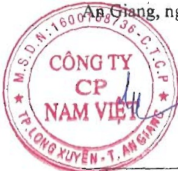

##### Thông tin về bộ phận

Thông tin bộ phận được trình bày theo lĩnh vực kinh doanh và khu vực địa lý. Báo cáo bộ phận chính yếu là theo khu vực địa lý dựa trên cơ cấu tổ chức và quản lý nội bộ và hệ thống Báo cáo tài chính nội bộ của Tập đoàn.

### 2a. Thông tin về khu vực địa lý

Chi tiết doanh thu thuần về bán hàng và cung cấp dịch vụ ra bên ngoài theo khu vực địa lý dựa trên vị trí của khách hàng như sau:

<table border=1 style='margin: auto; word-wrap: break-word;'><tr><td style='text-align: center; word-wrap: break-word;'></td><td style='text-align: center; word-wrap: break-word;'>Năm nay</td><td style='text-align: center; word-wrap: break-word;'>Năm trước</td></tr><tr><td style='text-align: center; word-wrap: break-word;'>Xuất khẩu</td><td style='text-align: center; word-wrap: break-word;'>2.915.375.524.342</td><td style='text-align: center; word-wrap: break-word;'>3.419.425.721.133</td></tr><tr><td style='text-align: center; word-wrap: break-word;'>Trong nước</td><td style='text-align: center; word-wrap: break-word;'>1.523.747.108.538</td><td style='text-align: center; word-wrap: break-word;'>1.477.221.319.305</td></tr><tr><td style='text-align: center; word-wrap: break-word;'>Cộng</td><td style='text-align: center; word-wrap: break-word;'>4.439.122.632.880</td><td style='text-align: center; word-wrap: break-word;'>4.896.647.040.438</td></tr></table>

Tập đoàn không thực hiện theo dõi các thông tin về kết quả kính doanh, tài sản cổ định và các tài sản dài hạn khác và giá trị các khoản chi phí lớn không bằng tiền của bộ phận theo khu vực địa lý dựa trên vị trí của khách hàng.

### 2b. Thông tin về lĩnh vực kinh doanh

Hoạt động của Tập đoàn chủ yếu nằm trong một lĩnh vực kinh doanh chính là sản xuất chế biến thủy sản chiếm tỷ lệ 97% trên tổng doanh thu của Tập đoàn (năm trước 96%).

##### Sự kiện phát sinh sau ngày kết thúc năm tài chính

Không có sự kiện trọng yếu nào khác phát sinh sau ngày kết thúc năm tài chính yêu cầu phải điều chỉnh số liệu hoặc công bố trên Báo cáo tài chính hợp nhất.

Nguyễn Hà Thu Diễm

Người lập/Kế toán trưởng

A8 Giang, ngày 29 tháng 3 năm 2024

Trần Minh Cảnh

Phó Tổng Giám độc

