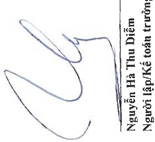

<table border=1 style='margin: auto; word-wrap: break-word;'><tr><td colspan="8">CÔNG TY CỘ PHẠN NAM VIỆT</td></tr><tr><td colspan="8">Địa chỉ: 19D Trân Hưng Đạo. Plường MỤ Quý, TP. Long Xuyên, Tình An Giang</td></tr><tr><td colspan="8">BAO CAO TAI CHÍNH HỢP NHẬT</td></tr><tr><td colspan="8">Cho năm tài chính kết thúc ngày 31 tháng 12 năm 2023</td></tr><tr><td colspan="8">Phụ lục 01: Bảng rằng, giám tài sản có định hữu hình</td></tr><tr><td style='text-align: center; word-wrap: break-word;'>Nha cửa, vật kiện trúc</td><td style='text-align: center; word-wrap: break-word;'>Máy móc và thiết bị</td><td style='text-align: center; word-wrap: break-word;'>Phương tiện vận tải, truyền đản</td><td style='text-align: center; word-wrap: break-word;'>Thiết bị, dụng cụ quản lý</td><td style='text-align: center; word-wrap: break-word;'>Tài sản có định hữu hình khác</td><td colspan="3">Cộng</td></tr><tr><td style='text-align: center; word-wrap: break-word;'>Nguyên giá Số dầu năm</td><td style='text-align: center; word-wrap: break-word;'>370.579.557.593</td><td style='text-align: center; word-wrap: break-word;'>962.400.358.893</td><td style='text-align: center; word-wrap: break-word;'>142.330.703.574</td><td style='text-align: center; word-wrap: break-word;'>16.964.417.777</td><td style='text-align: center; word-wrap: break-word;'>107.592.141.115</td><td colspan="2">1.599.867.178.952</td></tr><tr><td style='text-align: center; word-wrap: break-word;'>Mua trong năm</td><td style='text-align: center; word-wrap: break-word;'>108.024.699</td><td style='text-align: center; word-wrap: break-word;'>6.041.439.430</td><td style='text-align: center; word-wrap: break-word;'>1.828.150.380</td><td style='text-align: center; word-wrap: break-word;'>488.071.246</td><td style='text-align: center; word-wrap: break-word;'>228.000.000</td><td colspan="2">8.693.685.755</td></tr><tr><td style='text-align: center; word-wrap: break-word;'>Dầu tư xây dựng cơ bản hoàn thành</td><td style='text-align: center; word-wrap: break-word;'>5.280.623.707</td><td style='text-align: center; word-wrap: break-word;'>1.894.736.148</td><td style='text-align: center; word-wrap: break-word;'>1.211.263.747</td><td style='text-align: center; word-wrap: break-word;'>-</td><td style='text-align: center; word-wrap: break-word;'>4.699.170.368</td><td colspan="2">13.085.793.970</td></tr><tr><td style='text-align: center; word-wrap: break-word;'>Mua lại tài sản có định thuê tài chính</td><td style='text-align: center; word-wrap: break-word;'>-</td><td style='text-align: center; word-wrap: break-word;'>15.561.327.018</td><td style='text-align: center; word-wrap: break-word;'>-</td><td style='text-align: center; word-wrap: break-word;'>-</td><td style='text-align: center; word-wrap: break-word;'>-</td><td colspan="2">15.561.327.018</td></tr><tr><td style='text-align: center; word-wrap: break-word;'>Thanh lý, nhượng bán</td><td style='text-align: center; word-wrap: break-word;'>(6.500.789.941)</td><td style='text-align: center; word-wrap: break-word;'>(152.329.538.611)</td><td style='text-align: center; word-wrap: break-word;'>(1.057.388.810)</td><td style='text-align: center; word-wrap: break-word;'>(464.844.182)</td><td style='text-align: center; word-wrap: break-word;'>-</td><td colspan="2">(160.352.561.544)</td></tr><tr><td style='text-align: center; word-wrap: break-word;'>Số cuối năm</td><td style='text-align: center; word-wrap: break-word;'>369.467.416.058</td><td style='text-align: center; word-wrap: break-word;'>833.568.322.878</td><td style='text-align: center; word-wrap: break-word;'>144.312.728.891</td><td style='text-align: center; word-wrap: break-word;'>16.987.644.841</td><td style='text-align: center; word-wrap: break-word;'>112.519.311.483</td><td colspan="2">1.476.855.424.151</td></tr><tr><td colspan="8">Trong đó:</td></tr><tr><td style='text-align: center; word-wrap: break-word;'>Đã khấu hao hết nhưng vẫn còn sử dụng</td><td style='text-align: center; word-wrap: break-word;'>230.280.055.343</td><td style='text-align: center; word-wrap: break-word;'>497.070.153.331</td><td style='text-align: center; word-wrap: break-word;'>42.828.846.595</td><td style='text-align: center; word-wrap: break-word;'>7.138.911.781</td><td style='text-align: center; word-wrap: break-word;'>27.683.503.157</td><td colspan="2">805.001.470.207</td></tr><tr><td style='text-align: center; word-wrap: break-word;'>Chó thanh lý</td><td style='text-align: center; word-wrap: break-word;'>-</td><td style='text-align: center; word-wrap: break-word;'>-</td><td style='text-align: center; word-wrap: break-word;'>-</td><td style='text-align: center; word-wrap: break-word;'>-</td><td style='text-align: center; word-wrap: break-word;'>-</td><td colspan="2">-</td></tr><tr><td colspan="8">Giá trị hao môn</td></tr><tr><td style='text-align: center; word-wrap: break-word;'>Số dầu năm</td><td style='text-align: center; word-wrap: break-word;'>308.170.688.417</td><td style='text-align: center; word-wrap: break-word;'>655.591.421.349</td><td style='text-align: center; word-wrap: break-word;'>82.372.017.654</td><td style='text-align: center; word-wrap: break-word;'>11.845.577.122</td><td style='text-align: center; word-wrap: break-word;'>45.991.345.309</td><td colspan="2">1.103.971.049.851</td></tr><tr><td style='text-align: center; word-wrap: break-word;'>Khẩu hao trong năm</td><td style='text-align: center; word-wrap: break-word;'>10.440.207.555</td><td style='text-align: center; word-wrap: break-word;'>38.474.739.351</td><td style='text-align: center; word-wrap: break-word;'>13.436.878.320</td><td style='text-align: center; word-wrap: break-word;'>1.347.548.960</td><td style='text-align: center; word-wrap: break-word;'>8.870.707.338</td><td colspan="2">72.570.081.524</td></tr><tr><td style='text-align: center; word-wrap: break-word;'>Mua lại tài sản có định thuê tài chính</td><td style='text-align: center; word-wrap: break-word;'>-</td><td style='text-align: center; word-wrap: break-word;'>8.423.818.195</td><td style='text-align: center; word-wrap: break-word;'>-</td><td style='text-align: center; word-wrap: break-word;'>-</td><td style='text-align: center; word-wrap: break-word;'>-</td><td colspan="2">8.423.818.195</td></tr><tr><td style='text-align: center; word-wrap: break-word;'>Thanh lý, nhưng bán</td><td style='text-align: center; word-wrap: break-word;'>(6.500.789.941)</td><td style='text-align: center; word-wrap: break-word;'>(25.445.841.981)</td><td style='text-align: center; word-wrap: break-word;'>(954.444.358)</td><td style='text-align: center; word-wrap: break-word;'>(135.719.273)</td><td style='text-align: center; word-wrap: break-word;'>-</td><td colspan="2">(33.036.795.553)</td></tr><tr><td style='text-align: center; word-wrap: break-word;'>Số cuối năm</td><td style='text-align: center; word-wrap: break-word;'>312.110.106.031</td><td style='text-align: center; word-wrap: break-word;'>677.044.136.914</td><td style='text-align: center; word-wrap: break-word;'>94.854.451.616</td><td style='text-align: center; word-wrap: break-word;'>13.057.406.809</td><td style='text-align: center; word-wrap: break-word;'>54.862.052.647</td><td colspan="2">1.151.928.154.017</td></tr><tr><td colspan="8">Giá trị còn lại</td></tr><tr><td style='text-align: center; word-wrap: break-word;'>Số dầu năm</td><td style='text-align: center; word-wrap: break-word;'>62.408.869.176</td><td style='text-align: center; word-wrap: break-word;'>306.808.937.544</td><td style='text-align: center; word-wrap: break-word;'>59.958.685.920</td><td style='text-align: center; word-wrap: break-word;'>5.118.840.655</td><td style='text-align: center; word-wrap: break-word;'>61.600.795.806</td><td colspan="2">495.896.129.101</td></tr><tr><td style='text-align: center; word-wrap: break-word;'>Số cuối năm</td><td style='text-align: center; word-wrap: break-word;'>57.357.310.027</td><td style='text-align: center; word-wrap: break-word;'>156.524.185.964</td><td style='text-align: center; word-wrap: break-word;'>49.458.277.275</td><td style='text-align: center; word-wrap: break-word;'>3.930.238.032</td><td style='text-align: center; word-wrap: break-word;'>57.657.258.836</td><td colspan="2">324.927.270.134</td></tr><tr><td colspan="8">Trong đó:</td></tr><tr><td colspan="8">Tạm thời chưa sử dụng</td></tr><tr><td style='text-align: center; word-wrap: break-word;'>Đang cho thanh lý</td><td style='text-align: center; word-wrap: break-word;'>-</td><td style='text-align: center; word-wrap: break-word;'>-</td><td style='text-align: center; word-wrap: break-word;'>-</td><td style='text-align: center; word-wrap: break-word;'>-</td><td style='text-align: center; word-wrap: break-word;'>-</td><td style='text-align: center; word-wrap: break-word;'>-</td><td style='text-align: center; word-wrap: break-word;'>-</td></tr><tr><td colspan="8"></td></tr><tr><td colspan="8">Trân Minh Cảnh Phó Tổng Giám đốc</td></tr></table>