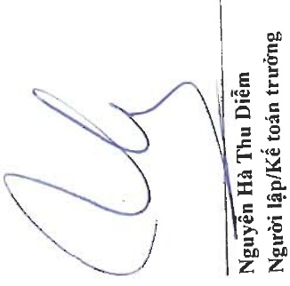
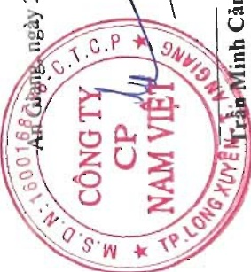

CÔNG TY CỔ PHẦN NAM VIỆT

Địa chỉ: 19D Trần Hưng Đạo, Phường Mỹ Quý, TP. Long Xuyên, Tinh An Giang

Cho năm tài chính kết thúc ngày 31 tháng 12 năm 2023

Phụ lục 02: Bảng tăng, giảm vay và nợ thuê tài chính ngắn hạn

Don vi tính: VND

Vay ngắn hạn ngân hàng

Vay ngắn hạn các tỗ chức khác

Vay ngắn hạn các cá nhân

<table border=1 style='margin: auto; word-wrap: break-word;'><tr><td style='text-align: center; word-wrap: break-word;'>Số tiền vay phát sinh trong năm</td><td style='text-align: center; word-wrap: break-word;'>Kết chuyển từ vay và nợ dài hạn</td><td style='text-align: center; word-wrap: break-word;'>Chênh lệch tỷ giá</td><td style='text-align: center; word-wrap: break-word;'>Số tiền vay dựa trong năm</td><td style='text-align: center; word-wrap: break-word;'>Số cuối năm</td></tr><tr><td style='text-align: center; word-wrap: break-word;'>1.397.888.999.366</td><td style='text-align: center; word-wrap: break-word;'>4.490.258.192.187</td><td style='text-align: center; word-wrap: break-word;'>-</td><td style='text-align: center; word-wrap: break-word;'>1.906.614.402</td><td style='text-align: center; word-wrap: break-word;'>(4.212.753.461.472)</td></tr><tr><td style='text-align: center; word-wrap: break-word;'>5.573.808.210</td><td style='text-align: center; word-wrap: break-word;'>1.200.000.000</td><td style='text-align: center; word-wrap: break-word;'>-</td><td style='text-align: center; word-wrap: break-word;'>-</td><td style='text-align: center; word-wrap: break-word;'>(3.833.500.000)</td></tr><tr><td style='text-align: center; word-wrap: break-word;'>305.896.923.400</td><td style='text-align: center; word-wrap: break-word;'>35.690.000.000</td><td style='text-align: center; word-wrap: break-word;'>-</td><td style='text-align: center; word-wrap: break-word;'>-</td><td style='text-align: center; word-wrap: break-word;'>(341.586.923.400)</td></tr><tr><td style='text-align: center; word-wrap: break-word;'>9.999.999.996</td><td style='text-align: center; word-wrap: break-word;'>-</td><td style='text-align: center; word-wrap: break-word;'>9.999.999.996</td><td style='text-align: center; word-wrap: break-word;'>-</td><td style='text-align: center; word-wrap: break-word;'>(9.166.666.663)</td></tr><tr><td style='text-align: center; word-wrap: break-word;'>49.887.594.379</td><td style='text-align: center; word-wrap: break-word;'>-</td><td style='text-align: center; word-wrap: break-word;'>113.663.621.261</td><td style='text-align: center; word-wrap: break-word;'>-</td><td style='text-align: center; word-wrap: break-word;'>(70.918.317.265)</td></tr><tr><td style='text-align: center; word-wrap: break-word;'>1.769.247.325.351</td><td style='text-align: center; word-wrap: break-word;'>4.527.148.192.187</td><td style='text-align: center; word-wrap: break-word;'>123.663.621.257</td><td style='text-align: center; word-wrap: break-word;'>1.906.614.402</td><td style='text-align: center; word-wrap: break-word;'>(4.638.258.868.800)</td></tr></table>

Vay dài hạn đến hạn trả

Nợ thuê tài chính đến hạn trả

Cộng

Phó Tổng Giám độc