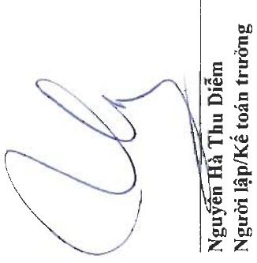

<table border=1 style='margin: auto; word-wrap: break-word;'><tr><td style='text-align: center; word-wrap: break-word;'>Vốn góp của chủ sở hữu</td><td style='text-align: center; word-wrap: break-word;'>Thắng dữ vốn cổ phản</td><td style='text-align: center; word-wrap: break-word;'>Cổ phiếu quỹ</td><td style='text-align: center; word-wrap: break-word;'>chưa phân phối</td><td style='text-align: center; word-wrap: break-word;'>Cộng</td></tr><tr><td style='text-align: center; word-wrap: break-word;'>1.275.396.250.000</td><td style='text-align: center; word-wrap: break-word;'>21.489.209.100</td><td style='text-align: center; word-wrap: break-word;'>(27.587.629.848)</td><td style='text-align: center; word-wrap: break-word;'>1.066.287.796.900</td><td style='text-align: center; word-wrap: break-word;'>2.335.585.626.152</td></tr><tr><td style='text-align: center; word-wrap: break-word;'>-</td><td style='text-align: center; word-wrap: break-word;'>-</td><td style='text-align: center; word-wrap: break-word;'>-</td><td style='text-align: center; word-wrap: break-word;'>673.745.234.347</td><td style='text-align: center; word-wrap: break-word;'>673.745.234.347</td></tr><tr><td style='text-align: center; word-wrap: break-word;'>-</td><td style='text-align: center; word-wrap: break-word;'>-</td><td style='text-align: center; word-wrap: break-word;'>-</td><td style='text-align: center; word-wrap: break-word;'>(127.127.875.000)</td><td style='text-align: center; word-wrap: break-word;'>(127.127.875.000)</td></tr><tr><td style='text-align: center; word-wrap: break-word;'>1.275.396.250.000</td><td style='text-align: center; word-wrap: break-word;'>21.489.209.100</td><td style='text-align: center; word-wrap: break-word;'>(27.587.629.848)</td><td style='text-align: center; word-wrap: break-word;'>1.612.905.156.247</td><td style='text-align: center; word-wrap: break-word;'>2.882.202.985.499</td></tr><tr><td style='text-align: center; word-wrap: break-word;'>1.275.396.250.000</td><td style='text-align: center; word-wrap: break-word;'>21.489.209.100</td><td style='text-align: center; word-wrap: break-word;'>(27.587.629.848)</td><td style='text-align: center; word-wrap: break-word;'>1.612.905.156.247</td><td style='text-align: center; word-wrap: break-word;'>2.882.202.985.499</td></tr><tr><td style='text-align: center; word-wrap: break-word;'>60.000.000.000</td><td style='text-align: center; word-wrap: break-word;'>-</td><td style='text-align: center; word-wrap: break-word;'>-</td><td style='text-align: center; word-wrap: break-word;'>-</td><td style='text-align: center; word-wrap: break-word;'>60.000.000.000</td></tr><tr><td style='text-align: center; word-wrap: break-word;'>-</td><td style='text-align: center; word-wrap: break-word;'>-</td><td style='text-align: center; word-wrap: break-word;'>-</td><td style='text-align: center; word-wrap: break-word;'>39.191.645.110</td><td style='text-align: center; word-wrap: break-word;'>39.191.645.110</td></tr><tr><td style='text-align: center; word-wrap: break-word;'>-</td><td style='text-align: center; word-wrap: break-word;'>-</td><td style='text-align: center; word-wrap: break-word;'>-</td><td style='text-align: center; word-wrap: break-word;'>(400.000.000)</td><td style='text-align: center; word-wrap: break-word;'>(400.000.000)</td></tr><tr><td style='text-align: center; word-wrap: break-word;'>-</td><td style='text-align: center; word-wrap: break-word;'>-</td><td style='text-align: center; word-wrap: break-word;'>-</td><td style='text-align: center; word-wrap: break-word;'>(133.127.875.000)</td><td style='text-align: center; word-wrap: break-word;'>(133.127.875.000)</td></tr><tr><td style='text-align: center; word-wrap: break-word;'>1.335.396.250.000</td><td style='text-align: center; word-wrap: break-word;'>21.489.209.100</td><td style='text-align: center; word-wrap: break-word;'>(27.587.629.848)</td><td style='text-align: center; word-wrap: break-word;'>1.518.568.926.357</td><td style='text-align: center; word-wrap: break-word;'>2.847.866.755.609</td></tr></table>

Số dư đậu năm nay

Phát hành cổ phiếu trong năm

Lợi nhuận trong năm nay

Trích lập các quỹ trong năm nay

Chia cổ tức trong năm nay

Số dư cuối năm nay

Số dư đậu năm trước

Lợi nhuận trong năm trước

Chia cổ tức trong năm trước

Số dư cuội kỳ trước

Đơn vị tính: VND

Địa chỉ: 19D Trần Hưng Đạo, Phường Mỹ Quý, TP. Long Xuyên, Tình An Giang

BẢO CÁO TÀI CHÍNH HỢP NHẤT

Cho năm tài chính kết thúc ngày 31 tháng 12 năm 2023

Phụ lục 03: Băng đôi chiếu biến động của vốn chủ sở hữu