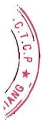

Năm 2024, tình hình chính trị thế giới tiếp tục diễn biến phức tạp, khó lường; cạnh tranh chiến lược gay gắt, xung đột leo thang ở Ucraina, Trung đông, Biển đồ, căng thẳng gia tăng ở bán đảo Triều Tiên và eo biển Đài Loan; giá xăng dầu, hàng hóa cơ bản, cước vận tải biển biển động mạnh; kinh tế, thương mại phục hồi chậm, thiếu vững chắc; đầu tư toàn cầu sụt giảm; tỷ giá, lãi suất biến động khó lường; thiên tai, biến đổi khí hậu, an ninh lương thực, an ninh mạng diễn biến phức tạp.

Trong bối cảnh kinh tế thế giới khó khăn và có dấu hiệu suy thoái, nhiều doanh nghiệp phải cắt giảm lao động thậm chí ngung hoạt động, có thể xem là năm khó khăn nhất của rất nhiều công ty, trong đó có Nam Việt.

Doanh thu năm 2024 là 4.911 tỷ đồng, đạt 110,64% so với năm 2023, lợi nhuận trước thuế đạt 78,5 tỷ đồng, đạt 121,73% so với năm 2023.

#### Môi trường kinh doanh 2024

Thuận lợi:

- Navico vẫn duy trì chuỗi giá trị khép kín từ sản xuất thức ăn, nuôi trồng thủy sản và chế biến thủy sản.

- Công ty có sẵn các nhà máy có công suất 1.000 tấn nguyên liệu / ngày nên đáp ứng đủ khi nhu cầu tăng cao.

- Công suất nhà máy chế biến thức ăn có khả năng đáp ứng 100% nhu cầu của toàn bộ vùng nuôi.

Đồng bằng sông Cửu Long của Việt Nam có điều kiện sinh thái thuận lợi cho việc nuôi cá tra quy mô lớn, hơn nữa trong nhiều thập niên qua An Giang không bị ảnh hưởng của xâm ngập mặn, biến đổi khí hậu.

Navico là một thương hiệu hàng đầu về các sản phẩm cá tra và là thương hiệu uy tín đối với khách hàng trên thế giới; Công ty có thị trường xuất khẩu tương đối da dạng và ổn định qua nhiều năm.

- Navico có đội ngũ cán bộ giàu kinh nghiệm, đoàn kết, tràn đầy năng lượng, luôn khát khao đổi mới sáng tạo và trung thành tuyệt đối với công ty.

#### Khó khăn:

Xung đột leo thang ở Ucraina, Trung đông, Biển đỏ, căng thẳng gia tăng ở bán đảo Triều Tiên và eo biển Đài Loan;

- Giá xăng dầu, hàng hóa cơ bản, cước vận tải biển biển động mạnh;

- Kinh tế, thương mại phục hồi chận, thiếu vững chắc; đâu tư toàn cầu sụt giảm; tỷ giá, lãi suất biến động khó lường

- Một số thị trường tiếp tục dụng lên các hàng rào phi thuế quan để hạn chế và thất chặt kiểm soát hàng hóa nhập khẩu

