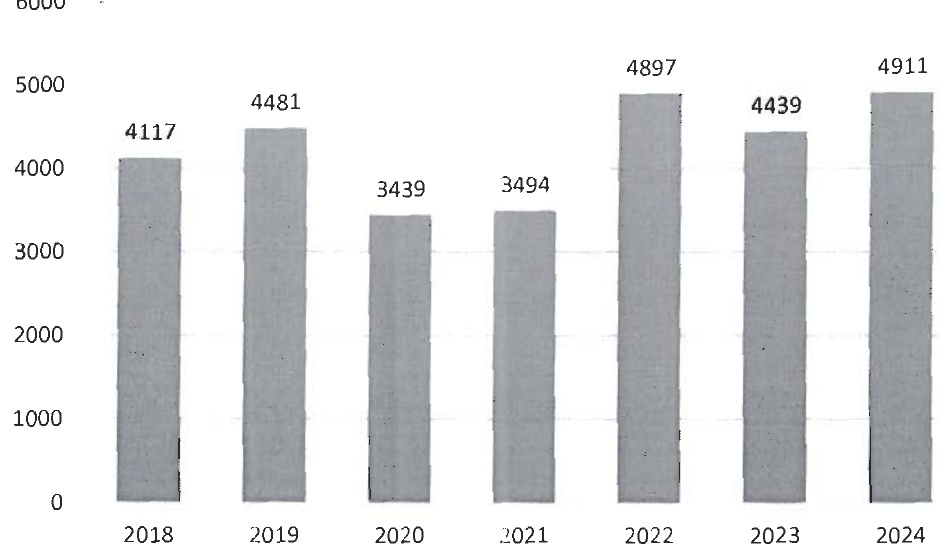

- Doanh thu thuần của toàn công ty trong năm 2024 đạt 4.911 tỷ đồng, tăng 10,64% so với cùng kì năm trước

b- Chi tiết doanh thu năm 2024

<table border=1 style='margin: auto; word-wrap: break-word;'><tr><td style='text-align: center; word-wrap: break-word;'>STT</td><td style='text-align: center; word-wrap: break-word;'>Doanh Thu</td><td style='text-align: center; word-wrap: break-word;'>Loại tiền</td><td style='text-align: center; word-wrap: break-word;'>Tỷ lệ 2023</td><td style='text-align: center; word-wrap: break-word;'>Tỷ lệ 2024</td></tr><tr><td style='text-align: center; word-wrap: break-word;'>1</td><td style='text-align: center; word-wrap: break-word;'>Thành phẩm đồng lạnh</td><td style='text-align: center; word-wrap: break-word;'>VND</td><td style='text-align: center; word-wrap: break-word;'>81.75%</td><td style='text-align: center; word-wrap: break-word;'>78,85%</td></tr><tr><td style='text-align: center; word-wrap: break-word;'>2</td><td style='text-align: center; word-wrap: break-word;'>Thành phẩm chả cá</td><td style='text-align: center; word-wrap: break-word;'>VND</td><td style='text-align: center; word-wrap: break-word;'>5.10%</td><td style='text-align: center; word-wrap: break-word;'>5,04%</td></tr><tr><td style='text-align: center; word-wrap: break-word;'>3</td><td style='text-align: center; word-wrap: break-word;'>Phụ Phẩm</td><td style='text-align: center; word-wrap: break-word;'>VND</td><td style='text-align: center; word-wrap: break-word;'>8.81%</td><td style='text-align: center; word-wrap: break-word;'>6,31%</td></tr><tr><td style='text-align: center; word-wrap: break-word;'>4</td><td style='text-align: center; word-wrap: break-word;'>Thức ăn</td><td style='text-align: center; word-wrap: break-word;'>VND</td><td style='text-align: center; word-wrap: break-word;'>0.10%</td><td style='text-align: center; word-wrap: break-word;'>0,08%</td></tr><tr><td style='text-align: center; word-wrap: break-word;'>5</td><td style='text-align: center; word-wrap: break-word;'>Cá nguyên liệu</td><td style='text-align: center; word-wrap: break-word;'>VND</td><td style='text-align: center; word-wrap: break-word;'>1.47%</td><td style='text-align: center; word-wrap: break-word;'>7,13%</td></tr><tr><td style='text-align: center; word-wrap: break-word;'>6</td><td style='text-align: center; word-wrap: break-word;'>Điện mặt trời</td><td style='text-align: center; word-wrap: break-word;'>VND</td><td style='text-align: center; word-wrap: break-word;'>2.38%</td><td style='text-align: center; word-wrap: break-word;'>2,21%</td></tr><tr><td style='text-align: center; word-wrap: break-word;'>7</td><td style='text-align: center; word-wrap: break-word;'>Khác</td><td style='text-align: center; word-wrap: break-word;'>VND</td><td style='text-align: center; word-wrap: break-word;'>0.38%</td><td style='text-align: center; word-wrap: break-word;'>0,38%</td></tr><tr><td style='text-align: center; word-wrap: break-word;'></td><td style='text-align: center; word-wrap: break-word;'>Tổng cộng VND</td><td style='text-align: center; word-wrap: break-word;'></td><td style='text-align: center; word-wrap: break-word;'>100%</td><td style='text-align: center; word-wrap: break-word;'>100%</td></tr></table>

Doanh thu bán thành phẩm động lạnh vãn chiếm tỷ trọng cao nhất trong cơ cấu doanh thu của Navico chiếm 78,85%, tiếp đến là cá nguyên liệu chiếm tỷ trọng 7,13%.

### c- Biểu đồ doanh thu qua các năm:

d- Biểu đồ cơ cấu doanh thu năm 2024: