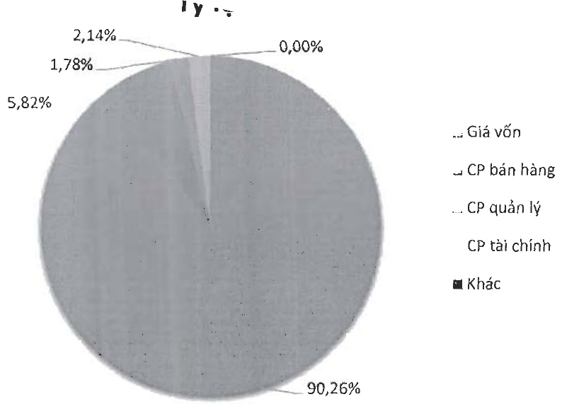

Tỷ lệ cơ cấu chi phí năm 2024

#### 1.2 Tình hình tài chính

a- Tình hình tài sản:

Tính đến 31/12/2024, giá trị tổng tài sản đạt 4.862 tỷ đồng, giảm 4,9 % so với năm 2023. Tỷ trọng tài sản ngắn hạn chiếm 53,2% so với tổng tài sản, giảm 4,5% so với năm 2023.

Trong cơ cấu tài sản ngắn hạn, hàng tồn kho của Công ty chiếm tỷ trọng lớn nhất, tương đương 63,9%, tiếp đến là các khoản phải thu ngắn hạn chiếm 21,3%.

Đối với tài sản dài hạn, tài sản cố định là khoản mục chiếm tỷ trọng cao nhất, đạt 47,1%. Ngoài ra, các khoản tài sản dở dang dài hạn cũng chiếm phần lớn trong cơ cấu tài sản dài hạn, tương ứng 42,8%.

Các chỉ tiêu về năng lực hoạt động của Navico trong năm 2024 thay đổi đáng kể so với năm 2023, trong đó:

Vòng quay tổng tài sản từ 0,84 thành 0,98 vòng.

Vòng quay hàng tồn kho từ 1,71 thành 2,18 vòng.

Biểu đồ cơ cấu tài sản qua các năm