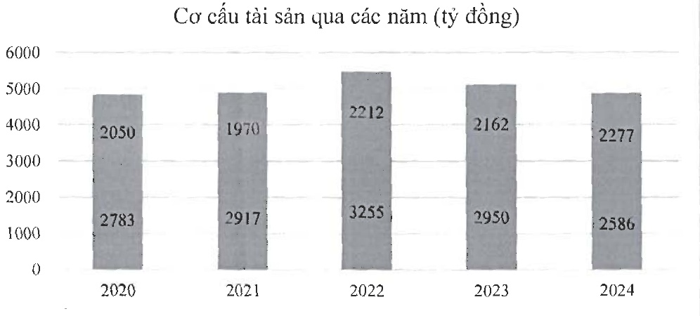

TS ngắn hạn

#### b- Tình hình nợ phải trả

Tại thời điểm 31/12/2024, Tổng nợ phải trả của Công ty là 2.065 tỷ đồng, chiếm 42,47% cơ cấu nguồn vốn (nợ phải trả /tổng nguồn vốn).

Trong đó, nợ ngắn hạn là 1.941 tỷ đồng chiếm tỷ trọng chủ yếu là 94% trong tổng nợ phải trả. Công ty luôn coi trọng công tác quản trị rủi ro nói chung và rủi ro thanh khoản nói riêng. Ban điều hành thường xuyên theo dõi yêu cầu về thanh toán hiện tại và dự kiến trong tương lai nhằm duy trì một lượng tiền cũng như các khoản vay ở mức phù hợp, giám sát các lường tiền phát sinh thực tế với dự kiến nhằm giảm thiểu ảnh hưởng do biến động dòng tiền của Công ty.

c- Về ảnh hưởng của chênh lệch tỷ giá:

Công ty thực hiện một số các giao dịch có gốc ngoại tệ, theo đó, công ty sẽ chịu rủi ro khi có biến động về tỷ giá.

Công ty chủ yếu chịu ảnh hưởng của thay đổi tỷ giá của đồng USD.

d- Về ảnh hưởng của chênh lệch lãi vay

<table border=1 style='margin: auto; word-wrap: break-word;'><tr><td style='text-align: center; word-wrap: break-word;'>Chỉ tiêu</td><td style='text-align: center; word-wrap: break-word;'>Đơn vị tính</td><td style='text-align: center; word-wrap: break-word;'>2023</td><td style='text-align: center; word-wrap: break-word;'>2024</td></tr><tr><td style='text-align: center; word-wrap: break-word;'>Vay ngắn hạn</td><td style='text-align: center; word-wrap: break-word;'>Tỷ đồng</td><td style='text-align: center; word-wrap: break-word;'>1.784</td><td style='text-align: center; word-wrap: break-word;'>1.624</td></tr><tr><td style='text-align: center; word-wrap: break-word;'>Vay dài hạn</td><td style='text-align: center; word-wrap: break-word;'>Tỷ đồng</td><td style='text-align: center; word-wrap: break-word;'>145</td><td style='text-align: center; word-wrap: break-word;'>111</td></tr><tr><td style='text-align: center; word-wrap: break-word;'>Chi phí lãi vay</td><td style='text-align: center; word-wrap: break-word;'>Tỷ đồng</td><td style='text-align: center; word-wrap: break-word;'>137</td><td style='text-align: center; word-wrap: break-word;'>91</td></tr><tr><td style='text-align: center; word-wrap: break-word;'>Chi phí lãi vay/ Doanh thu thuần</td><td style='text-align: center; word-wrap: break-word;'>%</td><td style='text-align: center; word-wrap: break-word;'>3,09%</td><td style='text-align: center; word-wrap: break-word;'>1,86%</td></tr></table>

Năm 2024, lãi vay công ty phải trả là 91 tỷ đồng, giảm 33,32% so với năm 2023.

Kế hoạch phát triển trong tương lai

a- Mục tiêu- chiến lược SXKD năm 2025

Tích cực đi vào chất lượng của chuỗi sản xuất theo hướng nâng cao chất lượng, đa dạng hóa sản phẩm, giảm chi phí, đảm bảo môi trường.

