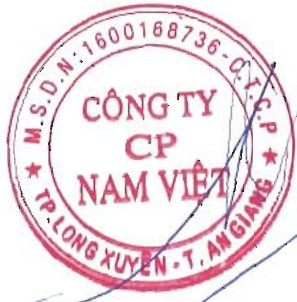
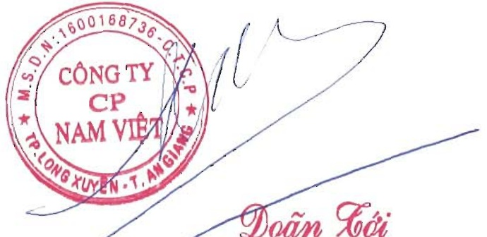

<table border=1 style='margin: auto; word-wrap: break-word;'><tr><td style='text-align: center; word-wrap: break-word;'>STT</td><td style='text-align: center; word-wrap: break-word;'>Bên A</td><td style='text-align: center; word-wrap: break-word;'>Bên B</td><td style='text-align: center; word-wrap: break-word;'>NỘI DUNG GIAO DỊCH</td></tr><tr><td style='text-align: center; word-wrap: break-word;'>10</td><td style='text-align: center; word-wrap: break-word;'>Công ty CP Nam Việt</td><td style='text-align: center; word-wrap: break-word;'>Nguyên Hà Thu Diễm</td><td style='text-align: center; word-wrap: break-word;'>Công ty chia cổ tức</td></tr><tr><td style='text-align: center; word-wrap: break-word;'>11</td><td style='text-align: center; word-wrap: break-word;'>Công ty CP Nam Việt</td><td style='text-align: center; word-wrap: break-word;'>Đỗ Thị Thanh Thủy</td><td style='text-align: center; word-wrap: break-word;'>Công ty chia cổ tức</td></tr></table>

d. Đánh giá việc thực hiện các quy định về quản trị công ty: Về quản trị Công ty thực hiện theo các Quy định của pháp luật, luôn công khai, minh bạch, có hiệu quả.

F.BÁO CÁO TÀI CHÍNH

(Được trình bày ở phụ lục đính kèm)

XÁC NHẬN CỦA ĐẠI DIỆN THEO PHÁP LUẬT CỦA CÔNG TY

(Ký, ghi rõ họ tên, đóng dấu)

TỔNG GIÁM ĐỐC

PHỤ LỤC BÁO CÁO TÀI CHÍNH

(Báo cáo tài chính hợp nhất năm 2024, đã được kiểm toán)

