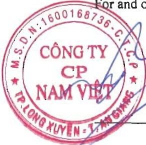
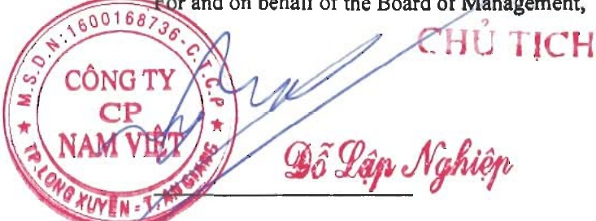

The Board of Directors hereby commits to the compliance with the aforementioned requirements in preparation of the Financial Statements.

##### Approval of the Financial Statements

The Board of Management hereby approves the accompanying Financial Statements, which give a true and fair view of the financial position as of 31 December 2024 of the Corporation, its financial performance and its cash flows for the fiscal year then ended, in conformity with the Vietnamese Accounting Standards, the Vietnamese Enterprise Accounting System and relevant statutory requirements on the preparation and presentation of the Financial Statements.

For and on behalf of the Board of Management,

Date: 28 March 2025

