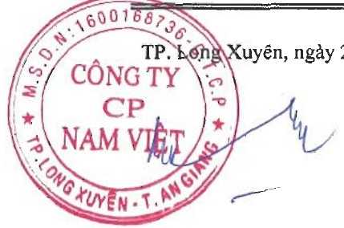

### BÁO CÁO KẾT QUẢ HOẠT ĐỒNG KINH DOANH HỢP NHẤT Cho năm tài chính kết thúc ngày 31 tháng 12 năm 2024

Đơn vị tính: VND

<table border=1 style='margin: auto; word-wrap: break-word;'><tr><td style='text-align: center; word-wrap: break-word;'>CHỈ TIÊU</td><td style='text-align: center; word-wrap: break-word;'>Mã số</td><td style='text-align: center; word-wrap: break-word;'>Thuyết minh</td><td style='text-align: center; word-wrap: break-word;'>Năm nay</td><td style='text-align: center; word-wrap: break-word;'>Năm trước</td></tr><tr><td style='text-align: center; word-wrap: break-word;'>1. Doanh thu bán hàng và cung cấp dịch vụ</td><td style='text-align: center; word-wrap: break-word;'>01</td><td style='text-align: center; word-wrap: break-word;'>VI.1</td><td style='text-align: center; word-wrap: break-word;'>4.939.111.900.770</td><td style='text-align: center; word-wrap: break-word;'>4.461.787.494.846</td></tr><tr><td style='text-align: center; word-wrap: break-word;'>2. Các khoản giảm trừ doanh thu</td><td style='text-align: center; word-wrap: break-word;'>02</td><td style='text-align: center; word-wrap: break-word;'>VI.2</td><td style='text-align: center; word-wrap: break-word;'>27.845.927.857</td><td style='text-align: center; word-wrap: break-word;'>22.664.861.966</td></tr><tr><td style='text-align: center; word-wrap: break-word;'>3. Doanh thu thuần về bán hàng và cung cấp dịch vụ</td><td style='text-align: center; word-wrap: break-word;'>10</td><td style='text-align: center; word-wrap: break-word;'></td><td style='text-align: center; word-wrap: break-word;'>4.911.265.972.913</td><td style='text-align: center; word-wrap: break-word;'>4.439.122.632.880</td></tr><tr><td style='text-align: center; word-wrap: break-word;'>4. Giá vốn hàng bán</td><td style='text-align: center; word-wrap: break-word;'>11</td><td style='text-align: center; word-wrap: break-word;'>VI.3</td><td style='text-align: center; word-wrap: break-word;'>4.350.893.868.111</td><td style='text-align: center; word-wrap: break-word;'>3.991.672.291.149</td></tr><tr><td style='text-align: center; word-wrap: break-word;'>5. Lợi nhuận gộp về bán hàng và cung cấp dịch vụ</td><td style='text-align: center; word-wrap: break-word;'>20</td><td style='text-align: center; word-wrap: break-word;'></td><td style='text-align: center; word-wrap: break-word;'>560.372.104.802</td><td style='text-align: center; word-wrap: break-word;'>447.450.341.731</td></tr><tr><td style='text-align: center; word-wrap: break-word;'>6. Doanh thu hoạt động tài chính</td><td style='text-align: center; word-wrap: break-word;'>21</td><td style='text-align: center; word-wrap: break-word;'>VI.4</td><td style='text-align: center; word-wrap: break-word;'>32.616.939.987</td><td style='text-align: center; word-wrap: break-word;'>32.100.008.584</td></tr><tr><td style='text-align: center; word-wrap: break-word;'>7. Chỉ phí tài chính</td><td style='text-align: center; word-wrap: break-word;'>22</td><td style='text-align: center; word-wrap: break-word;'>VI.5</td><td style='text-align: center; word-wrap: break-word;'>103.483.384.141</td><td style='text-align: center; word-wrap: break-word;'>164.570.703.519</td></tr><tr><td style='text-align: center; word-wrap: break-word;'>Trong đó: chỉ phí lãi vay</td><td style='text-align: center; word-wrap: break-word;'>23</td><td style='text-align: center; word-wrap: break-word;'></td><td style='text-align: center; word-wrap: break-word;'>91.346.541.557</td><td style='text-align: center; word-wrap: break-word;'>137.293.023.317</td></tr><tr><td style='text-align: center; word-wrap: break-word;'>8. Phần lãi hoặc lỗ trong công ty liên doanh, liên kết</td><td style='text-align: center; word-wrap: break-word;'>24</td><td style='text-align: center; word-wrap: break-word;'>V.2b</td><td style='text-align: center; word-wrap: break-word;'>(4.085.674.940)</td><td style='text-align: center; word-wrap: break-word;'>(4.023.233.887)</td></tr><tr><td style='text-align: center; word-wrap: break-word;'>9. Chỉ phí bán hàng</td><td style='text-align: center; word-wrap: break-word;'>25</td><td style='text-align: center; word-wrap: break-word;'>VI.6</td><td style='text-align: center; word-wrap: break-word;'>280.323.845.208</td><td style='text-align: center; word-wrap: break-word;'>188.416.893.163</td></tr><tr><td style='text-align: center; word-wrap: break-word;'>10. Chỉ phí quản lý doanh nghiệp</td><td style='text-align: center; word-wrap: break-word;'>26</td><td style='text-align: center; word-wrap: break-word;'>VI.7</td><td style='text-align: center; word-wrap: break-word;'>85.814.451.161</td><td style='text-align: center; word-wrap: break-word;'>75.715.825.411</td></tr><tr><td style='text-align: center; word-wrap: break-word;'>11. Lợi nhuận thuần từ hoạt động kinh doanh</td><td style='text-align: center; word-wrap: break-word;'>30</td><td style='text-align: center; word-wrap: break-word;'></td><td style='text-align: center; word-wrap: break-word;'>119.281.689.339</td><td style='text-align: center; word-wrap: break-word;'>46.823.694.335</td></tr><tr><td style='text-align: center; word-wrap: break-word;'>12. Thu nhập khác</td><td style='text-align: center; word-wrap: break-word;'>31</td><td style='text-align: center; word-wrap: break-word;'>VI.8</td><td style='text-align: center; word-wrap: break-word;'>15.229.153.460</td><td style='text-align: center; word-wrap: break-word;'>20.002.753.189</td></tr><tr><td style='text-align: center; word-wrap: break-word;'>13. Chỉ phí khác</td><td style='text-align: center; word-wrap: break-word;'>32</td><td style='text-align: center; word-wrap: break-word;'>VI.9</td><td style='text-align: center; word-wrap: break-word;'>55.997.256.641</td><td style='text-align: center; word-wrap: break-word;'>2.329.412.280</td></tr><tr><td style='text-align: center; word-wrap: break-word;'>14. Lợi nhuận khác</td><td style='text-align: center; word-wrap: break-word;'>40</td><td style='text-align: center; word-wrap: break-word;'></td><td style='text-align: center; word-wrap: break-word;'>(40.768.103.181)</td><td style='text-align: center; word-wrap: break-word;'>17.673.340.909</td></tr><tr><td style='text-align: center; word-wrap: break-word;'>15. Tổng lợi nhuận kế toán trước thuế</td><td style='text-align: center; word-wrap: break-word;'>50</td><td style='text-align: center; word-wrap: break-word;'></td><td style='text-align: center; word-wrap: break-word;'>78.513.586.158</td><td style='text-align: center; word-wrap: break-word;'>64.497.035.244</td></tr><tr><td style='text-align: center; word-wrap: break-word;'>16. Chỉ phí thuế thu nhập doanh nghiệp hiện hành</td><td style='text-align: center; word-wrap: break-word;'>51</td><td style='text-align: center; word-wrap: break-word;'>V.17</td><td style='text-align: center; word-wrap: break-word;'>25.509.970.957</td><td style='text-align: center; word-wrap: break-word;'>23.723.017.431</td></tr><tr><td style='text-align: center; word-wrap: break-word;'>17. Chỉ phí thuế thu nhập doanh nghiệp hoản lại</td><td style='text-align: center; word-wrap: break-word;'>52</td><td style='text-align: center; word-wrap: break-word;'>V.14, V.24</td><td style='text-align: center; word-wrap: break-word;'>5.171.441.554</td><td style='text-align: center; word-wrap: break-word;'>4.749.660.477</td></tr><tr><td style='text-align: center; word-wrap: break-word;'>18. Lợi nhuận sau thuế thu nhập doanh nghiệp</td><td style='text-align: center; word-wrap: break-word;'>60</td><td style='text-align: center; word-wrap: break-word;'></td><td style='text-align: center; word-wrap: break-word;'>47.832.173.647</td><td style='text-align: center; word-wrap: break-word;'>36.024.357.336</td></tr><tr><td style='text-align: center; word-wrap: break-word;'>19. Lợi nhuận sau thuế của công ty mẹ</td><td style='text-align: center; word-wrap: break-word;'>61</td><td style='text-align: center; word-wrap: break-word;'></td><td style='text-align: center; word-wrap: break-word;'>47.832.173.647</td><td style='text-align: center; word-wrap: break-word;'>36.024.357.336</td></tr><tr><td style='text-align: center; word-wrap: break-word;'>20. Lợi nhuận sau thuế của cổ đồng không kiểm soát</td><td style='text-align: center; word-wrap: break-word;'>62</td><td style='text-align: center; word-wrap: break-word;'></td><td style='text-align: center; word-wrap: break-word;'>-</td><td style='text-align: center; word-wrap: break-word;'>-</td></tr><tr><td style='text-align: center; word-wrap: break-word;'>21. Lãi cơ bản trên cổ phiếu</td><td style='text-align: center; word-wrap: break-word;'>70</td><td style='text-align: center; word-wrap: break-word;'>VI.10</td><td style='text-align: center; word-wrap: break-word;'>179</td><td style='text-align: center; word-wrap: break-word;'>134</td></tr><tr><td style='text-align: center; word-wrap: break-word;'>22. Lãi suy giảm trên cổ phiếu</td><td style='text-align: center; word-wrap: break-word;'>71</td><td style='text-align: center; word-wrap: break-word;'>VI.10</td><td style='text-align: center; word-wrap: break-word;'>179</td><td style='text-align: center; word-wrap: break-word;'>134</td></tr></table>

TP. Long Xuyên, ngày 28 tháng 3 năm 2025

Nguyễn Hà Thu Diễm

Kế toán trưởng/Người lập

Trần Minh Cảnh

Phó Tổng Giám đốc

