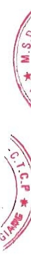

### 25c. Cổ phiếu

<table border=1 style='margin: auto; word-wrap: break-word;'><tr><td style='text-align: center; word-wrap: break-word;'></td><td style='text-align: center; word-wrap: break-word;'>Số cuối năm</td><td style='text-align: center; word-wrap: break-word;'>Số đầu năm</td></tr><tr><td style='text-align: center; word-wrap: break-word;'>Số lượng cổ phiếu đăng ký phát hành</td><td style='text-align: center; word-wrap: break-word;'>266.667.500</td><td style='text-align: center; word-wrap: break-word;'>133.539.625</td></tr><tr><td style='text-align: center; word-wrap: break-word;'>Số lượng cổ phiếu đã bán ra công chúng</td><td style='text-align: center; word-wrap: break-word;'>266.667.500</td><td style='text-align: center; word-wrap: break-word;'>133.539.625</td></tr><tr><td style='text-align: center; word-wrap: break-word;'>- Cổ phiếu phổ thông</td><td style='text-align: center; word-wrap: break-word;'>266.667.500</td><td style='text-align: center; word-wrap: break-word;'>133.539.625</td></tr><tr><td style='text-align: center; word-wrap: break-word;'>- Cổ phiếu uu đãi</td><td style='text-align: center; word-wrap: break-word;'>-</td><td style='text-align: center; word-wrap: break-word;'>-</td></tr><tr><td style='text-align: center; word-wrap: break-word;'>Số lượng cổ phiếu được mua lại</td><td style='text-align: center; word-wrap: break-word;'>411.750</td><td style='text-align: center; word-wrap: break-word;'>411.750</td></tr><tr><td style='text-align: center; word-wrap: break-word;'>- Cổ phiếu phổ thông</td><td style='text-align: center; word-wrap: break-word;'>411.750</td><td style='text-align: center; word-wrap: break-word;'>411.750</td></tr><tr><td style='text-align: center; word-wrap: break-word;'>- Cổ phiếu uu đãi</td><td style='text-align: center; word-wrap: break-word;'>-</td><td style='text-align: center; word-wrap: break-word;'>-</td></tr><tr><td style='text-align: center; word-wrap: break-word;'>Số lượng cổ phiếu đang lưu hành</td><td style='text-align: center; word-wrap: break-word;'>266.255.750</td><td style='text-align: center; word-wrap: break-word;'>133.127.875</td></tr><tr><td style='text-align: center; word-wrap: break-word;'>- Cổ phiếu phổ thông</td><td style='text-align: center; word-wrap: break-word;'>266.255.750</td><td style='text-align: center; word-wrap: break-word;'>133.127.875</td></tr><tr><td style='text-align: center; word-wrap: break-word;'>- Cổ phiếu uu đãi</td><td style='text-align: center; word-wrap: break-word;'>-</td><td style='text-align: center; word-wrap: break-word;'>-</td></tr></table>

Mệnh giá cổ phiếu đang lưu hành: 10.000 VND.

### 25d. Phân phối lợi nhuận

Trong năm, Công ty mẹ đã chia cổ tức năm 2023 với tỷ lệ 5%/ mệnh giá tương đương số tiền là 66.563.937.500 VND theo Nghị quyết Đại hội đồng cổ đồng thường niên năm 2024 số 73/NQ.DHDCĐ ngày 29 tháng 6 năm 2024 và Nghị quyết Hội đồng quản trị số 120/NQ-HDQT ngày 11 tháng 9 năm 2024.

Ngoài ra Công ty mẹ cũng tạm trích quỹ phúc lợi năm 2024 với số tiền 300.000.000 VND theo Tờ trình ngày 05 tháng 12 năm 2024 được Chủ tịch Hội đồng quản trị phê duyệt.

### 26. Các khoản mục ngoài Bảng cân đối kế toán hợp nhất

<table border=1 style='margin: auto; word-wrap: break-word;'><tr><td style='text-align: center; word-wrap: break-word;'></td><td style='text-align: center; word-wrap: break-word;'>Số cuối năm</td><td style='text-align: center; word-wrap: break-word;'>Số đầu năm</td></tr><tr><td style='text-align: center; word-wrap: break-word;'>Dollar Mỹ (USD)</td><td style='text-align: center; word-wrap: break-word;'>99.651,07</td><td style='text-align: center; word-wrap: break-word;'>831.897,93</td></tr><tr><td style='text-align: center; word-wrap: break-word;'>Euro (EUR)</td><td style='text-align: center; word-wrap: break-word;'>2.821,04</td><td style='text-align: center; word-wrap: break-word;'>2.909,02</td></tr><tr><td style='text-align: center; word-wrap: break-word;'>Dollar Úc (AUD)</td><td style='text-align: center; word-wrap: break-word;'>772,28</td><td style='text-align: center; word-wrap: break-word;'>963,60</td></tr><tr><td style='text-align: center; word-wrap: break-word;'>Rub Nga (RUB)</td><td style='text-align: center; word-wrap: break-word;'>2.952,31</td><td style='text-align: center; word-wrap: break-word;'>6.445,47</td></tr></table>

<table border=1 style='margin: auto; word-wrap: break-word;'><tr><td style='text-align: center; word-wrap: break-word;'></td><td colspan="2">Số cuối năm</td><td colspan="2">Số đầu năm</td></tr><tr><td style='text-align: center; word-wrap: break-word;'></td><td style='text-align: center; word-wrap: break-word;'>Nguyên tê</td><td style='text-align: center; word-wrap: break-word;'>VND</td><td style='text-align: center; word-wrap: break-word;'>Nguyên tê</td><td style='text-align: center; word-wrap: break-word;'>VND</td></tr><tr><td style='text-align: center; word-wrap: break-word;'>Khách hàng nước ngoài</td><td style='text-align: center; word-wrap: break-word;'>9.718.204,85</td><td style='text-align: center; word-wrap: break-word;'>188.579.975.866</td><td style='text-align: center; word-wrap: break-word;'>9.429.672,13</td><td style='text-align: center; word-wrap: break-word;'>182.038.120.299</td></tr><tr><td style='text-align: center; word-wrap: break-word;'>Khách hàng trong nước</td><td style='text-align: center; word-wrap: break-word;'>21.844.921.197</td><td style='text-align: center; word-wrap: break-word;'></td><td style='text-align: center; word-wrap: break-word;'>21.714.875.400</td><td style='text-align: center; word-wrap: break-word;'></td></tr><tr><td style='text-align: center; word-wrap: break-word;'>Cộng</td><td style='text-align: center; word-wrap: break-word;'>210.424.897.063</td><td style='text-align: center; word-wrap: break-word;'></td><td style='text-align: center; word-wrap: break-word;'>203.752.995.699</td><td style='text-align: center; word-wrap: break-word;'></td></tr></table>

Nguyên nhân xóa sổ: Nợ quá hạn thanh toán nhiều năm không thu hồi được.

