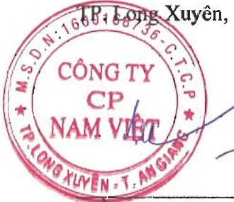

### 2a. Thông tin về khu vực địa lý

Chi tiết doanh thu thuần về bán hàng và cung cấp dịch vụ ra bên ngoài theo khu vực địa lý dựa trên vị trí của khách hàng như sau:

<table border=1 style='margin: auto; word-wrap: break-word;'><tr><td style='text-align: center; word-wrap: break-word;'></td><td style='text-align: center; word-wrap: break-word;'>Năm nay</td><td style='text-align: center; word-wrap: break-word;'>Năm trước</td></tr><tr><td style='text-align: center; word-wrap: break-word;'>Xuất khẩu</td><td style='text-align: center; word-wrap: break-word;'>3.209.981.791.417</td><td style='text-align: center; word-wrap: break-word;'>2.915.375.524.342</td></tr><tr><td style='text-align: center; word-wrap: break-word;'>Trong nước</td><td style='text-align: center; word-wrap: break-word;'>1.701.284.181.496</td><td style='text-align: center; word-wrap: break-word;'>1.523.747.108.538</td></tr><tr><td style='text-align: center; word-wrap: break-word;'>Cộng</td><td style='text-align: center; word-wrap: break-word;'>4.911.265.972.913</td><td style='text-align: center; word-wrap: break-word;'>4.439.122.632.880</td></tr></table>

Tập đoàn không thực hiện theo dõi các thông tin về kết quả kinh doanh, tài sản cố định và các tài sản dài hạn khác và giá trị các khoản chi phí lớn không bằng tiền của bộ phận theo khu vực địa lý dựa trên vị trí của khách hàng.

### 2b. Thông tin về lĩnh vực kinh doanh

Hoạt động của Tập đoàn cnu yeu nằm trong một lĩnh vực kinh doanh chính là sản xuất chế biến thủy sản chiếm tỷ lệ 98% trên tổng doanh thu của Tập đoàn (năm trước 97%).

### 3. Số liệu so sánh

Tập đoàn đã điều chỉnh hồi tổ thuế thu nhập doanh nghiệp từ năm 2019 đến năm 2023 do cơ quan thuế không chấp thuận Tập đoàn được hướng thuế suất ưu đãi và do xác định lại ngành nghề ưu đãi. Ánh hướng của việc điều chỉnh hồi tổ đến số liệu so sánh trên Báo cáo tài chính hợp nhất như sau:

<table border=1 style='margin: auto; word-wrap: break-word;'><tr><td style='text-align: center; word-wrap: break-word;'></td><td style='text-align: center; word-wrap: break-word;'>Mã số</td><td style='text-align: center; word-wrap: break-word;'>Số liệu trước điều chỉnh</td><td style='text-align: center; word-wrap: break-word;'>Các điều chỉnh</td><td style='text-align: center; word-wrap: break-word;'>Số liệu sau điều chỉnh</td></tr><tr><td style='text-align: center; word-wrap: break-word;'>Bảng cân đối kế toán hợp nhất</td><td style='text-align: center; word-wrap: break-word;'></td><td style='text-align: center; word-wrap: break-word;'></td><td style='text-align: center; word-wrap: break-word;'></td><td style='text-align: center; word-wrap: break-word;'></td></tr><tr><td style='text-align: center; word-wrap: break-word;'>Thuê và các khoản phải nộp Nhà nước</td><td style='text-align: center; word-wrap: break-word;'>314</td><td style='text-align: center; word-wrap: break-word;'>27.923.959.069</td><td style='text-align: center; word-wrap: break-word;'>32.141.165.487</td><td style='text-align: center; word-wrap: break-word;'>60.065.124.556</td></tr><tr><td style='text-align: center; word-wrap: break-word;'>Lợi nhuận sau thuê chưa phân phối</td><td style='text-align: center; word-wrap: break-word;'>421</td><td style='text-align: center; word-wrap: break-word;'>1.518.568.926.357</td><td style='text-align: center; word-wrap: break-word;'>(32.141.165.487)</td><td style='text-align: center; word-wrap: break-word;'>1.486.427.760.870</td></tr><tr><td style='text-align: center; word-wrap: break-word;'>Báo cáo kết quả hoạt động kinh doanh hợp nhất</td><td style='text-align: center; word-wrap: break-word;'></td><td style='text-align: center; word-wrap: break-word;'></td><td style='text-align: center; word-wrap: break-word;'></td><td style='text-align: center; word-wrap: break-word;'></td></tr><tr><td style='text-align: center; word-wrap: break-word;'>Chi phí thuê thu nhập doanh nghiệp hiện hành</td><td style='text-align: center; word-wrap: break-word;'>51</td><td style='text-align: center; word-wrap: break-word;'>20.555.729.657</td><td style='text-align: center; word-wrap: break-word;'>3.167.287.774</td><td style='text-align: center; word-wrap: break-word;'>23.723.017.431</td></tr><tr><td style='text-align: center; word-wrap: break-word;'>Lợi nhuận sau thuê thu nhập doanh nghiệp</td><td style='text-align: center; word-wrap: break-word;'>60</td><td style='text-align: center; word-wrap: break-word;'>39.191.645.110</td><td style='text-align: center; word-wrap: break-word;'>(3.167.287.774)</td><td style='text-align: center; word-wrap: break-word;'>36.024.357.336</td></tr><tr><td style='text-align: center; word-wrap: break-word;'>Lợi nhuận sau thuê của công ty mẹ</td><td style='text-align: center; word-wrap: break-word;'>61</td><td style='text-align: center; word-wrap: break-word;'>39.191.645.110</td><td style='text-align: center; word-wrap: break-word;'>(3.167.287.774)</td><td style='text-align: center; word-wrap: break-word;'>36.024.357.336</td></tr></table>

4. Sự kiện phát sinh sau ngày kết thúc năm tài chính

Không có sự kiện trọng yếu nào khác phát sinh sau ngày kết thúc năm tài chính yêu cầu phải điều chỉnh số liệu hoặc công bố trên Báo cáo tài chính hợp nhất.

Nguyễn Hà Thu Diễm

Người lập/Kế toán trưởng

B, Long Xuyên, ngày 28 tháng 3 năm 2025

Trân Minh Cảnh

Phó Tổng Giám đốc

