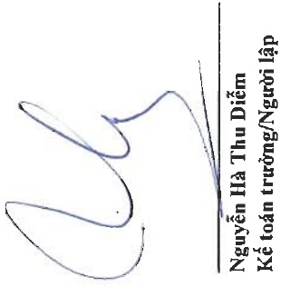
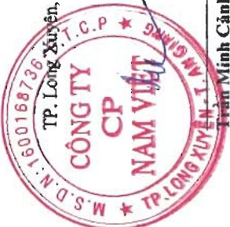

Địa chỉ: 19D Trần Hưng Đạo, Phường Mỹ Quý, TP. Long Xuyên, Tinh An Giang

BẢO CÁO TÀI CHÍNH HỌP NHẬT

Cho năm tài chính kết thúc ngày 31 tháng 12 năm 2024

Phụ lục 01: Bảng tăng, giảm tài sản cổ định hữu hình

Đơn vị tính: VND

Nhà cửa,

vật kiến trúc

Máy móc

và thiết bị

Phương tiện

vận tải, truyền dẫn

Thiết bị,

dụng cụ quản lý

Tài sản cô định

hữu hình khác

Cộng

Dầu tư xây dựng cơ bản hoàn thành

Mua lại tài sản cổ định thuê tài chính

Thanh lý, nhượng bán

369.467.416.058 833.568.322.878 144.312.728.891 16.987.644.841 112.519.311.483 1.476.855.424.151

14.128.895.282 1.783.088.071 4.413.794.420 617.256.442 20.943.034.215

12.939.398.455 18.951.295.588 1.707.425.677 4.260.348.331 37.858.468.051

29.827.125.113

(106.841.788) (100.596.514.859) (10.990.608.876) (80.818.182)

382.299.972.725 795.879.124.002 136.812.633.763 21.320.621.079 117.396.916.256 1.453.709.267.825

Dã khâu hao hết nhưng vẫn còn sử dụng

Chờ thanh lý

Khâu hao trong năm

Mua lại tài sản cố định thuê tài chính

Thanh lý, nhượng bán

Số cuối năm

312.110.106.031 677.044.136.914 94.854.451.616 13.057.406.809 54.862.052.647 1.151.928.154.017 11.700.396.812 28.521.381.111 12.247.263.702 1.815.852.571 6.858.217.732 61.143.111.928 16.729.862.285 (106.841.788) (81.197.104.690) (6.655.622.104) (80.818.182) (88.040.386.764) 323.703.661.055 641.098.275.620 100.446.093.214 14.792.441.198 61.720.270.379 1.141.760.741.466

57.357.310.027 156.524.185.964 49.458.277.275 3.930.238.032 57.657.258.836 324.927.270.134 58.596.311.670 154.780.848.382 36.366.540.549 6.528.179.881 55.676.645.877 311.948.526.359

TP. Long Xuyên, ngày 28 tháng 3 năm 2025

Phó Tổng Giám đốc

