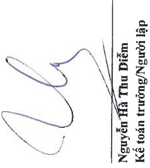
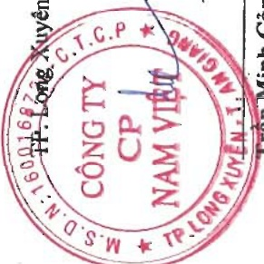

#### CÔNG TY CỔ PHẦN NAM VIỆT

BẢO CÁO TÀI CHÍNH HỢP NHẬT

Đơn vị tính: VND

Cho năm tài chính kết thúc ngày 31 tháng 12 năm 2024

Phụ lục 02: Bảng tăng, giảm vay và nợ thuê tài chính ngăn hạn

Vay ngắn hạn ngân hàng

Vay ngắn hạn các tồ chức khác

Vay dài hạn đến hạn trà

Nợ thuê tài chính đến hạn trả

<table border=1 style='margin: auto; word-wrap: break-word;'><tr><td style='text-align: center; word-wrap: break-word;'></td><td style='text-align: center; word-wrap: break-word;'>Số tiền vay phát sinh trong năm</td><td style='text-align: center; word-wrap: break-word;'>Kết chuyển từ vay và nợ dài hạn</td><td style='text-align: center; word-wrap: break-word;'>Số tiền vay đã trả trong năm</td><td style='text-align: center; word-wrap: break-word;'>Số cuối năm</td></tr><tr><td style='text-align: center; word-wrap: break-word;'>1.677.300.344.483</td><td style='text-align: center; word-wrap: break-word;'>4.177.598.416.331</td><td style='text-align: center; word-wrap: break-word;'>-</td><td style='text-align: center; word-wrap: break-word;'>(4.366.946.724.221)</td><td style='text-align: center; word-wrap: break-word;'>1.487.952.036.593</td></tr><tr><td style='text-align: center; word-wrap: break-word;'>2.940.308.210</td><td style='text-align: center; word-wrap: break-word;'>4.160.000.000</td><td style='text-align: center; word-wrap: break-word;'>-</td><td style='text-align: center; word-wrap: break-word;'>(2.785.000.000)</td><td style='text-align: center; word-wrap: break-word;'>4.315.308.210</td></tr><tr><td style='text-align: center; word-wrap: break-word;'>10.833.333.329</td><td style='text-align: center; word-wrap: break-word;'>-</td><td style='text-align: center; word-wrap: break-word;'>9.999.999.996</td><td style='text-align: center; word-wrap: break-word;'>(10.833.333.329)</td><td style='text-align: center; word-wrap: break-word;'>9.999.999.996</td></tr><tr><td style='text-align: center; word-wrap: break-word;'>92.632.898.375</td><td style='text-align: center; word-wrap: break-word;'>-</td><td style='text-align: center; word-wrap: break-word;'>131.480.550.370</td><td style='text-align: center; word-wrap: break-word;'>(101.911.476.390)</td><td style='text-align: center; word-wrap: break-word;'>122.201.972.355</td></tr><tr><td style='text-align: center; word-wrap: break-word;'>1.783.706.884.397</td><td style='text-align: center; word-wrap: break-word;'>4.181.758.416.331</td><td style='text-align: center; word-wrap: break-word;'>141.480.550.366</td><td style='text-align: center; word-wrap: break-word;'>(4.482.476.533.940)</td><td style='text-align: center; word-wrap: break-word;'>1.624.469.317.154</td></tr></table>

T. Long Xuyên, ngày 28 tháng 3 năm 2025

Trân Minh Cảnh

Phó Tổng Giám độc