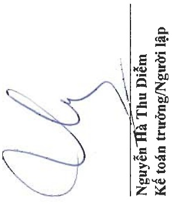

Địa chỉ: 19D Trần Hung Đạo, Phường Mỹ Quý, TP. Long Xuyên, Tình An Giang

BẢO CÁO TÀI CHÍNH HỢP NHẤT

Cho năm tài chính kết thúc ngày 31 tháng 12 năm 2024

Phụ lục 03: Băng đôi chiếu biến động của vốn chủ sở hữu

Số dư đâu năm trước

Đơn vị tính: VND

Điều chính do thay đổi thuế suất thuế thu nhập doanh nghiệp Số dư đấu năm trước được trình bày lại trong năm trước Phát hành cổ phiếu trong năm trước

Lợi nhuận trong năm trước

Trích lập các quỹ trong năm trước

Chia cổ tức trong năm trước

Số dư cuối năm trước

<table border=1 style='margin: auto; word-wrap: break-word;'><tr><td style='text-align: center; word-wrap: break-word;'></td><td colspan="5">Lợi nhuận</td></tr><tr><td style='text-align: center; word-wrap: break-word;'>Vốn góp của chủ sở hữu</td><td style='text-align: center; word-wrap: break-word;'>Thắng dữ vốn cổ phản</td><td style='text-align: center; word-wrap: break-word;'>Cổ phiếu quỹ</td><td style='text-align: center; word-wrap: break-word;'>chưa phân phối</td><td style='text-align: center; word-wrap: break-word;'>Cộng</td><td style='text-align: center; word-wrap: break-word;'>2.882.202.985.499</td></tr><tr><td style='text-align: center; word-wrap: break-word;'>1.275.396.250.000</td><td style='text-align: center; word-wrap: break-word;'>21.489.209.100</td><td style='text-align: center; word-wrap: break-word;'>(27.587.629.848)</td><td style='text-align: center; word-wrap: break-word;'>1.612.905.156.247</td><td style='text-align: center; word-wrap: break-word;'>(28.973.877.713)</td><td style='text-align: center; word-wrap: break-word;'>(28.973.877.713)</td></tr><tr><td style='text-align: center; word-wrap: break-word;'>1.275.396.250.000</td><td style='text-align: center; word-wrap: break-word;'>21.489.209.100</td><td style='text-align: center; word-wrap: break-word;'>(27.587.629.848)</td><td style='text-align: center; word-wrap: break-word;'>1.583.931.278.534</td><td style='text-align: center; word-wrap: break-word;'>2.853.229.107.786</td><td style='text-align: center; word-wrap: break-word;'>60.000.000.000</td></tr><tr><td style='text-align: center; word-wrap: break-word;'>60.000.000.000</td><td style='text-align: center; word-wrap: break-word;'>-</td><td style='text-align: center; word-wrap: break-word;'>-</td><td style='text-align: center; word-wrap: break-word;'>-</td><td style='text-align: center; word-wrap: break-word;'>-</td><td style='text-align: center; word-wrap: break-word;'>36.024.357.336</td></tr><tr><td style='text-align: center; word-wrap: break-word;'>-</td><td style='text-align: center; word-wrap: break-word;'>-</td><td style='text-align: center; word-wrap: break-word;'>-</td><td style='text-align: center; word-wrap: break-word;'>-</td><td style='text-align: center; word-wrap: break-word;'>(400.000.000)</td><td style='text-align: center; word-wrap: break-word;'>(400.000.000)</td></tr><tr><td style='text-align: center; word-wrap: break-word;'>-</td><td style='text-align: center; word-wrap: break-word;'>-</td><td style='text-align: center; word-wrap: break-word;'>-</td><td style='text-align: center; word-wrap: break-word;'>-</td><td style='text-align: center; word-wrap: break-word;'>(133.127.875.000)</td><td style='text-align: center; word-wrap: break-word;'>(133.127.875.000)</td></tr><tr><td style='text-align: center; word-wrap: break-word;'>1.335.396.250.000</td><td style='text-align: center; word-wrap: break-word;'>21.489.209.100</td><td style='text-align: center; word-wrap: break-word;'>(27.587.629.848)</td><td style='text-align: center; word-wrap: break-word;'>1.486.427.760.870</td><td style='text-align: center; word-wrap: break-word;'>2.815.725.590.122</td><td style='text-align: center; word-wrap: break-word;'>-</td></tr><tr><td style='text-align: center; word-wrap: break-word;'>1.335.396.250.000</td><td style='text-align: center; word-wrap: break-word;'>21.489.209.100</td><td style='text-align: center; word-wrap: break-word;'>(27.587.629.848)</td><td style='text-align: center; word-wrap: break-word;'>1.486.427.760.870</td><td style='text-align: center; word-wrap: break-word;'>2.815.725.590.122</td><td style='text-align: center; word-wrap: break-word;'>-</td></tr><tr><td style='text-align: center; word-wrap: break-word;'>1.331.278.750.000</td><td style='text-align: center; word-wrap: break-word;'>-</td><td style='text-align: center; word-wrap: break-word;'>-</td><td style='text-align: center; word-wrap: break-word;'>(1.331.278.750.000)</td><td style='text-align: center; word-wrap: break-word;'>-</td><td style='text-align: center; word-wrap: break-word;'>-</td></tr><tr><td style='text-align: center; word-wrap: break-word;'>-</td><td style='text-align: center; word-wrap: break-word;'>-</td><td style='text-align: center; word-wrap: break-word;'>-</td><td style='text-align: center; word-wrap: break-word;'>-</td><td style='text-align: center; word-wrap: break-word;'>47.832.173.647</td><td style='text-align: center; word-wrap: break-word;'>47.832.173.647</td></tr><tr><td style='text-align: center; word-wrap: break-word;'>-</td><td style='text-align: center; word-wrap: break-word;'>-</td><td style='text-align: center; word-wrap: break-word;'>-</td><td style='text-align: center; word-wrap: break-word;'>-</td><td style='text-align: center; word-wrap: break-word;'>(300.000.000)</td><td style='text-align: center; word-wrap: break-word;'>(300.000.000)</td></tr><tr><td style='text-align: center; word-wrap: break-word;'>-</td><td style='text-align: center; word-wrap: break-word;'>-</td><td style='text-align: center; word-wrap: break-word;'>-</td><td style='text-align: center; word-wrap: break-word;'>-</td><td style='text-align: center; word-wrap: break-word;'>(66.563.937.500)</td><td style='text-align: center; word-wrap: break-word;'>(66.563.937.500)</td></tr><tr><td style='text-align: center; word-wrap: break-word;'>2.666.675.000.000</td><td style='text-align: center; word-wrap: break-word;'>21.489.209.100</td><td style='text-align: center; word-wrap: break-word;'>(27.587.629.848)</td><td style='text-align: center; word-wrap: break-word;'>136.117.247.017</td><td style='text-align: center; word-wrap: break-word;'>2.796.693.826.269</td><td style='text-align: center; word-wrap: break-word;'>-</td></tr></table>

Trích lập các quỹ trong năm nay

Chia cổ tức trong năm nay

Số dư cuối năm nay

