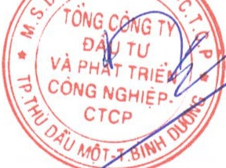

# CÔNG BỘ THÔNG TIN TRÊN CỔNG THÔNG TIN ĐIỂN TỬ CỦA ỦY BAN CHỨNG KHOÁN NHÀ NƯỚC VÀ SỞ GIAO DỊCH CHỨNG

Digitally signed by TÔNG CÔNG TY ĐẦU TỬ VÀ PHÁT TRIỂN CÔNG

NGHIỆP - CTCP

DN: C=VN, S=Binh Dương, L=Thủ Dầu Một, CN=TỔNG CÔNG TY

ĐẦU TỬ VÀ PHÁT TRIỂN CÔNG NGHIỆP - CTCP,

OID.0.9.2342.19200300.100.1.1=CMND:3700145020

Reason: I am the author of this document

Location:

Date: 2019-04-23 08:41:01

KHOÁN HÀ NỘI

Kính gửi:

Ủy ban Chứng khoán Nhà nước

Sở giao dịch chứng khoán Hà Nội

Tổng Công ty Đầu tư và Phát triển Công nghiệp – CTCP

Trụ sở chính: Số 8, đường Hùng Vương, Phường Hòa Phú, thành phố Thủ Dầu Một, tỉnh Bình Dương

Điện thoại: 0274 3822 655

Fax: 0274 3822 713

Người được ủy quyền công bố thông tin: Ông Nguyễn Văn Hoàng

Chức vụ: Phó Tổng giám đốc

Địa chỉ: Số 8, đường Hùng Vương, Phường Hòa Phú, thành phố Thủ Dầu Một, tỉnh Bình Dương

Điện thoại: 0274 3822 655

Fax: 0274 3822 713

Loại thông tin công bố:

x Định kỳ

24h

72h

theo yêu cầu

khác

Nội dung thông tin công bố:

Báo cáo thường niên năm 2018.

Thông tin này đã được công bố trên trang thông tin điện tử của Tổng công ty vào ngày 22/04/2019 tại đường dẫn: http://www.becamex.com.vn mục thông tin doanh nghiệp - công bố thông tin.

Chúng tôi xin cam kết các thông tin công bố trên đây là đúng sự thật và hoàn toàn chịu trách nhiệm trước pháp luật về nội dung các thông tin đã công bố.

Tài liệu đính kèm:

- BCTN năm 2018

Ngày22 tháng 04 năm 2019

Người được ủy quyền công bố thông tin

PHỐ TỔNG GIÁM ĐỐC

NGUYỄN VĂN HOÀNG