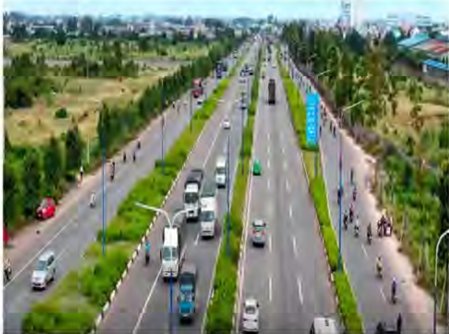

### 4.2/ Mục tiêu cụ thể:

### Về nguồn nhân lực:

Tổng công ty luôn xác định nguồn nhân lực là yếu tố then chốt tạo nên sự thành công cho Tổng công ty. Để bắt kịp với tốc độ tăng trưởng nhanh chóng trong những năm tới, Tổng công ty sẽ xây dựng một đội ngũ cán bộ quản lý và lao động có trình độ chuyên môn cao, giới ngoại ngữ; đồng thời có kế hoạch đào tạo đội ngũ cán bộ nguồn, bồi dưỡng, nâng cao nghiệp vụ chuyên môn và ngoại ngữ cho CBCNV, nêu cao ý thức trách nhiệm và khuyến khích các ý kiến sáng tạo và tinh thần dám nghĩ, dám làm trong quá trình đào tạo.

## Về đầu tư mở rộng sản xuất và phát triển các lĩnh vực kinh doanh:

### * Phát triển ha tàng công nghiệp:

Tiếp tục xây dựng và phát triển các khu công nghiệp tập trung gắn liền với phát triển đô thị và dịch vụ, khu công nghiệp đa ngành, khu công nghiệp chuyên ngành, cụm công nghiệp nhằm thu hút đầu tư. Những dự án cụ thể:

- Đấy mạnh việc xây dựng và thu hút đầu tư vào khu Liên hợp công nghiệp – dịch vụ và đô thị Bình Dương. Hỗ trợ nhà đầu tư Mapletree (Singapore) xây dựng Khu công nghệ cao tại Trung tâm thành phố mới Bình Dương thuộc khu Liên hợp công nghiệp – dịch vụ và đô thị Bình Dương.

- Khuyến kích các nhà đầu tư có quy mô về khoa học công nghệ để đầu tư vào các lĩnh vực công nghệ cao, tiết kiệm lao động.

