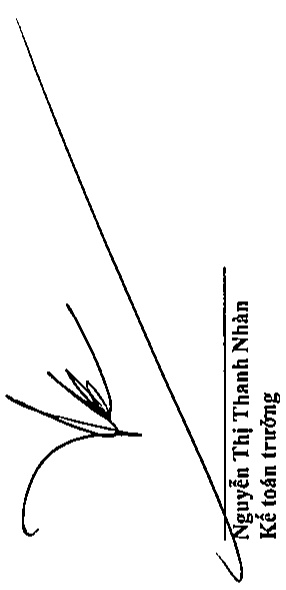
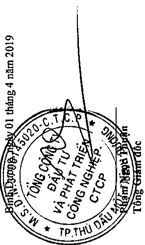
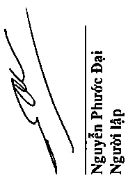
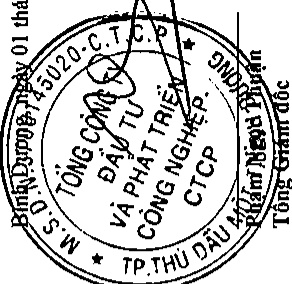

### 0

TỔNG CÔNG TY ĐẦU TỬ VÀ PHÁT TRIỂN CÔNG NGHIỆP - CTCP Địa chỉ: Số 8 Hùng Vương, Phương Hòa Phú, TP. Thủ Dầu Một, Tình Bình Dương BẢO CÁO TÀI CHÍNH TỔNG HỌP

<table border=1 style='margin: auto; word-wrap: break-word;'><tr><td style='text-align: center; word-wrap: break-word;'></td><td style='text-align: center; word-wrap: break-word;'>Vốn góp của chủ sở hữu</td><td style='text-align: center; word-wrap: break-word;'>Chênh lệch tỷ giá hồi đoái</td><td style='text-align: center; word-wrap: break-word;'>Chênh lệch đánh giá lại tài sản</td><td style='text-align: center; word-wrap: break-word;'>Quy đều tư phát triển</td><td style='text-align: center; word-wrap: break-word;'>Quy hỗ trợ sắp xếp doanh nghiệp</td><td style='text-align: center; word-wrap: break-word;'>Lợi nhuận sau thuê</td><td colspan="2">Cộng</td></tr><tr><td style='text-align: center; word-wrap: break-word;'>Số dữ dầu năm trước</td><td style='text-align: center; word-wrap: break-word;'>7.951.756.326.147</td><td style='text-align: center; word-wrap: break-word;'>-</td><td style='text-align: center; word-wrap: break-word;'>-</td><td style='text-align: center; word-wrap: break-word;'>4.742.258.882.594</td><td style='text-align: center; word-wrap: break-word;'>458.631.431.897</td><td style='text-align: center; word-wrap: break-word;'>1.362.110.178.212</td><td style='text-align: center; word-wrap: break-word;'>-</td><td style='text-align: center; word-wrap: break-word;'>14.514.756.818.850</td></tr><tr><td style='text-align: center; word-wrap: break-word;'>Lợi nhuận trong năm</td><td style='text-align: center; word-wrap: break-word;'>247.763.000.000</td><td style='text-align: center; word-wrap: break-word;'>-</td><td style='text-align: center; word-wrap: break-word;'>-</td><td style='text-align: center; word-wrap: break-word;'>-</td><td style='text-align: center; word-wrap: break-word;'>-</td><td style='text-align: center; word-wrap: break-word;'>-</td><td style='text-align: center; word-wrap: break-word;'>5.447.749.536</td><td style='text-align: center; word-wrap: break-word;'>5.447.749.536</td></tr><tr><td style='text-align: center; word-wrap: break-word;'>Thu tiền về từ phát hành cổ phiếu</td><td style='text-align: center; word-wrap: break-word;'>(2.999.558.207.876)</td><td style='text-align: center; word-wrap: break-word;'>-</td><td style='text-align: center; word-wrap: break-word;'>-</td><td style='text-align: center; word-wrap: break-word;'>-</td><td style='text-align: center; word-wrap: break-word;'>-</td><td style='text-align: center; word-wrap: break-word;'>497.093.269.504</td><td style='text-align: center; word-wrap: break-word;'>-</td><td style='text-align: center; word-wrap: break-word;'>744.856.269.504</td></tr><tr><td style='text-align: center; word-wrap: break-word;'>Bàn giao tài sản cho UBND tính Bình Dương</td><td style='text-align: center; word-wrap: break-word;'>13.113.384.363</td><td style='text-align: center; word-wrap: break-word;'>-</td><td style='text-align: center; word-wrap: break-word;'>-</td><td style='text-align: center; word-wrap: break-word;'>-</td><td style='text-align: center; word-wrap: break-word;'>-</td><td style='text-align: center; word-wrap: break-word;'>-</td><td style='text-align: center; word-wrap: break-word;'>-</td><td style='text-align: center; word-wrap: break-word;'>(2.999.558.207.876)</td></tr><tr><td style='text-align: center; word-wrap: break-word;'>Điều chính nguồn</td><td style='text-align: center; word-wrap: break-word;'>4.912.736.497.366</td><td style='text-align: center; word-wrap: break-word;'>-</td><td style='text-align: center; word-wrap: break-word;'>-</td><td style='text-align: center; word-wrap: break-word;'>(3.754.667.974.956)</td><td style='text-align: center; word-wrap: break-word;'>(458.631.431.897)</td><td style='text-align: center; word-wrap: break-word;'>(13.113.384.363)</td><td style='text-align: center; word-wrap: break-word;'>-</td><td style='text-align: center; word-wrap: break-word;'>-</td></tr><tr><td style='text-align: center; word-wrap: break-word;'>Xử lý tài chính về vốn chủ sở hữu</td><td style='text-align: center; word-wrap: break-word;'>-</td><td style='text-align: center; word-wrap: break-word;'>-</td><td style='text-align: center; word-wrap: break-word;'>17.581.463</td><td style='text-align: center; word-wrap: break-word;'>-</td><td style='text-align: center; word-wrap: break-word;'>-</td><td style='text-align: center; word-wrap: break-word;'>(723.565.008.356)</td><td style='text-align: center; word-wrap: break-word;'>24.127.910.992</td><td style='text-align: center; word-wrap: break-word;'>(6.851)</td></tr><tr><td style='text-align: center; word-wrap: break-word;'>Chênh lệch tỷ giá do định giá doanh nghiệp</td><td style='text-align: center; word-wrap: break-word;'>-</td><td style='text-align: center; word-wrap: break-word;'>-</td><td style='text-align: center; word-wrap: break-word;'>-</td><td style='text-align: center; word-wrap: break-word;'>-</td><td style='text-align: center; word-wrap: break-word;'>-</td><td style='text-align: center; word-wrap: break-word;'>-</td><td style='text-align: center; word-wrap: break-word;'>-</td><td style='text-align: center; word-wrap: break-word;'>17.581.463</td></tr><tr><td style='text-align: center; word-wrap: break-word;'>Điều chính phải nộp Quỹ hỗ trợ sắp xếp doanh nghiệp</td><td style='text-align: center; word-wrap: break-word;'>-</td><td style='text-align: center; word-wrap: break-word;'>-</td><td style='text-align: center; word-wrap: break-word;'>-</td><td style='text-align: center; word-wrap: break-word;'>-</td><td style='text-align: center; word-wrap: break-word;'>-</td><td style='text-align: center; word-wrap: break-word;'>(1.122.525.054.997)</td><td style='text-align: center; word-wrap: break-word;'>-</td><td style='text-align: center; word-wrap: break-word;'>(1.122.525.054.997)</td></tr><tr><td style='text-align: center; word-wrap: break-word;'>Trích lập các quỹ trong năm</td><td style='text-align: center; word-wrap: break-word;'>-</td><td style='text-align: center; word-wrap: break-word;'>-</td><td style='text-align: center; word-wrap: break-word;'>-</td><td style='text-align: center; word-wrap: break-word;'>-</td><td style='text-align: center; word-wrap: break-word;'>-</td><td style='text-align: center; word-wrap: break-word;'>-</td><td style='text-align: center; word-wrap: break-word;'>(3.414.267.688)</td><td style='text-align: center; word-wrap: break-word;'>(3.414.267.688)</td></tr><tr><td style='text-align: center; word-wrap: break-word;'>Nộp lợi nhuận về ngân sách nhà nước</td><td style='text-align: center; word-wrap: break-word;'>-</td><td style='text-align: center; word-wrap: break-word;'>-</td><td style='text-align: center; word-wrap: break-word;'>-</td><td style='text-align: center; word-wrap: break-word;'>-</td><td style='text-align: center; word-wrap: break-word;'>-</td><td style='text-align: center; word-wrap: break-word;'>-</td><td style='text-align: center; word-wrap: break-word;'>(26.161.392.840)</td><td style='text-align: center; word-wrap: break-word;'>(26.161.392.840)</td></tr><tr><td style='text-align: center; word-wrap: break-word;'>Điều chính giảm chênh lệch đánh giá lại tài sản do thanh lý tài sản</td><td style='text-align: center; word-wrap: break-word;'>-</td><td style='text-align: center; word-wrap: break-word;'>-</td><td style='text-align: center; word-wrap: break-word;'>-</td><td style='text-align: center; word-wrap: break-word;'>(987.590.907.638)</td><td style='text-align: center; word-wrap: break-word;'>-</td><td style='text-align: center; word-wrap: break-word;'>-</td><td style='text-align: center; word-wrap: break-word;'>-</td><td style='text-align: center; word-wrap: break-word;'>(987.590.907.638)</td></tr><tr><td style='text-align: center; word-wrap: break-word;'>Số dữ cuối năm trước</td><td style='text-align: center; word-wrap: break-word;'>10.125.811.000.000</td><td style='text-align: center; word-wrap: break-word;'>17.581.463</td><td style='text-align: center; word-wrap: break-word;'>-</td><td style='text-align: center; word-wrap: break-word;'>-</td><td style='text-align: center; word-wrap: break-word;'>-</td><td style='text-align: center; word-wrap: break-word;'>-</td><td style='text-align: center; word-wrap: break-word;'>-</td><td style='text-align: center; word-wrap: break-word;'>10.125.828.581.463</td></tr><tr><td style='text-align: center; word-wrap: break-word;'>Số dữ dầu năm</td><td style='text-align: center; word-wrap: break-word;'>10.125.811.000.000</td><td style='text-align: center; word-wrap: break-word;'>17.581.463</td><td style='text-align: center; word-wrap: break-word;'>-</td><td style='text-align: center; word-wrap: break-word;'>-</td><td style='text-align: center; word-wrap: break-word;'>-</td><td style='text-align: center; word-wrap: break-word;'>-</td><td style='text-align: center; word-wrap: break-word;'>-</td><td style='text-align: center; word-wrap: break-word;'>10.125.828.581.463</td></tr><tr><td style='text-align: center; word-wrap: break-word;'>Lợi nhuận trong năm</td><td style='text-align: center; word-wrap: break-word;'>-</td><td style='text-align: center; word-wrap: break-word;'>(17.581.463)</td><td style='text-align: center; word-wrap: break-word;'>-</td><td style='text-align: center; word-wrap: break-word;'>-</td><td style='text-align: center; word-wrap: break-word;'>-</td><td style='text-align: center; word-wrap: break-word;'>-</td><td style='text-align: center; word-wrap: break-word;'>882.995.457.804</td><td style='text-align: center; word-wrap: break-word;'>882.977.876.341</td></tr><tr><td style='text-align: center; word-wrap: break-word;'>Trích lập các quỹ trong năm</td><td style='text-align: center; word-wrap: break-word;'>-</td><td style='text-align: center; word-wrap: break-word;'>-</td><td style='text-align: center; word-wrap: break-word;'>-</td><td style='text-align: center; word-wrap: break-word;'>-</td><td style='text-align: center; word-wrap: break-word;'>88.299.545.780</td><td style='text-align: center; word-wrap: break-word;'>-</td><td style='text-align: center; word-wrap: break-word;'>(221.866.664.451)</td><td style='text-align: center; word-wrap: break-word;'>(133.567.118.671)</td></tr><tr><td style='text-align: center; word-wrap: break-word;'>Số dữ cưới năm nay</td><td style='text-align: center; word-wrap: break-word;'>10.125.811.000.000</td><td style='text-align: center; word-wrap: break-word;'>-</td><td style='text-align: center; word-wrap: break-word;'>-</td><td style='text-align: center; word-wrap: break-word;'>-</td><td style='text-align: center; word-wrap: break-word;'>88.299.545.780</td><td style='text-align: center; word-wrap: break-word;'>-</td><td style='text-align: center; word-wrap: break-word;'>661.128.793.353</td><td style='text-align: center; word-wrap: break-word;'>10.875.239.339.133</td></tr></table>

