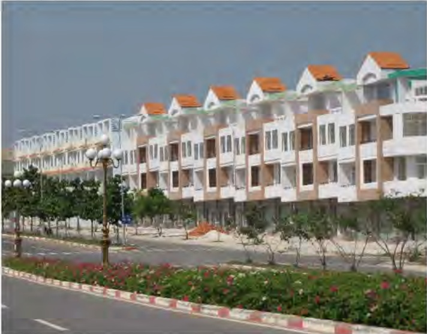
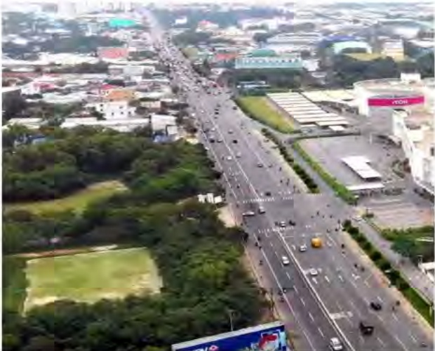
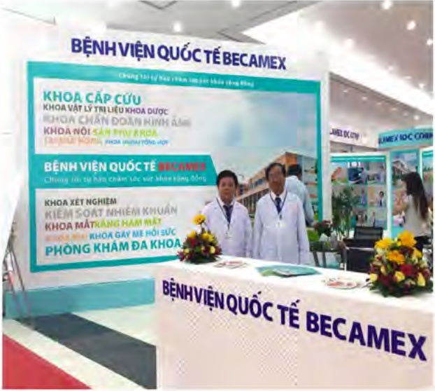

#### * Co sở hạ tầng giao thông:

- Tiếp tục hoàn thiện mạng lưới giao thông trong các khu công nghiệp, mạng lưới giao thông liên huyện, liên tỉnh nhằm đáp ứng nhu cầu giao thông ngày càng cao.

- Liên doanh, liên kết với các doanh nghiệp có uy tín trong và ngoài nước nhằm phát triển các càng hàng hải, càng hàng không; xây dựng mạng lưới giao thông nối liền các vùng trọng điểm và các đầu mối giao thông quan trọng, nhằm tạo thành các con đường “Ngắn nhất, nhanh nhất, thuận lợi nhất, an toàn nhất” để đến với Bình Dương và tỏa ra các khu vực lân cận.

#### * Phát triển Y tế và giáo dục:

- Hoàn thành và đưa vào hoạt động Trường Đại học Quốc tế Miền Đông, diện tích 26 ha, quy mô 24.000 sinh viên chính thức tuyển sinh khóa đầu tiên năm 2011.

- Hoàn thành và đưa vào hoạt động Bệnh viện da khoa quốc tế Becamex: diện tích 12,76 ha, quy mô 1.000 giường.

- Hoàn thành và đưa vào hoạt động Bệnh Viện Đa khoa Mỹ Phước với quy mô gần 500 giường.

- Nâng cao chất lượng phục vụ tại các Bệnh Viện và chất lượng giảng dạy tại các hệ thống trường học.

#### * Xây dựng và phát triển đô thị:

- Tiếp tục thực hiện hoàn thành dự án Becamex City center. Điều hành tốt hoạt động tòa nhà văn phòng và khu trung tâm thương mại Becamex.

- Đấy mạnh công tác xúc tiến và thu hút đâu tư xây dựng đô thị tại thành phố mới Bình Dương, bao gồm văn phòng làm việc, trung tâm tài chính - ngân hàng, khu thương mại, khách sạn cao cấp, khu căn hộ cao cấp, biết thụ sinh thái.

- Tiếp tục đầy mạnh thực hiện dự án ở khu vực Bàu Bàng, và các dự án ở các huyện lần cận.

