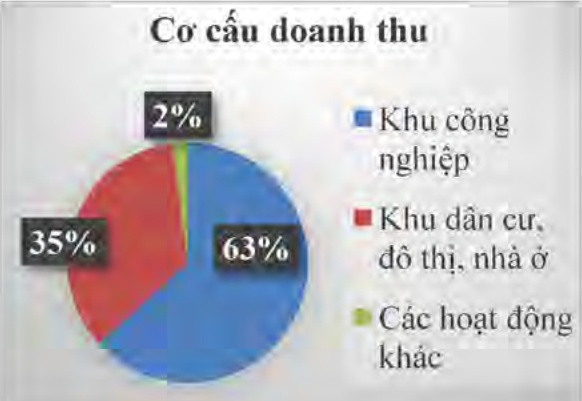

## II. Tình hình hoạt động trong năm

1. Tình hình hoạt động sản xuất kinh doanh

Kết quả kinh doanh theo số liệu báo cáo tài chính tổng hợp năm 2018 (đã được kiểm toán)

<table border=1 style='margin: auto; word-wrap: break-word;'><tr><td style='text-align: center; word-wrap: break-word;'>STT</td><td style='text-align: center; word-wrap: break-word;'>Chỉ tiêu</td><td style='text-align: center; word-wrap: break-word;'>Đơn vị</td><td style='text-align: center; word-wrap: break-word;'>Kế hoạch năm 2018</td><td style='text-align: center; word-wrap: break-word;'>Thực hiện năm 2018</td><td style='text-align: center; word-wrap: break-word;'>TH/KH</td></tr><tr><td style='text-align: center; word-wrap: break-word;'>1</td><td style='text-align: center; word-wrap: break-word;'>Tổng doanh thu</td><td rowspan="6">Tỷ đồng</td><td style='text-align: center; word-wrap: break-word;'>4.300</td><td style='text-align: center; word-wrap: break-word;'>4.732</td><td style='text-align: center; word-wrap: break-word;'>110%</td></tr><tr><td style='text-align: center; word-wrap: break-word;'>2</td><td style='text-align: center; word-wrap: break-word;'>Tổng chi phí</td><td style='text-align: center; word-wrap: break-word;'>3.730</td><td style='text-align: center; word-wrap: break-word;'>3.680</td><td style='text-align: center; word-wrap: break-word;'>98%</td></tr><tr><td style='text-align: center; word-wrap: break-word;'>3</td><td style='text-align: center; word-wrap: break-word;'>Lợi nhuận trước thuế</td><td style='text-align: center; word-wrap: break-word;'>570</td><td style='text-align: center; word-wrap: break-word;'>1.052</td><td style='text-align: center; word-wrap: break-word;'>184%</td></tr><tr><td style='text-align: center; word-wrap: break-word;'>4</td><td style='text-align: center; word-wrap: break-word;'>Thu nhập chịu thuế</td><td style='text-align: center; word-wrap: break-word;'></td><td style='text-align: center; word-wrap: break-word;'>1.039</td><td style='text-align: center; word-wrap: break-word;'></td></tr><tr><td style='text-align: center; word-wrap: break-word;'>5</td><td style='text-align: center; word-wrap: break-word;'>Thuế Thu nhập doanh nghiệp 20% phải nộp</td><td style='text-align: center; word-wrap: break-word;'></td><td style='text-align: center; word-wrap: break-word;'>169</td><td style='text-align: center; word-wrap: break-word;'></td></tr><tr><td style='text-align: center; word-wrap: break-word;'>6</td><td style='text-align: center; word-wrap: break-word;'>Lợi nhuận sau thuế</td><td style='text-align: center; word-wrap: break-word;'>570</td><td style='text-align: center; word-wrap: break-word;'>883</td><td style='text-align: center; word-wrap: break-word;'>155%</td></tr></table>

Phân tích kết quả kinh doanh năm 2018 theo từng lĩnh vực:

Khu công nghiệp

<table border=1 style='margin: auto; word-wrap: break-word;'><tr><td style='text-align: center; word-wrap: break-word;'>Doanh thu</td><td style='text-align: center; word-wrap: break-word;'>Tỷ đồng</td><td style='text-align: center; word-wrap: break-word;'>2.994</td></tr><tr><td style='text-align: center; word-wrap: break-word;'>Chi phí</td><td style='text-align: center; word-wrap: break-word;'>Tỷ đồng</td><td style='text-align: center; word-wrap: break-word;'>2.329</td></tr><tr><td style='text-align: center; word-wrap: break-word;'>LNTT</td><td style='text-align: center; word-wrap: break-word;'>Tỷ đồng</td><td style='text-align: center; word-wrap: break-word;'>666</td></tr></table>

Khu dân cư, đô thị, nhà ở

<table border=1 style='margin: auto; word-wrap: break-word;'><tr><td style='text-align: center; word-wrap: break-word;'>Doanh thu</td><td style='text-align: center; word-wrap: break-word;'>Tỷ đồng</td><td style='text-align: center; word-wrap: break-word;'>1.641</td></tr><tr><td style='text-align: center; word-wrap: break-word;'>Chi phí</td><td style='text-align: center; word-wrap: break-word;'>Tỷ đồng</td><td style='text-align: center; word-wrap: break-word;'>1.276</td></tr><tr><td style='text-align: center; word-wrap: break-word;'>LNTT</td><td style='text-align: center; word-wrap: break-word;'>Tỷ đồng</td><td style='text-align: center; word-wrap: break-word;'>365</td></tr></table>

Các hoạt động khác

<table border=1 style='margin: auto; word-wrap: break-word;'><tr><td style='text-align: center; word-wrap: break-word;'>Doanh thu</td><td style='text-align: center; word-wrap: break-word;'>Tỷ đồng</td><td style='text-align: center; word-wrap: break-word;'>97</td></tr><tr><td style='text-align: center; word-wrap: break-word;'>Chi phí</td><td style='text-align: center; word-wrap: break-word;'>Tỷ đồng</td><td style='text-align: center; word-wrap: break-word;'>76</td></tr><tr><td style='text-align: center; word-wrap: break-word;'>LNTT</td><td style='text-align: center; word-wrap: break-word;'>Tỷ đồng</td><td style='text-align: center; word-wrap: break-word;'>21</td></tr></table>

Trong năm 2018, doanh thu từ lĩnh vực cho thuê, phát triển Khu công nghiệp chủ yếu đến từ các dự án sau: KCN Mỹ Phước; KCN Bàu Bàng; KCN Thới Hòa.

Doanh thu lĩnh vực dân cư, đô thị, nhà ở đến từ các dự án sau: Khu dân cư Mỹ Phước, Khu dân cư Thới Hòa, Khu Dân cư Bàu Bàng và Nhà ở Xã hội

Các hoạt động khác: bao gồm hoạt động tài chính và hoạt động kinh doanh nhỏ lệ khác.