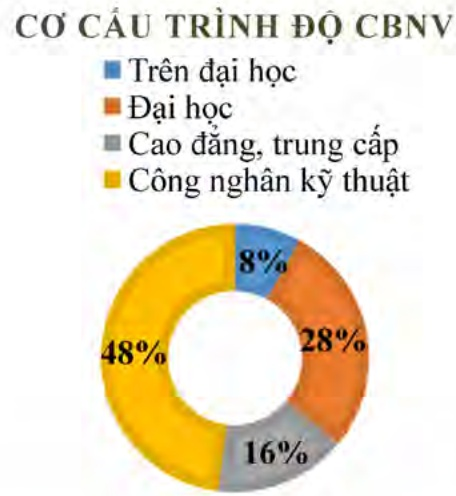

- Số lượng cán bộ, nhân viên. Tóm tắt chính sách và thay đổi trong chính sách đối với người lao động.

Chính sách và thay đổi trong chính sách đối với người lao động:

- Chính sách lương: Với quan điểm tiền lương phải tương xứng, phù hợp với năng lực, Tổng Công ty không ngừng rà soát, đánh giá nhân viên, so sánh năng lực với mức lương trên thị trường và tinh hình lạm phát để điều chỉnh mức lương đảm bảo cuộc sống của CBNV ngày càng được nâng cao và đảm bảo đúng theo quy định của Nhà nước.

- Chính sách khen thưởng: Ngoài tiền lương và phụ cấp được chi trả hàng tháng, căn cứ vào kết quả sản xuất kinh doanh và mức độ hoàn thành công việc của người lao động, Tổng Công ty xem xét chi lương tháng 13 vào dịp cuối năm, chi thưởng cho người lao động vào các dịp lễ, Tết. Hàng năm, Tổng công ty xem xét khen thưởng cho các cá nhân hoàn thành xuất sắc nhiệm vụ nhằm khuyến khích, tạo động lực cho người lao động luôn phấn đấu nâng cao chất lượng công việc.

- Công tác đào tạo: Trong thời gian qua, phòng Tổ chức Hành chính đã phối hợp với các đơn vị trong việc tìm kiếm các đơn vị đào tạo nhằm đào tạo nâng cao trình độ chuyên môn nghiệp vụ cho CBCNV. Kết quả là: Hoàn thành chương trình đào tạo nhân sự trong việc ứng dụng BIM tại Tổng Công ty; Hoàn thành chương trình đào tạo mới và đào tạo lại nghiệp vụ Bảo vệ, phòng Cháy chữa cháy, an toàn lao động cho toàn bộ Bảo vệ các khu trực thuộc Tổng Công ty; Thực hiện tốt chương trình huấn luyện nhân viên mới tại Tổng Công ty.

<table border=1 style='margin: auto; word-wrap: break-word;'><tr><td style='text-align: center; word-wrap: break-word;'>Tổng số CBVN</td><td style='text-align: center; word-wrap: break-word;'>2.398 người</td></tr><tr><td style='text-align: center; word-wrap: break-word;'>Trong đó:</td><td style='text-align: center; word-wrap: break-word;'></td></tr><tr><td style='text-align: center; word-wrap: break-word;'>+ Người Việt Nam</td><td style='text-align: center; word-wrap: break-word;'>2.231 người</td></tr><tr><td style='text-align: center; word-wrap: break-word;'>+ Người nước ngoài</td><td style='text-align: center; word-wrap: break-word;'>77 người</td></tr><tr><td style='text-align: center; word-wrap: break-word;'>Theo trình độ:</td><td style='text-align: center; word-wrap: break-word;'></td></tr><tr><td style='text-align: center; word-wrap: break-word;'>+ Trên Đại học</td><td style='text-align: center; word-wrap: break-word;'>178 người</td></tr><tr><td style='text-align: center; word-wrap: break-word;'>+ Đại học</td><td style='text-align: center; word-wrap: break-word;'>672 người</td></tr><tr><td style='text-align: center; word-wrap: break-word;'>+ Cao đẳng, trung cấp</td><td style='text-align: center; word-wrap: break-word;'>385 người</td></tr><tr><td style='text-align: center; word-wrap: break-word;'>+ Công nhân kỹ thuật</td><td style='text-align: center; word-wrap: break-word;'>1163 người</td></tr></table>

