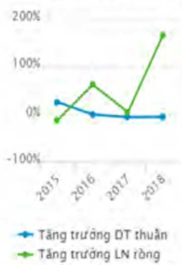
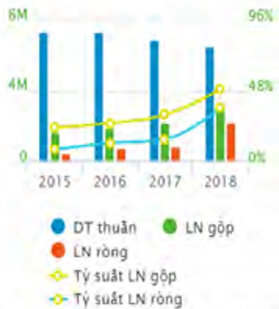
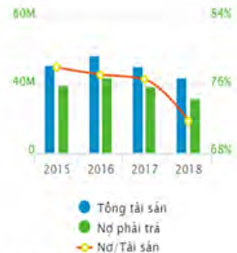

## III. Báo cáo và đánh giá của Ban Tổng Giám đốc

### 1. Đánh giá kết quả hoạt động sản xuất kinh doanh

##### Một số chỉ tiêu tài chính năm 2018

<table border=1 style='margin: auto; word-wrap: break-word;'><tr><td style='text-align: center; word-wrap: break-word;'>Tổng tài sản</td><td style='text-align: center; word-wrap: break-word;'>37.149</td></tr><tr><td style='text-align: center; word-wrap: break-word;'>Vốn chủ sở hữu</td><td style='text-align: center; word-wrap: break-word;'>10.875</td></tr><tr><td style='text-align: center; word-wrap: break-word;'>Tổng doanh thu</td><td style='text-align: center; word-wrap: break-word;'>4.732</td></tr><tr><td style='text-align: center; word-wrap: break-word;'>Lợi nhuận gộp bán hàng &amp; dịch vụ</td><td style='text-align: center; word-wrap: break-word;'>2.191</td></tr><tr><td style='text-align: center; word-wrap: break-word;'>Lợi nhuận thuần hoạt động KD</td><td style='text-align: center; word-wrap: break-word;'>1.043</td></tr><tr><td style='text-align: center; word-wrap: break-word;'>Lợi nhuận sau thuế</td><td style='text-align: center; word-wrap: break-word;'>883</td></tr></table>

(Đơn vị tính: tỷ VND)

Một số chỉ tiêu tài chính năm 2018

<table border=1 style='margin: auto; word-wrap: break-word;'><tr><td style='text-align: center; word-wrap: break-word;'>Nhóm chỉ số Sinh lợi</td><td style='text-align: center; word-wrap: break-word;'>%</td></tr><tr><td style='text-align: center; word-wrap: break-word;'>Lợi nhuận trên doanh thu thuần</td><td style='text-align: center; word-wrap: break-word;'>25</td></tr><tr><td style='text-align: center; word-wrap: break-word;'>Lợi nhuận trên vốn chủ sở hữu</td><td style='text-align: center; word-wrap: break-word;'>10</td></tr><tr><td style='text-align: center; word-wrap: break-word;'>Tỷ suất lợi nhuận trên tổng tài sản</td><td style='text-align: center; word-wrap: break-word;'>3</td></tr><tr><td style='text-align: center; word-wrap: break-word;'>Chỉ tiêu về năng lực hoạt động</td><td style='text-align: center; word-wrap: break-word;'></td></tr><tr><td style='text-align: center; word-wrap: break-word;'>Giá vốn hàng bán/Hàng tồn kho bình quân</td><td style='text-align: center; word-wrap: break-word;'>0,12</td></tr><tr><td style='text-align: center; word-wrap: break-word;'>Doanh thu thuần/Tổng tài sản</td><td style='text-align: center; word-wrap: break-word;'>0,13</td></tr><tr><td style='text-align: center; word-wrap: break-word;'>Nhóm chỉ số Thanh khoản</td><td style='text-align: center; word-wrap: break-word;'></td></tr><tr><td style='text-align: center; word-wrap: break-word;'>Hệ số thanh toán ngắn hạn</td><td style='text-align: center; word-wrap: break-word;'>1,39</td></tr><tr><td style='text-align: center; word-wrap: break-word;'>Hệ số thanh toán nhanh</td><td style='text-align: center; word-wrap: break-word;'>0,66</td></tr></table>

Năm 2018 là năm đầu tiên hoạt động dưới hình thức công ty cổ phần, bước sang mô hình hoạt động mới với nhiều khía cạnh chưa được tiếp cận, tuy nhiên Ban Tổng giảm độc dưới sự chỉ đạo của Hội đồng quản trị đã hoàn thành tốt nhiệm vụ các chỉ tiêu kết quả kinh doanh năm 2018 cụ thể như sau: Tổng doanh thu thực hiện đạt 4.732 tỷ đồng tăng 10% so với kế hoạch năm 2018, lợi nhuận trước thuế đạt 1.052 tỷ đồng tăng 84%, lợi nhuận sau thuế đạt 883 tỷ đồng, tăng 53% so với kế hoạch năm 2018.

Tổng doanh thu 4.732 tỷ đồng, trong đó hoạt động phát triển khu công nghiệp là 2.994 tỷ đồng chiếm tỷ trọng hơn 63% tổng doanh thu, lĩnh vực phát triển đô thị dân cư đóng góp hơn 1.641 chiếm 35% trong tổng doanh thu. Và hoạt động khác 97 tỷ đồng chiếm 2% tổng doanh thu.

Khu công nghiệp: doanh thu từ dự án KCN Mỹ Phước 764 tỷ đồng, dự án KCN Bàu Bàng 1.739 tỷ đồng, dự án KCN Thới Hòa: 490 tỷ đồng.

Khu dân cư, đô thị: doanh thu chủ yếu đến từ các dự án Khu dân cư Bàu Bàng: 1.153 tỷ đồng, các khu dân cư Thới Hòa: 324 tỷ đồng, NOXH 206 tỷ đồng và các dự án khác.

Số liệu theo BCTC Tổng hợp

Biểu đồ tăng trưởng Becamex IDC Corp qua các năm (số liệu hợp nhất) (M: nghìn tỷ VND)

