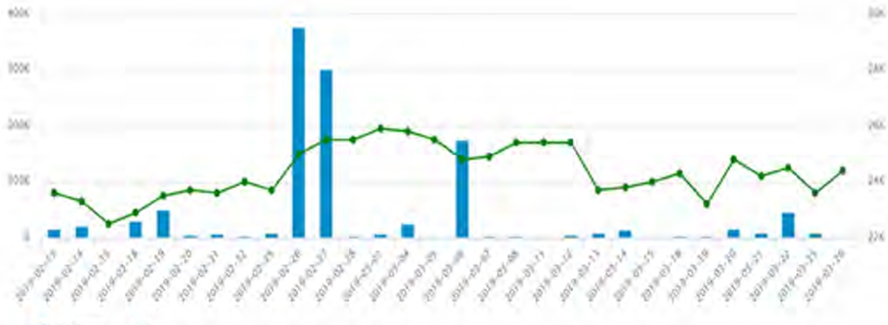

Giá thị trường

VND 24.500

Giá trung bình 2018

VND 20,212

Doanh thu 2018

VND 4.372 tỷ

riển vọng dài hạn

Lợi nhuận 2018

VND 883 tỷ

Triển vọng ngắn hạn

<table border=1 style='margin: auto; word-wrap: break-word;'><tr><td style='text-align: center; word-wrap: break-word;'>Tiêu cực</td><td style='text-align: center; word-wrap: break-word;'>Trung binh</td><td style='text-align: center; word-wrap: break-word;'>Tich cực</td></tr><tr><td colspan="3">Cổ phiếu niêm yết và lưu hành</td></tr><tr><td style='text-align: center; word-wrap: break-word;'>Mã cổ phiếu</td><td colspan="2">BCM</td></tr><tr><td style='text-align: center; word-wrap: break-word;'>Sản giao dịch</td><td colspan="2">UPCOM</td></tr><tr><td style='text-align: center; word-wrap: break-word;'>Ngày giao dịch dầu tiên</td><td colspan="2">21/02/2018</td></tr><tr><td style='text-align: center; word-wrap: break-word;'>Giá ngày giao dịch dầu tiên</td><td colspan="2">25.000</td></tr><tr><td style='text-align: center; word-wrap: break-word;'>Số lượng CP đang niêm yết</td><td colspan="2">24.776.300</td></tr><tr><td style='text-align: center; word-wrap: break-word;'>Số lượng CP đang lưu hành</td><td colspan="2">1.012.581.100</td></tr><tr><td style='text-align: center; word-wrap: break-word;'>Giá trị vốn hóa (tỷ VND)</td><td colspan="2">24.000</td></tr><tr><td colspan="3">Thông tin giao dịch</td></tr><tr><td style='text-align: center; word-wrap: break-word;'>Giá cổ phiếu hiện tại (VND)</td><td colspan="2">24.500</td></tr><tr><td style='text-align: center; word-wrap: break-word;'>Lợi nhuận/cổ phiếu EPS (VND)</td><td colspan="2">2.070</td></tr><tr><td style='text-align: center; word-wrap: break-word;'>Giá trị sổ sách</td><td colspan="2">13.404</td></tr><tr><td style='text-align: center; word-wrap: break-word;'>Giá trị trưởng trên EPS (P/E)</td><td colspan="2">12,3</td></tr><tr><td style='text-align: center; word-wrap: break-word;'>Giá trị trưởng trên giá sổ sách (P/B)</td><td colspan="2">2,1</td></tr><tr><td colspan="3">Cơ cấu sổ hữu</td></tr><tr><td style='text-align: center; word-wrap: break-word;'>Cổ dông Nhà nước</td><td colspan="2">97,55%</td></tr><tr><td style='text-align: center; word-wrap: break-word;'>Cổ dông trong nước</td><td colspan="2">0,47%</td></tr><tr><td style='text-align: center; word-wrap: break-word;'>Cổ dông nước ngoài</td><td colspan="2">1,98%</td></tr></table>

Becamex IDC Corp là một trong những công ty đầu tư và phát triển công nghiệp có quy mô lớn và hiệu quả nhất khi so sánh với các doanh nghiệp cùng ngành đang niêm yết trên thị trường chứng khoán Việt nam.

Cổ phiếu BCM trở nên hấp dẫn nhờ tăng trưởng doanh thu và khả năng sinh lời cải thiện. BCM hiện đang giao dịch với P/E là 11x, thấp hơn 52% so với P/E bình quân các doanh nghiệp quy mô tương đương cùng ngành đang niêm yết (23.51). Dựa trên lợi thế so sánh về quy mô và thị trường khu vực, cổ phiếu BCM đã cho thấy tiềm năng phát triển tốt trong tương lai.

Becamex IDC Corp tăng trưởng bền vững và ổn định qua từng năm. Có thể thấy được trong khi nhiều doanh nghiệp gặp khó khăn trong năm 2018 cũng như dự báo trong năm 2019 sắp tới thì Becamex IDC Corp vẫn giữ đà tăng trưởng lợi nhuận ổn định với chi phí nợ ngày càng giảm.

Biểu đồ giá và khối lượng giao dịch cổ phiếu BCM năm 2018

