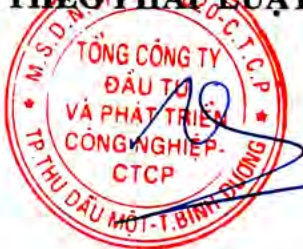

<table border=1 style='margin: auto; word-wrap: break-word;'><tr><td style='text-align: center; word-wrap: break-word;'>Tên tổ chức</td><td style='text-align: center; word-wrap: break-word;'>Mối quan hệ liên quan với công ty</td><td style='text-align: center; word-wrap: break-word;'>Nội dung giao dịch/Thời điểm giao dịch</td><td style='text-align: center; word-wrap: break-word;'>Số lượng, tỷ lệ năm giữ cổ phiếu sau khi giao dịch</td></tr><tr><td style='text-align: center; word-wrap: break-word;'>Công ty CP Bêtông Becamex (ACC)</td><td style='text-align: center; word-wrap: break-word;'>Công ty con</td><td style='text-align: center; word-wrap: break-word;'>- Cung cấp và thi công thảm bề tông nhựa. - Cung cấp và thi công sơn kẻ đường. - Cung cấp và thi công lắp đặt biển báo giao thông. - Cung cấp và thi công trải bó via bề tông. - Cung cấp tấm đan, thi công lắp đặt công. - Cung cấp và thi công dải phân cách. - Thi công hệ thống thoát nước. Thời điểm phát sinh: trong năm 2018</td><td style='text-align: center; word-wrap: break-word;'>0</td></tr><tr><td style='text-align: center; word-wrap: break-word;'>Công ty CP Xây dựng và Giao thông Binh Dương (BCE)</td><td style='text-align: center; word-wrap: break-word;'>Công ty con</td><td style='text-align: center; word-wrap: break-word;'>- Thi công hệ thống chiếu sáng. Thời điểm phát sinh: trong năm 2018</td><td style='text-align: center; word-wrap: break-word;'>0</td></tr><tr><td style='text-align: center; word-wrap: break-word;'>Công ty CP Kinh doanh và Phát triển Bình Dương (TDC)</td><td style='text-align: center; word-wrap: break-word;'>Công ty con</td><td style='text-align: center; word-wrap: break-word;'>- Cung cấp mặt hàng bề tông trộn sẵn cho các công trình Tổng công ty. - Cung cấp thép xây dựng phục vụ thi công hạ tầng. - Cung cấp mặt hàng cấu kiện bề tông cho các công trình của Tổng công ty. Thời điểm phát sinh: trong năm 2018</td><td style='text-align: center; word-wrap: break-word;'>0</td></tr><tr><td style='text-align: center; word-wrap: break-word;'>Công ty CP Phát triển Công nghệ - VNTT</td><td style='text-align: center; word-wrap: break-word;'>Công ty liên kết</td><td style='text-align: center; word-wrap: break-word;'>- Thi công hệ thống chiếu sáng. - Thi công đường dây trung thế 22kV và TBA 3x50 kvA cấp nguồn trạm bom nước thải. - Thi công thay thế trụ, cần đèn và đèn. - Cung cấp phụ kiện kết nối các thiết bị server Thời điểm phát sinh: trong năm 2018</td><td style='text-align: center; word-wrap: break-word;'>0</td></tr></table>

d) Việc thực hiện các quy định về quản trị công ty: Hội đồng quản trị, Ban kiểm soát, Ban Tổng giám đốc tham gia đầy đủ các buổi tập huấn do Uỷ ban chứng khoản Nhà nước và Sở giao dịch chứng khoản tổ chức nhằm cấp nhất các chính sách pháp luật mới áp dụng cho công ty đại chúng.

XÁC NHẬN CỦA ĐẠI DIỆN THEO PHÁP LƯỢT CỦA CÔNG TY

