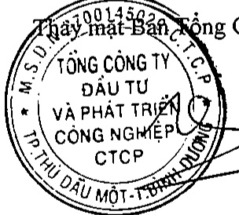
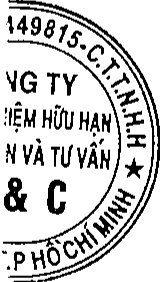

##### Kiểm toán viên

Công ty TNHH Kiểm toán và Tư vấn A&C đã được chi định kiểm toán Báo cáo tài chính tổng hợp cho năm tài chính kết thúc ngày 31 tháng 12 năm 2018 của Tổng Cộng ty.

##### Trách nhiệm của Ban Tổng Giám đốc

Ban Tổng Giám độc chịu trách nhiệm lập Báo cáo tài chính tổng hợp phản ánh trung thực và hợp lý tình hình tài chính, kết quả hoạt động kinh doanh và lưu chuyển tiền tệ của Tổng Công ty trong năm. Trong việc lập Báo cáo tài chính tổng hợp này, Ban Tổng Giám độc phải:

Chọn lựa các chính sách kế toán thích hợp và áp dụng các chính sách này một cách nhất quán;

- Thực hiện các xét đoán và các ước tính một cách hợp lý và thân trọng;

Nêu rõ các chuẩn mực kế toán áp dụng cho Tổng Công ty có được tuân thủ hay không và tất cả các sai lệch trọng yếu đã được trình bày và giải thích trong Báo cáo tài chính tổng hợp;

Lập Báo cáo tài chính tổng hợp trên cơ sở hoạt động liên tục trừ trường hợp không thể cho rằng Tổng Công ty sẽ tiếp tục hoạt động liên tục;

Thiết lập và thực hiện hệ thống kiểm soát nội bộ một cách hữu hiệu nhằm hạn chế rủi ro có sai sót trọng yếu do gian lận hoặc nhằm lẫn trong việc lập và trình bày Báo cáo tài chính tổng hợp.

Ban Tổng Giám độc đảm bảo các sổ kế toán thích hợp được lưu giữ đầy đủ để phản ánh tình hình tài chính của Tổng Cộng ty với mức độ chính xác hợp lý tại bất kỳ thời điểm nào và các sổ sách kế toán tuân thủ chế độ kế toán áp dụng. Ban Tổng Giám độc cũng chịu trách nhiệm quản lý các tài sản của Tổng Cộng ty và do đó đã thực hiện các biện pháp thích hợp để ngăn chặn và phát hiện các hành vi gian lận và các vi phạm khác.

Ban Tổng Giám độc cam kết đã tuân thủ các yêu cầu nêu trên trong việc lập Báo cáo tài chính tổng hợp.

##### Phê duyệt Báo cáo tài chính

Ban Tổng Giám độc phê duyệt Báo cáo tài chính tổng hợp đính kèm. Báo cáo tài chính tổng hợp đã phản ánh trung thực và hợp lý tình hình tài chính của Tổng Công ty tại thời điểm ngày 31 tháng 12 năm 2018, cũng như kết quả hoạt động kinh doanh và tình hình lưu chuyển tiền tệ từ ngày 01 tháng 02 năm 2018 đến ngày 31 tháng 12 năm 2018, phù hợp với các Chuẩn mực Kế toán Việt Nam, Chế độ Kế toán doanh nghiệp Việt Nam và các quy định pháp lý có liên quan đến việc lập và trình bày Báo cáo tài chính tổng hợp.

Thay-mặt-Bán (l (l (l (l

Phạm Ngọc Thuận Tổng Giám đốc

Ngày 05 tháng 4 năm 2019

