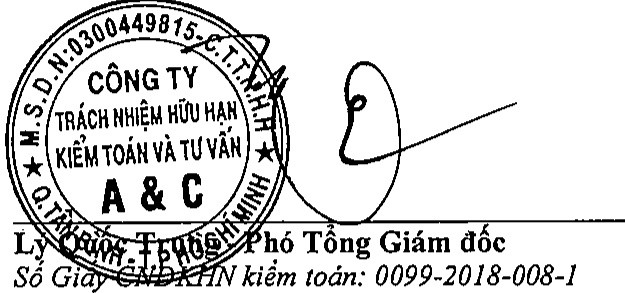

##### Ý kiến của Kiểm toán viên

Theo ý kiến của chúng tôi, Báo cáo tài chính tổng hợp đã phản ánh trung thực và hợp lý, trên các khía cạnh trọng yếu tình hình tài chính của Tổng Công ty Đầu tư và Phát triển Công nghiệp – CTCP tại ngày 31 tháng 12 năm 2018, cũng như kết quả hoạt động kinh doanh và tình hình lưu chuyển tiền tệ cho năm tài chính kết thúc cùng ngày, phù hợp với các Chuẩn mực Kế toán Việt Nam, Chế độ Kế toán doanh nghiệp Việt Nam và các quy định pháp lý có liên quan đến việc lập và trình bày Báo cáo tài chính tổng hợp.

Công ty TNHH Kiểm toán và Tư vấn A&C

Lý C架 C. Trường Phó Tổng Giám độc

Số Giấy CND KHN kiểm toán: 0099-2018-008-1

TP. Hồ Chí Minh, ngày 05 tháng 4 năm 2019

Đỗ Thị Mai Loan - Kiểm toán viên

Số Giấy CNDKHN kiểm toán: 0090-2018-008-1