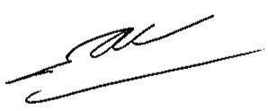
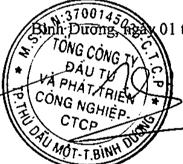

# TỔNG CÔNG TY ĐẦU TỬ VÀ PHÁT TRIỂN CÔNG NGHIỆP - CTCP

BÁO CÁO TÀI CHỈNH TÔNG HỢP

Cho năm tài chính kết thúc ngày 31 tháng 12 năm 2018

Bảng cân đối kế toán tổng hợp (tiếp theo)

<table border=1 style='margin: auto; word-wrap: break-word;'><tr><td style='text-align: center; word-wrap: break-word;'>CHỈ TIÊU</td><td style='text-align: center; word-wrap: break-word;'>Mã số</td><td style='text-align: center; word-wrap: break-word;'>Thuyết minh</td><td style='text-align: center; word-wrap: break-word;'>Số cuối năm</td><td style='text-align: center; word-wrap: break-word;'>Số đầu năm</td></tr><tr><td style='text-align: center; word-wrap: break-word;'>D - VỐN CHỮ SỞ HỮU</td><td style='text-align: center; word-wrap: break-word;'>400</td><td style='text-align: center; word-wrap: break-word;'></td><td style='text-align: center; word-wrap: break-word;'>10.875.239.339.133</td><td style='text-align: center; word-wrap: break-word;'>10.125.828.581.463</td></tr><tr><td style='text-align: center; word-wrap: break-word;'>I. Vốn chủ sở hữu</td><td style='text-align: center; word-wrap: break-word;'>410</td><td style='text-align: center; word-wrap: break-word;'></td><td style='text-align: center; word-wrap: break-word;'>10.875.239.339.133</td><td style='text-align: center; word-wrap: break-word;'>10.125.828.581.463</td></tr><tr><td style='text-align: center; word-wrap: break-word;'>1. Vốn góp của chủ sở hữu</td><td style='text-align: center; word-wrap: break-word;'>411</td><td style='text-align: center; word-wrap: break-word;'>V.23</td><td style='text-align: center; word-wrap: break-word;'>10.125.811.000.000</td><td style='text-align: center; word-wrap: break-word;'>10.125.811.000.000</td></tr><tr><td style='text-align: center; word-wrap: break-word;'>2. Thắng dư vốn cổ phần</td><td style='text-align: center; word-wrap: break-word;'>412</td><td style='text-align: center; word-wrap: break-word;'></td><td style='text-align: center; word-wrap: break-word;'>-</td><td style='text-align: center; word-wrap: break-word;'>-</td></tr><tr><td style='text-align: center; word-wrap: break-word;'>3. Quyền chọn chuyển đổi trái phiếu</td><td style='text-align: center; word-wrap: break-word;'>413</td><td style='text-align: center; word-wrap: break-word;'></td><td style='text-align: center; word-wrap: break-word;'>-</td><td style='text-align: center; word-wrap: break-word;'>-</td></tr><tr><td style='text-align: center; word-wrap: break-word;'>4. Vốn khác của chủ sở hữu</td><td style='text-align: center; word-wrap: break-word;'>414</td><td style='text-align: center; word-wrap: break-word;'></td><td style='text-align: center; word-wrap: break-word;'>-</td><td style='text-align: center; word-wrap: break-word;'>-</td></tr><tr><td style='text-align: center; word-wrap: break-word;'>5. Cổ phiếu quỹ</td><td style='text-align: center; word-wrap: break-word;'>415</td><td style='text-align: center; word-wrap: break-word;'></td><td style='text-align: center; word-wrap: break-word;'>-</td><td style='text-align: center; word-wrap: break-word;'>-</td></tr><tr><td style='text-align: center; word-wrap: break-word;'>6. Chênh lệch đánh giá lại tài sản</td><td style='text-align: center; word-wrap: break-word;'>416</td><td style='text-align: center; word-wrap: break-word;'></td><td style='text-align: center; word-wrap: break-word;'>-</td><td style='text-align: center; word-wrap: break-word;'>-</td></tr><tr><td style='text-align: center; word-wrap: break-word;'>7. Chênh lệch tỷ giá hối đoái</td><td style='text-align: center; word-wrap: break-word;'>417</td><td style='text-align: center; word-wrap: break-word;'>V.23</td><td style='text-align: center; word-wrap: break-word;'>-</td><td style='text-align: center; word-wrap: break-word;'>17.581.463</td></tr><tr><td style='text-align: center; word-wrap: break-word;'>8. Quỹ đầu tư phát triển</td><td style='text-align: center; word-wrap: break-word;'>418</td><td style='text-align: center; word-wrap: break-word;'>V.23</td><td style='text-align: center; word-wrap: break-word;'>88.299.545.780</td><td style='text-align: center; word-wrap: break-word;'>-</td></tr><tr><td style='text-align: center; word-wrap: break-word;'>9. Quỹ hỗ trợ sắp xếp doanh nghiệp</td><td style='text-align: center; word-wrap: break-word;'>419</td><td style='text-align: center; word-wrap: break-word;'>V.23</td><td style='text-align: center; word-wrap: break-word;'>-</td><td style='text-align: center; word-wrap: break-word;'>-</td></tr><tr><td style='text-align: center; word-wrap: break-word;'>10. Quỹ khác thuộc vốn chủ sở hữu</td><td style='text-align: center; word-wrap: break-word;'>420</td><td style='text-align: center; word-wrap: break-word;'></td><td style='text-align: center; word-wrap: break-word;'>-</td><td style='text-align: center; word-wrap: break-word;'>-</td></tr><tr><td style='text-align: center; word-wrap: break-word;'>11. Lợi nhuận sau thuế chưa phân phối</td><td style='text-align: center; word-wrap: break-word;'>421</td><td style='text-align: center; word-wrap: break-word;'>V.23</td><td style='text-align: center; word-wrap: break-word;'>661.128.793.353</td><td style='text-align: center; word-wrap: break-word;'>-</td></tr><tr><td style='text-align: center; word-wrap: break-word;'>- Lợi nhuận sau thuế chưa phân phối lũy kế đến cuối kỳ trước</td><td style='text-align: center; word-wrap: break-word;'>421a</td><td style='text-align: center; word-wrap: break-word;'></td><td style='text-align: center; word-wrap: break-word;'>-</td><td style='text-align: center; word-wrap: break-word;'>-</td></tr><tr><td style='text-align: center; word-wrap: break-word;'>- Lợi nhuận sau thuế chưa phân phối kỳ này</td><td style='text-align: center; word-wrap: break-word;'>421b</td><td style='text-align: center; word-wrap: break-word;'></td><td style='text-align: center; word-wrap: break-word;'>661.128.793.353</td><td style='text-align: center; word-wrap: break-word;'>-</td></tr><tr><td style='text-align: center; word-wrap: break-word;'>12. Ngườn vốn đầu tư xây dựng cơ bản</td><td style='text-align: center; word-wrap: break-word;'>422</td><td style='text-align: center; word-wrap: break-word;'></td><td style='text-align: center; word-wrap: break-word;'>-</td><td style='text-align: center; word-wrap: break-word;'>-</td></tr><tr><td style='text-align: center; word-wrap: break-word;'>II. Ngườn kinh phí và quỹ khác</td><td style='text-align: center; word-wrap: break-word;'>430</td><td style='text-align: center; word-wrap: break-word;'></td><td style='text-align: center; word-wrap: break-word;'>-</td><td style='text-align: center; word-wrap: break-word;'>-</td></tr><tr><td style='text-align: center; word-wrap: break-word;'>1. Ngườn kinh phí</td><td style='text-align: center; word-wrap: break-word;'>431</td><td style='text-align: center; word-wrap: break-word;'></td><td style='text-align: center; word-wrap: break-word;'>-</td><td style='text-align: center; word-wrap: break-word;'>-</td></tr><tr><td style='text-align: center; word-wrap: break-word;'>2. Ngườn kinh phí đã hình thành tài sản cổ định</td><td style='text-align: center; word-wrap: break-word;'>432</td><td style='text-align: center; word-wrap: break-word;'></td><td style='text-align: center; word-wrap: break-word;'>-</td><td style='text-align: center; word-wrap: break-word;'>-</td></tr><tr><td style='text-align: center; word-wrap: break-word;'>TỔNG CỘNG NGUỒN VỔN</td><td style='text-align: center; word-wrap: break-word;'>440</td><td style='text-align: center; word-wrap: break-word;'></td><td style='text-align: center; word-wrap: break-word;'>37.149.097.126.823</td><td style='text-align: center; word-wrap: break-word;'>44.336.463.704.803</td></tr></table>

Nguyễn Phước Đại

Người lập

Bình Dương, ngày 01 tháng 4 năm 2019

Nguyễn Thị Thanh Nhàn Kế toán trưởng

Phạm Ngọc Thuận Tổng Giám đốc

