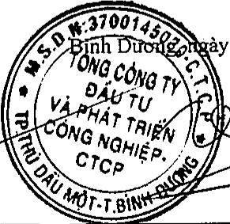

# BÁO CÁO KẾT QUẢ HOẠT ĐỘNG KINH DOANH TỔNG HỢP Cho năm tài chính kết thúc ngày 31 tháng 12 năm 2018

Đơn vị tính: VND

<table border=1 style='margin: auto; word-wrap: break-word;'><tr><td style='text-align: center; word-wrap: break-word;'>CHỈ TIỂU</td><td style='text-align: center; word-wrap: break-word;'>Mã số</td><td style='text-align: center; word-wrap: break-word;'>Thuyết minh</td><td style='text-align: center; word-wrap: break-word;'>Năm nay</td><td style='text-align: center; word-wrap: break-word;'>Năm trước</td></tr><tr><td style='text-align: center; word-wrap: break-word;'>1. Doanh thu bán hàng và cung cấp dịch vụ</td><td style='text-align: center; word-wrap: break-word;'>01</td><td style='text-align: center; word-wrap: break-word;'>VI.1</td><td style='text-align: center; word-wrap: break-word;'>6.061.491.619.936</td><td style='text-align: center; word-wrap: break-word;'>75.874.379.098</td></tr><tr><td style='text-align: center; word-wrap: break-word;'>2. Các khoản giảm trừ doanh thu</td><td style='text-align: center; word-wrap: break-word;'>02</td><td style='text-align: center; word-wrap: break-word;'>VI.2</td><td style='text-align: center; word-wrap: break-word;'>1.902.055.276.805</td><td style='text-align: center; word-wrap: break-word;'>350.000.000</td></tr><tr><td style='text-align: center; word-wrap: break-word;'>3. Doanh thu thuần về bán hàng và cung cấp dịch vụ</td><td style='text-align: center; word-wrap: break-word;'>10</td><td style='text-align: center; word-wrap: break-word;'></td><td style='text-align: center; word-wrap: break-word;'>4.159.436.343.131</td><td style='text-align: center; word-wrap: break-word;'>75.524.379.098</td></tr><tr><td style='text-align: center; word-wrap: break-word;'>4. Giá vốn hàng bán</td><td style='text-align: center; word-wrap: break-word;'>11</td><td style='text-align: center; word-wrap: break-word;'>VI.3</td><td style='text-align: center; word-wrap: break-word;'>1.967.747.870.018</td><td style='text-align: center; word-wrap: break-word;'>35.386.724.995</td></tr><tr><td style='text-align: center; word-wrap: break-word;'>5. Lợi nhuận gộp về bán hàng và cung cấp dịch vụ</td><td style='text-align: center; word-wrap: break-word;'>20</td><td style='text-align: center; word-wrap: break-word;'></td><td style='text-align: center; word-wrap: break-word;'>2.191.688.473.113</td><td style='text-align: center; word-wrap: break-word;'>40.137.654.103</td></tr><tr><td style='text-align: center; word-wrap: break-word;'>6. Doanh thu hoạt động tài chính</td><td style='text-align: center; word-wrap: break-word;'>21</td><td style='text-align: center; word-wrap: break-word;'>VI.4</td><td style='text-align: center; word-wrap: break-word;'>161.325.640.551</td><td style='text-align: center; word-wrap: break-word;'>52.071.664.103</td></tr><tr><td style='text-align: center; word-wrap: break-word;'>7. Chỉ phí tài chính</td><td style='text-align: center; word-wrap: break-word;'>22</td><td style='text-align: center; word-wrap: break-word;'>VI.5</td><td style='text-align: center; word-wrap: break-word;'>494.868.868.973</td><td style='text-align: center; word-wrap: break-word;'>36.103.493.283</td></tr><tr><td style='text-align: center; word-wrap: break-word;'>Trong đó: chỉ phí lãi vay</td><td style='text-align: center; word-wrap: break-word;'>23</td><td style='text-align: center; word-wrap: break-word;'></td><td style='text-align: center; word-wrap: break-word;'>466.651.806.511</td><td style='text-align: center; word-wrap: break-word;'>36.102.380.228</td></tr><tr><td style='text-align: center; word-wrap: break-word;'>8. Chỉ phí bán hàng</td><td style='text-align: center; word-wrap: break-word;'>25</td><td style='text-align: center; word-wrap: break-word;'>VI.6</td><td style='text-align: center; word-wrap: break-word;'>522.504.504.748</td><td style='text-align: center; word-wrap: break-word;'>40.325.175.854</td></tr><tr><td style='text-align: center; word-wrap: break-word;'>9. Chỉ phí quản lý doanh nghiệp</td><td style='text-align: center; word-wrap: break-word;'>26</td><td style='text-align: center; word-wrap: break-word;'>VI.7</td><td style='text-align: center; word-wrap: break-word;'>291.728.823.018</td><td style='text-align: center; word-wrap: break-word;'>12.918.497.281</td></tr><tr><td style='text-align: center; word-wrap: break-word;'>10. Lợi nhuận thuần từ hoạt động kinh doanh</td><td style='text-align: center; word-wrap: break-word;'>30</td><td style='text-align: center; word-wrap: break-word;'></td><td style='text-align: center; word-wrap: break-word;'>1.043.911.916.925</td><td style='text-align: center; word-wrap: break-word;'>2.862.151.788</td></tr><tr><td style='text-align: center; word-wrap: break-word;'>11. Thu nhập khác</td><td style='text-align: center; word-wrap: break-word;'>31</td><td style='text-align: center; word-wrap: break-word;'>VI.8</td><td style='text-align: center; word-wrap: break-word;'>411.611.994.451</td><td style='text-align: center; word-wrap: break-word;'>3.156.987.167</td></tr><tr><td style='text-align: center; word-wrap: break-word;'>12. Chỉ phí khác</td><td style='text-align: center; word-wrap: break-word;'>32</td><td style='text-align: center; word-wrap: break-word;'>VI.9</td><td style='text-align: center; word-wrap: break-word;'>403.346.017.257</td><td style='text-align: center; word-wrap: break-word;'>571.389.419</td></tr><tr><td style='text-align: center; word-wrap: break-word;'>13. Lợi nhuận khác</td><td style='text-align: center; word-wrap: break-word;'>40</td><td style='text-align: center; word-wrap: break-word;'></td><td style='text-align: center; word-wrap: break-word;'>8.265.977.194</td><td style='text-align: center; word-wrap: break-word;'>2.585.597.748</td></tr><tr><td style='text-align: center; word-wrap: break-word;'>14. Tổng lợi nhuận kế toán trước thuế</td><td style='text-align: center; word-wrap: break-word;'>50</td><td style='text-align: center; word-wrap: break-word;'></td><td style='text-align: center; word-wrap: break-word;'>1.052.177.894.119</td><td style='text-align: center; word-wrap: break-word;'>5.447.749.536</td></tr><tr><td style='text-align: center; word-wrap: break-word;'>15. Chỉ phí thuế thu nhập doanh nghiệp hiện hành</td><td style='text-align: center; word-wrap: break-word;'>51</td><td style='text-align: center; word-wrap: break-word;'>VI.15</td><td style='text-align: center; word-wrap: break-word;'>169.182.436.315</td><td style='text-align: center; word-wrap: break-word;'>-</td></tr><tr><td style='text-align: center; word-wrap: break-word;'>16. Chỉ phí thuế thu nhập doanh nghiệp hoản lại</td><td style='text-align: center; word-wrap: break-word;'>52</td><td style='text-align: center; word-wrap: break-word;'></td><td style='text-align: center; word-wrap: break-word;'>-</td><td style='text-align: center; word-wrap: break-word;'>-</td></tr><tr><td style='text-align: center; word-wrap: break-word;'>17. Lợi nhuận sau thuế thu nhập doanh nghiệp</td><td style='text-align: center; word-wrap: break-word;'>60</td><td style='text-align: center; word-wrap: break-word;'></td><td style='text-align: center; word-wrap: break-word;'>882.995.457.804</td><td style='text-align: center; word-wrap: break-word;'>5.447.749.536</td></tr><tr><td style='text-align: center; word-wrap: break-word;'>18. Lãi cơ bản trên cổ phiếu</td><td style='text-align: center; word-wrap: break-word;'>70</td><td style='text-align: center; word-wrap: break-word;'>VI.10</td><td style='text-align: center; word-wrap: break-word;'>-</td><td style='text-align: center; word-wrap: break-word;'>-</td></tr><tr><td style='text-align: center; word-wrap: break-word;'>19. Lãi suy giảm trên cổ phiếu</td><td style='text-align: center; word-wrap: break-word;'>71</td><td style='text-align: center; word-wrap: break-word;'>VI.10</td><td style='text-align: center; word-wrap: break-word;'>-</td><td style='text-align: center; word-wrap: break-word;'>-</td></tr></table>

Zinh Dương ngày 01 tháng 4 năm 2019

Nguyễn Phước Đại

Người lập

Nguyễn Thị Thanh Nhàn

Kế toán trưởng

Phạm Ngọc Thuận

Tổng Giám đốc

