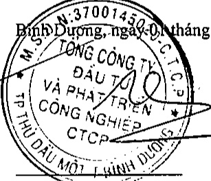

<table border=1 style='margin: auto; word-wrap: break-word;'><tr><td style='text-align: center; word-wrap: break-word;'>CHỈ TIỀU</td><td style='text-align: center; word-wrap: break-word;'>Mã số</td><td style='text-align: center; word-wrap: break-word;'>Thuyết minh</td><td style='text-align: center; word-wrap: break-word;'>Năm nay</td><td style='text-align: center; word-wrap: break-word;'>Năm trước</td></tr><tr><td style='text-align: center; word-wrap: break-word;'>III. Lưu chuyển tiền từ hoạt động tài chính</td><td style='text-align: center; word-wrap: break-word;'></td><td style='text-align: center; word-wrap: break-word;'></td><td style='text-align: center; word-wrap: break-word;'></td><td style='text-align: center; word-wrap: break-word;'></td></tr><tr><td style='text-align: center; word-wrap: break-word;'>1. Tiền thu từ phát hành cổ phiếu, nhận vốn góp của chủ sở hữu</td><td style='text-align: center; word-wrap: break-word;'>31</td><td style='text-align: center; word-wrap: break-word;'></td><td style='text-align: center; word-wrap: break-word;'>-</td><td style='text-align: center; word-wrap: break-word;'>-</td></tr><tr><td style='text-align: center; word-wrap: break-word;'>2. Tiền trả lại vốn góp cho các chủ sở hữu, mua lại cổ phiếu của doanh nghiệp đã phát hành</td><td style='text-align: center; word-wrap: break-word;'>32</td><td style='text-align: center; word-wrap: break-word;'></td><td style='text-align: center; word-wrap: break-word;'>-</td><td style='text-align: center; word-wrap: break-word;'>-</td></tr><tr><td style='text-align: center; word-wrap: break-word;'>3. Tiền thu từ đi vay</td><td style='text-align: center; word-wrap: break-word;'>33</td><td style='text-align: center; word-wrap: break-word;'>V.20</td><td style='text-align: center; word-wrap: break-word;'>6.493.548.179.319</td><td style='text-align: center; word-wrap: break-word;'>324.235.287.637</td></tr><tr><td style='text-align: center; word-wrap: break-word;'>4. Tiền trả nợ gốc vay</td><td style='text-align: center; word-wrap: break-word;'>34</td><td style='text-align: center; word-wrap: break-word;'>V.20</td><td style='text-align: center; word-wrap: break-word;'>(8.275.221.009.778)</td><td style='text-align: center; word-wrap: break-word;'>(464.557.464.682)</td></tr><tr><td style='text-align: center; word-wrap: break-word;'>5. Tiền trả nợ gốc thuê tài chính</td><td style='text-align: center; word-wrap: break-word;'>35</td><td style='text-align: center; word-wrap: break-word;'></td><td style='text-align: center; word-wrap: break-word;'>-</td><td style='text-align: center; word-wrap: break-word;'>-</td></tr><tr><td style='text-align: center; word-wrap: break-word;'>6. Cổ tức, lợi nhuận đã trả cho chủ sở hữu</td><td style='text-align: center; word-wrap: break-word;'>36</td><td style='text-align: center; word-wrap: break-word;'></td><td style='text-align: center; word-wrap: break-word;'>-</td><td style='text-align: center; word-wrap: break-word;'>-</td></tr><tr><td style='text-align: center; word-wrap: break-word;'>Lưu chuyển tiền thuần từ hoạt động tài chính</td><td style='text-align: center; word-wrap: break-word;'>40</td><td style='text-align: center; word-wrap: break-word;'></td><td style='text-align: center; word-wrap: break-word;'>(1.781.672.830.459)</td><td style='text-align: center; word-wrap: break-word;'>(140.322.177.045)</td></tr><tr><td style='text-align: center; word-wrap: break-word;'>Lưu chuyển tiền thuần trong năm</td><td style='text-align: center; word-wrap: break-word;'>50</td><td style='text-align: center; word-wrap: break-word;'></td><td style='text-align: center; word-wrap: break-word;'>(155.812.280.947)</td><td style='text-align: center; word-wrap: break-word;'>(378.949.247.550)</td></tr><tr><td style='text-align: center; word-wrap: break-word;'>Tiền và tương đương tiền đầu năm</td><td style='text-align: center; word-wrap: break-word;'>60</td><td style='text-align: center; word-wrap: break-word;'>V.1</td><td style='text-align: center; word-wrap: break-word;'>2.357.590.776.482</td><td style='text-align: center; word-wrap: break-word;'>2.736.540.024.032</td></tr><tr><td style='text-align: center; word-wrap: break-word;'>Ảnh hướng của thay đổi tỷ giá hối đoái quy đổi ngoại tệ</td><td style='text-align: center; word-wrap: break-word;'>61</td><td style='text-align: center; word-wrap: break-word;'></td><td style='text-align: center; word-wrap: break-word;'>-</td><td style='text-align: center; word-wrap: break-word;'>-</td></tr><tr><td style='text-align: center; word-wrap: break-word;'>Tiền và tương đương tiền cuối năm</td><td style='text-align: center; word-wrap: break-word;'>70</td><td style='text-align: center; word-wrap: break-word;'>V.1</td><td style='text-align: center; word-wrap: break-word;'>2.201.778.495.535</td><td style='text-align: center; word-wrap: break-word;'>2.357.590.776.482</td></tr></table>

Bình Dương, ngay-o (tháng 4 năm 2019

Nguyễn Phước Đại

Người lập

Nguyễn Thị Thanh Nhàn Kế toán trưởng

Phạm Ngọc-Thuận Tổng Giám đốc