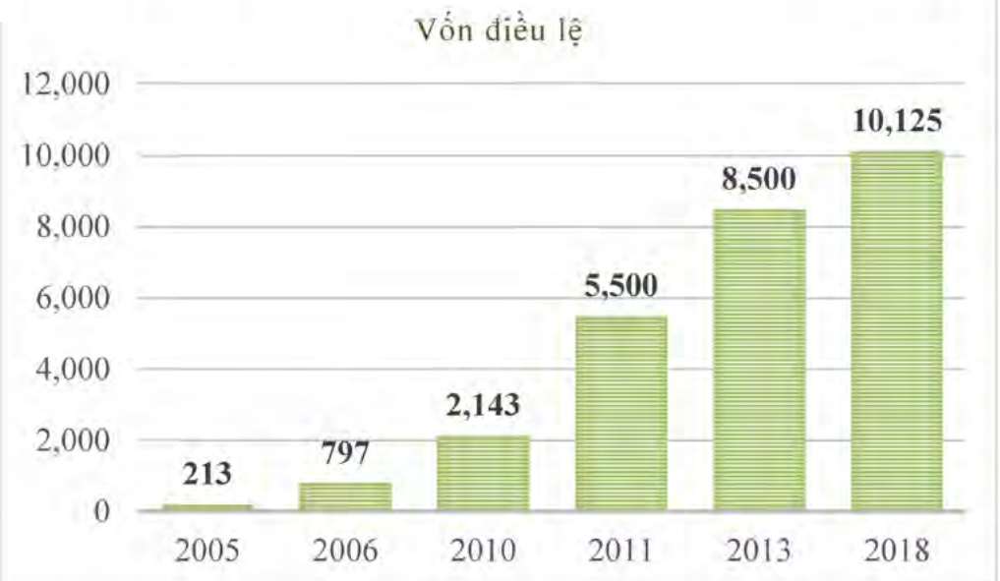
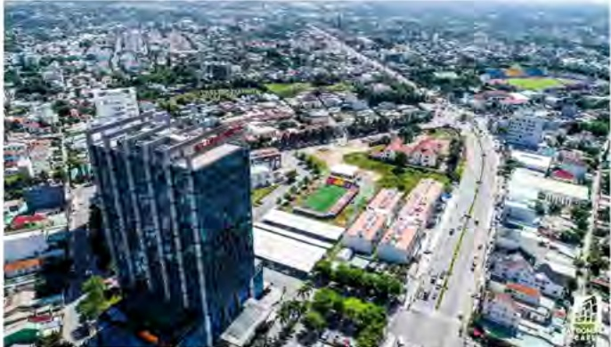

Thay đổi vốn điều lệ qua các năm:

Đv: tỷ đồng

2. Ngành nghề và địa bàn kinh doanh:

- Ngành nghề kinh doanh:

Kinh doanh bất động sản, quyền sử dụng đất thuộc chủ sở hữu, chủ sử dụng hoặc đi thuê;

Tư vấn, môi giới, đấu giá bất động sản, đấu giá quyền sử dụng đất; Tư vấn, thiết kế, giám sát, thi công, xây dựng các công trình dân dụng, công cộng, công nghiệp, giao thông, công trình kỹ thuật hạ tầng.

Khai thác, chế biến khoáng sản. Sản xuất và kinh doanh vật liệu xây dựng, các loại cấu kiện bề tông đúc sẵn.

Đầu tư xây dựng và kinh doanh cơ sở hạ tầng kỹ thuật khu công nghiệp, khu dân cư và khu đô thị; Dịch vụ nhà ở công nhân.

Tư vấn và lập quy hoạch chi tiết, thiết kế kỹ thuật, tổng dự toán, lập, thẩm định dự án đầu tư các khu dân cư, khu đô thị, khu công nghiệp, các công trình dân dụng, công nghiệp, giao thông.

Thực hiện kinh doanh các dự án đầu tư xây dựng theo hình thức đối tác công tư (PPP).

Dịch vụ vận tải, giao nhận hàng hóa và khai thuế hải quan.

Thực hiện các dịch vụ tiếp thị, nghiên cứu thị trường và tư vấn đâu tư.

Đầu tư tài chính vào các doanh nghiệp khác trong và ngoài nước.

Thực hiện các dịch vụ tiếp thị, nghiên cứu thị trường và tư vấn đấu tư.

Đầu tư tài chính vào các doanh nghiệp khác trong và ngoài nước.

Hoạt động trong lĩnh vực bệnh viện, y tế, giáo dục...