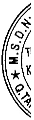

### 15. Quỹ phát triển khoa học và công nghệ

Quỹ phát triển khoa học và công nghệ được thành lập nhằm tạo nguồn tài chính đầu tư cho hoạt động khoa học và công nghệ của Tổng Công ty như sau:

- Cấp kinh phí để thực hiện các đề tài, dự án khoa học và công nghệ.

Hỗ trợ phát triển khoa học và công nghệ:

- Trang bị cơ sở vật chất - kỹ thuật cho hoạt động khoa học và công nghệ.

- Mua máy móc, thiết bị dề đổi mới công nghệ trực tiếp sử dụng vào việc sản xuất sản phẩm.

Mua bản quyền công nghệ, quyền sử dụng, quyền sở hữu sáng chế, giải pháp hữu ích, kiểu đáng công nghiệp, thông tin khoa học và công nghệ, các tài liệu, sản phẩm có liên quan để phục vụ cho hoạt động khoa học và công nghệ.

- Trả lương, chi thuê chuyên gia hoặc hợp đồng với tổ chức khoa học và công nghệ để thực hiện các hoạt động khoa học và công nghệ.

- Chi phí cho đào tạo nhân lực khoa học và công nghệ theo quy định của pháp luật về khoa học và công nghệ.

- Chi cho các hoạt động sáng kiến cải tiến kỹ thuật, hợp lý hóa sản xuất.

- Chi phí cho các hoạt động hợp tác nghiên cứu, triển khai về khoa học và công nghệ với các tổ chức, doanh nghiệp Việt Nam.

Tài sản cố định hình thành từ quỹ phát triển khoa học và công nghệ được ghi giảm quỹ tương ứng và không phải trích khẩu hao.

### 16. Vốn chủ sở hữu

Vốn góp của các cỗ động

### 17. Phân phối lợi nhuận

Lợi nhuận sau thuế thu nhập doanh nghiệp được phân phối cho các cổ đồng sau khi đã trích lập các quỹ theo quy định của pháp luật và đã được Đại hội đồng cổ đồng phê duyệt.

Vốn góp của các cổ động được ghi nhận theo số vốn thực tế đã góp của các cổ động.

Việc phân phối lợi nhuận cho các cổ đông được cân nhắc đến các khoản mục phi tiền tệ năm trong lợi nhuận sau thuế chưa phân phối có thể ảnh hưởng đến lường tiền và khả năng chỉ trả cổ tức như lãi do đánh giá lại tải sản mang đi góp vốn, lãi do đánh giá lại các khoản mục tiền tệ, các công cụ tài chính và các khoản mục phi tiền tệ khác.

Cổ tức được ghi nhận là nợ phải trả khi được Đại hội đồng cổ động phê duyệt.

### 18. Ghi nhận doanh thu và thu nhập

Doanh thu bán hàng hoá, thành phẩm

Doanh thu bán hàng hóa, thành phẩm được ghi nhận khi đồng thời thỏa mãn các điều kiện sau:

Tổng Công ty đã chuyển giao phần lớn rủi ro và lợi ích gắn liền với quyền sở hữu hàng hóa, sản phẩm cho người mua.

Tổng Công ty không còn nắm giữ quyền quản lý hàng hóa, sản phẩm như người sở hữu hàng hóa, sản phẩm hoặc quyền kiểm soát hàng hóa, sản phẩm.

Doanh thu được xác định tương đối chắc chắn. Khi hợp đồng quy định người mua được quyền trả lại sản phẩm, hàng hóa đã mua theo những điều kiện cụ thể, doanh thu chỉ được ghi nhận khi những điều kiện cụ thể đó không còn tồn tại và người mua không được quyền trả lại hàng hóa, sản phẩm (trừ trường hợp khách hàng có quyền trả lại hàng hóa, sản phẩm dưới hình thức đổi lại để lấy hàng hóa, dịch vụ khác).

Tổng Công ty đã hoặc sẽ thu được lợi ích kinh tế từ giao dịch bán hàng.

Xác định được chi phí liên quan đến giao dịch bán hàng.

