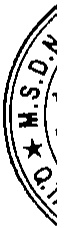

# TỔNG CÔNG TY ĐẦU TỬ VÀ PHÁT TRIỂN CÔNG NGHIỆP – CTCP Địa chỉ: Số 8 Hùng Vương, Phường Hòa Phú, TP. Thủ Dầu Một, Tinh Bình Dương BÁO CÁO TÀI CHÍNH TỔNG HỢP Cho năm tài chính kết thúc ngày 31 tháng 12 năm 2018 Bản thuyết minh Báo cáo tài chính tổng hợp (tiếp theo)

<table border=1 style='margin: auto; word-wrap: break-word;'><tr><td style='text-align: center; word-wrap: break-word;'></td><td style='text-align: center; word-wrap: break-word;'>Năm nay</td><td style='text-align: center; word-wrap: break-word;'>Năm trước</td></tr><tr><td style='text-align: center; word-wrap: break-word;'>Công ty Cổ phần Bệnh viện Mỹ Phước</td><td style='text-align: center; word-wrap: break-word;'></td><td style='text-align: center; word-wrap: break-word;'></td></tr><tr><td style='text-align: center; word-wrap: break-word;'>Chuyển nhượng quyền sử dụng đất</td><td style='text-align: center; word-wrap: break-word;'>13.577.738.349</td><td style='text-align: center; word-wrap: break-word;'>-</td></tr><tr><td style='text-align: center; word-wrap: break-word;'>Cung cấp điện</td><td style='text-align: center; word-wrap: break-word;'>376.763.949</td><td style='text-align: center; word-wrap: break-word;'>21.751.978</td></tr><tr><td style='text-align: center; word-wrap: break-word;'>Cung cấp dịch vụ khác</td><td style='text-align: center; word-wrap: break-word;'>611.172.443</td><td style='text-align: center; word-wrap: break-word;'>-</td></tr><tr><td style='text-align: center; word-wrap: break-word;'>Thù lao Hội đồng quản trị và Ban kiểm soát chi hộ</td><td style='text-align: center; word-wrap: break-word;'>120.000.000</td><td style='text-align: center; word-wrap: break-word;'>-</td></tr><tr><td style='text-align: center; word-wrap: break-word;'>Công ty Cổ phần Bề tổng Becamex</td><td style='text-align: center; word-wrap: break-word;'></td><td style='text-align: center; word-wrap: break-word;'></td></tr><tr><td style='text-align: center; word-wrap: break-word;'>Phí quản lý</td><td style='text-align: center; word-wrap: break-word;'>295.589.369</td><td style='text-align: center; word-wrap: break-word;'>21.868.408</td></tr><tr><td style='text-align: center; word-wrap: break-word;'>Tiền thuê đất</td><td style='text-align: center; word-wrap: break-word;'>222.457.808</td><td style='text-align: center; word-wrap: break-word;'>-</td></tr><tr><td style='text-align: center; word-wrap: break-word;'>Mua nguyên vật liệu</td><td style='text-align: center; word-wrap: break-word;'>23.598.067.665</td><td style='text-align: center; word-wrap: break-word;'>3.480.278.481</td></tr><tr><td style='text-align: center; word-wrap: break-word;'>Nhận cung cấp thi công công trình</td><td style='text-align: center; word-wrap: break-word;'>83.184.419.797</td><td style='text-align: center; word-wrap: break-word;'>20.899.137.557</td></tr><tr><td style='text-align: center; word-wrap: break-word;'>Thù lao Hội đồng quản trị và Ban kiểm soát chi hộ</td><td style='text-align: center; word-wrap: break-word;'>201.000.000</td><td style='text-align: center; word-wrap: break-word;'>-</td></tr><tr><td style='text-align: center; word-wrap: break-word;'>Công ty Cổ phần Dược Becamex</td><td style='text-align: center; word-wrap: break-word;'></td><td style='text-align: center; word-wrap: break-word;'></td></tr><tr><td style='text-align: center; word-wrap: break-word;'>Phí xử lý nước thải, tiền điện, nước, rác</td><td style='text-align: center; word-wrap: break-word;'>239.546.023</td><td style='text-align: center; word-wrap: break-word;'>23.606.808</td></tr><tr><td style='text-align: center; word-wrap: break-word;'>Chuyển nhượng quyền sử dụng đất</td><td style='text-align: center; word-wrap: break-word;'>194.704.818</td><td style='text-align: center; word-wrap: break-word;'>69.698.959</td></tr><tr><td style='text-align: center; word-wrap: break-word;'>Cổ tức được chia</td><td style='text-align: center; word-wrap: break-word;'>-</td><td style='text-align: center; word-wrap: break-word;'>4.532.880.000</td></tr><tr><td style='text-align: center; word-wrap: break-word;'>Thù lao Hội đồng quản trị và Ban kiểm soát chi hộ</td><td style='text-align: center; word-wrap: break-word;'>84.000.000</td><td style='text-align: center; word-wrap: break-word;'>-</td></tr><tr><td style='text-align: center; word-wrap: break-word;'>Trường Đại học Quốc tế Miền Đông</td><td style='text-align: center; word-wrap: break-word;'></td><td style='text-align: center; word-wrap: break-word;'></td></tr><tr><td style='text-align: center; word-wrap: break-word;'>Chí hộ chi phí lượng</td><td style='text-align: center; word-wrap: break-word;'>2.660.557.837</td><td style='text-align: center; word-wrap: break-word;'>202.294.086</td></tr><tr><td style='text-align: center; word-wrap: break-word;'>Chí hộ chi phí hoạt động</td><td style='text-align: center; word-wrap: break-word;'>32.090.566.926</td><td style='text-align: center; word-wrap: break-word;'>-</td></tr><tr><td style='text-align: center; word-wrap: break-word;'>Chí phí tài trợ học bổng</td><td style='text-align: center; word-wrap: break-word;'>3.013.133.000</td><td style='text-align: center; word-wrap: break-word;'>-</td></tr><tr><td style='text-align: center; word-wrap: break-word;'>Công ty Liên doanh TNHH Khu Công nghiệp Việt Nam - Singapore</td><td style='text-align: center; word-wrap: break-word;'></td><td style='text-align: center; word-wrap: break-word;'></td></tr><tr><td style='text-align: center; word-wrap: break-word;'>Doanh thu các công trình xây dựng</td><td style='text-align: center; word-wrap: break-word;'>18.129.600.574</td><td style='text-align: center; word-wrap: break-word;'>-</td></tr><tr><td style='text-align: center; word-wrap: break-word;'>Công ty Cổ phần Bảo hiểm Hùng Vương</td><td style='text-align: center; word-wrap: break-word;'></td><td style='text-align: center; word-wrap: break-word;'></td></tr><tr><td style='text-align: center; word-wrap: break-word;'>Nhận cung cấp dịch vụ bảo hiểm</td><td style='text-align: center; word-wrap: break-word;'>14.545.455</td><td style='text-align: center; word-wrap: break-word;'>-</td></tr><tr><td style='text-align: center; word-wrap: break-word;'>Công ty Cổ phần Dược phẩm Savi</td><td style='text-align: center; word-wrap: break-word;'></td><td style='text-align: center; word-wrap: break-word;'></td></tr><tr><td style='text-align: center; word-wrap: break-word;'>Cổ tức được chia</td><td style='text-align: center; word-wrap: break-word;'>8.444.850.000</td><td style='text-align: center; word-wrap: break-word;'>12.385.780.000</td></tr><tr><td style='text-align: center; word-wrap: break-word;'>Thù lao Hội đồng quản trị và Ban kiểm soát chi hộ</td><td style='text-align: center; word-wrap: break-word;'>566.400.000</td><td style='text-align: center; word-wrap: break-word;'>33.600.000</td></tr><tr><td style='text-align: center; word-wrap: break-word;'>Công ty Cổ phần Công nghệ &amp; Truyền thông Việt Nam</td><td style='text-align: center; word-wrap: break-word;'></td><td style='text-align: center; word-wrap: break-word;'></td></tr><tr><td style='text-align: center; word-wrap: break-word;'>Cung cấp điện</td><td style='text-align: center; word-wrap: break-word;'>-</td><td style='text-align: center; word-wrap: break-word;'>1.960.525</td></tr><tr><td style='text-align: center; word-wrap: break-word;'>Tiền thuê đất và phí quản lý</td><td style='text-align: center; word-wrap: break-word;'>32.490.338</td><td style='text-align: center; word-wrap: break-word;'>-</td></tr><tr><td style='text-align: center; word-wrap: break-word;'>Sang nhượng quyền sử dụng đất</td><td style='text-align: center; word-wrap: break-word;'>8.589.632.510</td><td style='text-align: center; word-wrap: break-word;'></td></tr><tr><td style='text-align: center; word-wrap: break-word;'>Mua thiết bị, thi công công trình</td><td style='text-align: center; word-wrap: break-word;'>56.947.928.407</td><td style='text-align: center; word-wrap: break-word;'>-</td></tr><tr><td style='text-align: center; word-wrap: break-word;'>Nhận cung cấp dịch vụ cước, bao tri</td><td style='text-align: center; word-wrap: break-word;'>8.959.453.564</td><td style='text-align: center; word-wrap: break-word;'>38.845.547</td></tr><tr><td style='text-align: center; word-wrap: break-word;'>Mua hàng hóa, công cụ dụng cụ</td><td style='text-align: center; word-wrap: break-word;'>9.065.004.029</td><td style='text-align: center; word-wrap: break-word;'>101.270.766</td></tr><tr><td style='text-align: center; word-wrap: break-word;'>Nhận giảm giá hàng bán</td><td style='text-align: center; word-wrap: break-word;'>760.168.373</td><td style='text-align: center; word-wrap: break-word;'>-</td></tr></table>

