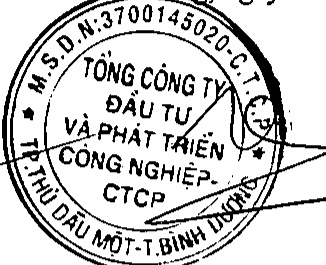

### 5. Sự kiện phát sinh sau ngày kết thúc năm tài chính

Không có sự kiện trọng yếu nào khác phát sinh sau ngày kết thúc năm tài chính cần phải điều chỉnh số liệu hoặc công bố trên Báo cáo tài chính tổng hợp.

Nguyễn Phước Đại

Người lập biểu

Bình Dương, ngày 01 tháng 4 năm 2019

Nguyễn Thị Thanh Nhàn

Kế toán trưởng

Phạm Ngọc Thuận

Tổng Giám đốc

