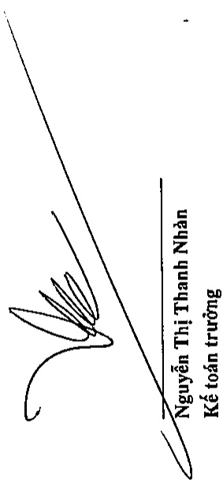
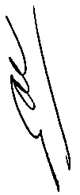
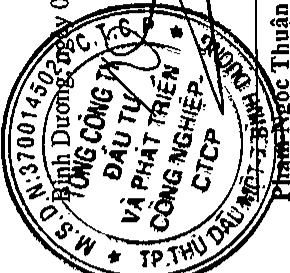

# C

Cho năm tài chính kết thúc ngày 31 tháng 12 năm 2018

Phụ lục 02: Chi tiết phát sinh về Thuê và các khoản phải nộp nhà nước

Đơn vị tính: VND

Các loại thuê khác

Phí, lệ phí và các khoản phải nộp khác

Cộng

The quick brown fox jumps over the lazy dog.

Tổng Giám đốc