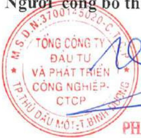

TỔNG CÔNG TY ĐẦU TỬ VÀ PHÁT

TRIỂN CÔNG NGHIỆP - CTCP

CỘNG HÒA XÃ HỘI CHỦ NGHĨA VIỆT NAM

Độc lập - Tự do - Hạnh phúc

# CÔNG BỎ THÔNG TIN TRÊN CỔNG THÔNG TIN ĐIỆN TỬ CỦA ỦY BAN CHỨNG KHOÁN NHÀ NƯỚC VÀ SỞ GIAO DỊCH CHỨNG KHOÁN HÀ NỘI

Kính gửi: Ủy ban Chứng khoán Nhà nước Sở giao dịch chứng khoán Hà Nội

Tổng Công ty Đầu tư và Phát triển Công nghiệp - CTCP

Trụ sở chính: Số 8, đường Hùng Vương, Phường Hòa Phú, thành phố Thủ Dầu Một, tỉnh Bình Dương.

Điện thoại: 0274 3822 655

Fax: 0274 3822 713

Người công bố thông tin gồm:

2. Ông Phạm Ngọc Thuận - Tổng giám đốc - Người đại diện pháp luật. Địa chỉ: Số 8, đường Hùng Vương, Phường Hòa Phú, thành phố Thủ Dầu Một, tỉnh Bình Dương.

Điện thoại: 0274 3822 655

Fax: 0274 3822 713

#### Loại thông tin công bố:

x Định kỳ

24h

72h

theo yêu cầu

khác

Nội dung thông tin công bố:

Báo cáo thường niên năm 2019 của Tổng Cộng ty Đầu tư và Phát triển Cộng nghiệp – CTCP.

Thông tin này đã được công bố trên trang thông tin điện tử của Tổng công ty vào ngày 27/4/2020 tại đường dẫn: http://www.becamex.com.vn mục Dành cho cổ đông - công bố thông tin.

Chúng tôi xin cam kết các thông tin công bố trên đây là đúng sự thật và hoàn toàn chịu trách nhiệm trước pháp luật về nội dung các thông tin đã công bố.

Tài liệu đính kèm:

- BCTN năm 2019

Ngày 24 tháng 4 năm 2020

Người công bố thông tin

