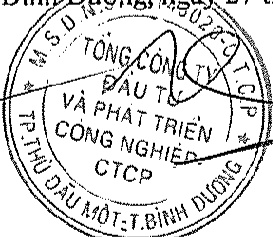

Ảnh hướng của việc điều chỉnh sai sót trên đến số liệu so sánh trên Báo cáo tài chính như sau:

<table border=1 style='margin: auto; word-wrap: break-word;'><tr><td style='text-align: center; word-wrap: break-word;'></td><td style='text-align: center; word-wrap: break-word;'>Mã số</td><td style='text-align: center; word-wrap: break-word;'>Số liệu trước điều chỉnh</td><td style='text-align: center; word-wrap: break-word;'>Các điều chỉnh</td><td style='text-align: center; word-wrap: break-word;'>Số liệu sau điều chỉnh</td></tr><tr><td style='text-align: center; word-wrap: break-word;'>Bảng cân đối kế toán</td><td style='text-align: center; word-wrap: break-word;'></td><td style='text-align: center; word-wrap: break-word;'></td><td style='text-align: center; word-wrap: break-word;'></td><td style='text-align: center; word-wrap: break-word;'></td></tr><tr><td style='text-align: center; word-wrap: break-word;'>Phải thu ngắn hạn của khách hàng</td><td style='text-align: center; word-wrap: break-word;'>131</td><td style='text-align: center; word-wrap: break-word;'>4.479.971.232.379</td><td style='text-align: center; word-wrap: break-word;'>1.196.675.204</td><td style='text-align: center; word-wrap: break-word;'>4.481.167.907.583</td></tr><tr><td style='text-align: center; word-wrap: break-word;'>Phải thu ngắn hạn khác</td><td style='text-align: center; word-wrap: break-word;'>136</td><td style='text-align: center; word-wrap: break-word;'>839.967.514.949</td><td style='text-align: center; word-wrap: break-word;'>105.663.055</td><td style='text-align: center; word-wrap: break-word;'>840.073.178.004</td></tr><tr><td style='text-align: center; word-wrap: break-word;'>Phải trả người bán ngắn hạn</td><td style='text-align: center; word-wrap: break-word;'>311</td><td style='text-align: center; word-wrap: break-word;'>1.215.920.354.535</td><td style='text-align: center; word-wrap: break-word;'>(43.469.339.040)</td><td style='text-align: center; word-wrap: break-word;'>1.172.451.015.495</td></tr><tr><td style='text-align: center; word-wrap: break-word;'>Thuế và các khoản phải nộp Nhà nước</td><td style='text-align: center; word-wrap: break-word;'>313</td><td style='text-align: center; word-wrap: break-word;'>1.519.423.013.289</td><td style='text-align: center; word-wrap: break-word;'>101.815.440.959</td><td style='text-align: center; word-wrap: break-word;'>1.621.238.454.248</td></tr><tr><td style='text-align: center; word-wrap: break-word;'>Chi phí phải trả ngắn hạn</td><td style='text-align: center; word-wrap: break-word;'>315</td><td style='text-align: center; word-wrap: break-word;'>6.210.522.465.334</td><td style='text-align: center; word-wrap: break-word;'>(17.233.738.567)</td><td style='text-align: center; word-wrap: break-word;'>6.193.288.726.767</td></tr><tr><td style='text-align: center; word-wrap: break-word;'>Lợi nhuận sau thuế chưa phân phối</td><td style='text-align: center; word-wrap: break-word;'>421</td><td style='text-align: center; word-wrap: break-word;'>2.136.766.477.510</td><td style='text-align: center; word-wrap: break-word;'>(39.810.025.093)</td><td style='text-align: center; word-wrap: break-word;'>2.096.956.452.417</td></tr><tr><td style='text-align: center; word-wrap: break-word;'>Báo cáo kết quả hoạt động kinh doanh</td><td style='text-align: center; word-wrap: break-word;'></td><td style='text-align: center; word-wrap: break-word;'></td><td style='text-align: center; word-wrap: break-word;'></td><td style='text-align: center; word-wrap: break-word;'></td></tr><tr><td style='text-align: center; word-wrap: break-word;'>Doanh thu bán hàng và cung cấp dịch vụ</td><td style='text-align: center; word-wrap: break-word;'>01</td><td style='text-align: center; word-wrap: break-word;'>8.624.725.099.971</td><td style='text-align: center; word-wrap: break-word;'>(49.814.368.091)</td><td style='text-align: center; word-wrap: break-word;'>8.574.910.731.880</td></tr><tr><td style='text-align: center; word-wrap: break-word;'>Các khoản giảm trừ doanh thu</td><td style='text-align: center; word-wrap: break-word;'>02</td><td style='text-align: center; word-wrap: break-word;'>2.129.321.307.093</td><td style='text-align: center; word-wrap: break-word;'>(16.472.214.215)</td><td style='text-align: center; word-wrap: break-word;'>2.112.849.092.878</td></tr><tr><td style='text-align: center; word-wrap: break-word;'>Giá vốn hàng bán</td><td style='text-align: center; word-wrap: break-word;'>11</td><td style='text-align: center; word-wrap: break-word;'>3.257.506.400.841</td><td style='text-align: center; word-wrap: break-word;'>(15.446.804.092)</td><td style='text-align: center; word-wrap: break-word;'>3.242.059.596.749</td></tr><tr><td style='text-align: center; word-wrap: break-word;'>Doanh thu hoạt động tài chính</td><td style='text-align: center; word-wrap: break-word;'>21</td><td style='text-align: center; word-wrap: break-word;'>109.914.069.319</td><td style='text-align: center; word-wrap: break-word;'>(29.759.078.301)</td><td style='text-align: center; word-wrap: break-word;'>80.154.991.018</td></tr><tr><td style='text-align: center; word-wrap: break-word;'>Chi phí quản lý doanh nghiệp</td><td style='text-align: center; word-wrap: break-word;'>26</td><td style='text-align: center; word-wrap: break-word;'>508.325.986.114</td><td style='text-align: center; word-wrap: break-word;'>(3.590.156.327)</td><td style='text-align: center; word-wrap: break-word;'>504.735.829.787</td></tr><tr><td style='text-align: center; word-wrap: break-word;'>Chi phí thuế thu nhập doanh nghiệp hiện hành</td><td style='text-align: center; word-wrap: break-word;'>51</td><td style='text-align: center; word-wrap: break-word;'>443.200.132.873</td><td style='text-align: center; word-wrap: break-word;'>5.619.369.506</td><td style='text-align: center; word-wrap: break-word;'>448.819.502.379</td></tr><tr><td style='text-align: center; word-wrap: break-word;'>Lợi nhuận sau thuế thu nhập doanh nghiệp</td><td style='text-align: center; word-wrap: break-word;'>60</td><td style='text-align: center; word-wrap: break-word;'>2.376.524.256.560</td><td style='text-align: center; word-wrap: break-word;'>(39.810.025.093)</td><td style='text-align: center; word-wrap: break-word;'>2.336.714.231.467</td></tr><tr><td style='text-align: center; word-wrap: break-word;'>Báo cáo lưu chuyển tiền tệ Lợi nhuận trước thuế</td><td style='text-align: center; word-wrap: break-word;'>01</td><td style='text-align: center; word-wrap: break-word;'>2.633.879.310.339</td><td style='text-align: center; word-wrap: break-word;'>(49.683.641.264)</td><td style='text-align: center; word-wrap: break-word;'>2.584.195.669.075</td></tr><tr><td style='text-align: center; word-wrap: break-word;'>Tăng, giảm các khoản phải thu</td><td style='text-align: center; word-wrap: break-word;'>09</td><td style='text-align: center; word-wrap: break-word;'>934.128.891.198</td><td style='text-align: center; word-wrap: break-word;'>(1.302.338.259)</td><td style='text-align: center; word-wrap: break-word;'>932.826.552.939</td></tr><tr><td style='text-align: center; word-wrap: break-word;'>Tăng, giảm các khoản phải trả</td><td style='text-align: center; word-wrap: break-word;'>11</td><td style='text-align: center; word-wrap: break-word;'>(6.722.367.130.080)</td><td style='text-align: center; word-wrap: break-word;'>50.985.979.523</td><td style='text-align: center; word-wrap: break-word;'>(6.671.381.150.557)</td></tr></table>

5. Sự kiện phát sinh sau ngày kết thúc năm tài chính

Không có sự kiện trọng yếu nào khác phát sinh sau ngày kết thúc năm tài chính cần phải điều chỉnh số liệu hoặc công bố trên Báo cáo tài chính hợp nhất.

Bình Đường ngày 27 tháng 3 năm 2020

Nguyễn Phước Đại

Người lập biểu

Nguyễn Thị Thanh Nhàn Kế toán trưởng

Phạm Ngọc Thuận

Tổng Giám đốc