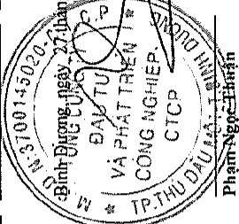
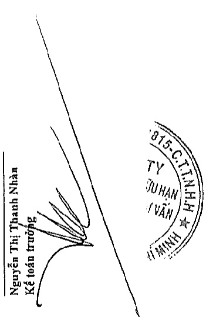
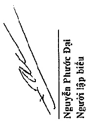

# 11

<table border=1 style='margin: auto; word-wrap: break-word;'><tr><td style='text-align: center; word-wrap: break-word;'>Gia tri phản sở hữu đâu năm</td><td style='text-align: center; word-wrap: break-word;'>Góp vốn trong năm</td><td style='text-align: center; word-wrap: break-word;'>Tăng do chuyển đổi cơ cấu</td><td style='text-align: center; word-wrap: break-word;'>Phần lãi hoặc lỗ trong năm</td><td style='text-align: center; word-wrap: break-word;'>Cổ tức, lợi nhuận được chia trong năm</td><td style='text-align: center; word-wrap: break-word;'>Giá trị phản chuyển nhưng</td><td style='text-align: center; word-wrap: break-word;'>Các khoản khác</td><td style='text-align: center; word-wrap: break-word;'>Giá trị phản sở hữu cưới năm</td></tr><tr><td style='text-align: center; word-wrap: break-word;'>đồng ty Liên doanh TNHH Khu công nghiệp Việt Nam - Singapore</td><td style='text-align: center; word-wrap: break-word;'>3.303.896.892.122</td><td style='text-align: center; word-wrap: break-word;'>-</td><td style='text-align: center; word-wrap: break-word;'>-</td><td style='text-align: center; word-wrap: break-word;'>933.263.624.580</td><td style='text-align: center; word-wrap: break-word;'>(460.600.000.000)</td><td style='text-align: center; word-wrap: break-word;'>-</td><td style='text-align: center; word-wrap: break-word;'>-</td></tr><tr><td style='text-align: center; word-wrap: break-word;'>Đồng ty Cổ phản Sétia - Becamex</td><td style='text-align: center; word-wrap: break-word;'>191.785.551.196</td><td style='text-align: center; word-wrap: break-word;'>-</td><td style='text-align: center; word-wrap: break-word;'>-</td><td style='text-align: center; word-wrap: break-word;'>43.638.461.458</td><td style='text-align: center; word-wrap: break-word;'>-</td><td style='text-align: center; word-wrap: break-word;'>-</td><td style='text-align: center; word-wrap: break-word;'>3.776.560.516.702</td></tr><tr><td style='text-align: center; word-wrap: break-word;'>Đồng ty Cổ phản Bảo hiểm Hùng Vương</td><td style='text-align: center; word-wrap: break-word;'>63.002.376.821</td><td style='text-align: center; word-wrap: break-word;'>-</td><td style='text-align: center; word-wrap: break-word;'>-</td><td style='text-align: center; word-wrap: break-word;'>-</td><td style='text-align: center; word-wrap: break-word;'>-</td><td style='text-align: center; word-wrap: break-word;'>(63.002.376.821)</td><td style='text-align: center; word-wrap: break-word;'>-</td></tr><tr><td style='text-align: center; word-wrap: break-word;'>Đồng ty Cổ phản Dược phẩm Savi</td><td style='text-align: center; word-wrap: break-word;'>106.594.787.036</td><td style='text-align: center; word-wrap: break-word;'>-</td><td style='text-align: center; word-wrap: break-word;'>-</td><td style='text-align: center; word-wrap: break-word;'>42.588.101.421</td><td style='text-align: center; word-wrap: break-word;'>(16.889.700.000)</td><td style='text-align: center; word-wrap: break-word;'>-</td><td style='text-align: center; word-wrap: break-word;'>(3.402.464.581)</td></tr><tr><td style='text-align: center; word-wrap: break-word;'>Đồng ty Cổ phản Công nghệ &amp; Truyền Ở Việt Nam</td><td style='text-align: center; word-wrap: break-word;'>117.378.323.852</td><td style='text-align: center; word-wrap: break-word;'>-</td><td style='text-align: center; word-wrap: break-word;'>-</td><td style='text-align: center; word-wrap: break-word;'>35.450.217.087</td><td style='text-align: center; word-wrap: break-word;'>-</td><td style='text-align: center; word-wrap: break-word;'>-</td><td style='text-align: center; word-wrap: break-word;'>152.828.540.939</td></tr><tr><td style='text-align: center; word-wrap: break-word;'>Đồng ty TNHH Becamex Tokyn</td><td style='text-align: center; word-wrap: break-word;'>2.950.388.245.586</td><td style='text-align: center; word-wrap: break-word;'>-</td><td style='text-align: center; word-wrap: break-word;'>-</td><td style='text-align: center; word-wrap: break-word;'>8.947.803.900</td><td style='text-align: center; word-wrap: break-word;'>-</td><td style='text-align: center; word-wrap: break-word;'>-</td><td style='text-align: center; word-wrap: break-word;'>2.939.336.049.486</td></tr><tr><td style='text-align: center; word-wrap: break-word;'>Đồng ty Cổ phản Phát triển Giáo dục Miền Đông</td><td style='text-align: center; word-wrap: break-word;'>152.750.456.908</td><td style='text-align: center; word-wrap: break-word;'>-</td><td style='text-align: center; word-wrap: break-word;'>-</td><td style='text-align: center; word-wrap: break-word;'>50.248.120.610</td><td style='text-align: center; word-wrap: break-word;'>(13.725.000.000)</td><td style='text-align: center; word-wrap: break-word;'>-</td><td style='text-align: center; word-wrap: break-word;'>189.273.577.518</td></tr><tr><td style='text-align: center; word-wrap: break-word;'>Đồng ty Cổ phản Nước - Môi trường Đình Dương</td><td style='text-align: center; word-wrap: break-word;'>753.223.593.288</td><td style='text-align: center; word-wrap: break-word;'>-</td><td style='text-align: center; word-wrap: break-word;'>-</td><td style='text-align: center; word-wrap: break-word;'>119.066.306.477</td><td style='text-align: center; word-wrap: break-word;'>(37.500.000.000)</td><td style='text-align: center; word-wrap: break-word;'>(293.940.914.454)</td><td style='text-align: center; word-wrap: break-word;'>-</td></tr><tr><td style='text-align: center; word-wrap: break-word;'>Đồng ty Liên doanh TNHH Sin Viet</td><td style='text-align: center; word-wrap: break-word;'>5.563.691.459</td><td style='text-align: center; word-wrap: break-word;'>-</td><td style='text-align: center; word-wrap: break-word;'>-</td><td style='text-align: center; word-wrap: break-word;'>478.865.602</td><td style='text-align: center; word-wrap: break-word;'>-</td><td style='text-align: center; word-wrap: break-word;'>-</td><td style='text-align: center; word-wrap: break-word;'>540.848.985.311</td></tr><tr><td style='text-align: center; word-wrap: break-word;'>Đồng ty Cổ phản Phát triển Công nghiệp JW</td><td style='text-align: center; word-wrap: break-word;'>765.165.035.825</td><td style='text-align: center; word-wrap: break-word;'>705.549.640.000</td><td style='text-align: center; word-wrap: break-word;'>-</td><td style='text-align: center; word-wrap: break-word;'>(35.075.185.000)</td><td style='text-align: center; word-wrap: break-word;'>-</td><td style='text-align: center; word-wrap: break-word;'>-</td><td style='text-align: center; word-wrap: break-word;'>6.042.557.061</td></tr><tr><td style='text-align: center; word-wrap: break-word;'>Đồng ty Cổ phản Dược Becamex</td><td style='text-align: center; word-wrap: break-word;'>27.240.710.717</td><td style='text-align: center; word-wrap: break-word;'>-</td><td style='text-align: center; word-wrap: break-word;'>-</td><td style='text-align: center; word-wrap: break-word;'>-</td><td style='text-align: center; word-wrap: break-word;'>-</td><td style='text-align: center; word-wrap: break-word;'>(27.240.710.717)</td><td style='text-align: center; word-wrap: break-word;'>-</td></tr><tr><td style='text-align: center; word-wrap: break-word;'>Đồng ty Cổ phản Phát triển Hạ lãng Kỳ</td><td style='text-align: center; word-wrap: break-word;'>159.472.902.720</td><td style='text-align: center; word-wrap: break-word;'>-</td><td style='text-align: center; word-wrap: break-word;'>-</td><td style='text-align: center; word-wrap: break-word;'>6.827.805.308</td><td style='text-align: center; word-wrap: break-word;'>-</td><td style='text-align: center; word-wrap: break-word;'>-</td><td style='text-align: center; word-wrap: break-word;'>1.435.639.490.825</td></tr><tr><td style='text-align: center; word-wrap: break-word;'>Đồng ty Cổ phản Cao su Bình Dương</td><td style='text-align: center; word-wrap: break-word;'>-</td><td style='text-align: center; word-wrap: break-word;'>-</td><td style='text-align: center; word-wrap: break-word;'>84.500.000.000</td><td style='text-align: center; word-wrap: break-word;'>9.999.205.715</td><td style='text-align: center; word-wrap: break-word;'>-</td><td style='text-align: center; word-wrap: break-word;'>-</td><td style='text-align: center; word-wrap: break-word;'>166.300.708.028</td></tr><tr><td style='text-align: center; word-wrap: break-word;'>Đồng ty Cổ phản Becamex Bình Định</td><td style='text-align: center; word-wrap: break-word;'>8.596.462.567.530</td><td style='text-align: center; word-wrap: break-word;'>40.000.000.000</td><td style='text-align: center; word-wrap: break-word;'>-</td><td style='text-align: center; word-wrap: break-word;'>(1.973.511.369)</td><td style='text-align: center; word-wrap: break-word;'>-</td><td style='text-align: center; word-wrap: break-word;'>-</td><td style='text-align: center; word-wrap: break-word;'>96.942.560.822</td></tr><tr><td style='text-align: center; word-wrap: break-word;'></td><td style='text-align: center; word-wrap: break-word;'></td><td style='text-align: center; word-wrap: break-word;'>745.549.640.000</td><td style='text-align: center; word-wrap: break-word;'>84.500.000.000</td><td style='text-align: center; word-wrap: break-word;'>1.213.459.815.787</td><td style='text-align: center; word-wrap: break-word;'>(528.714.700.000)</td><td style='text-align: center; word-wrap: break-word;'>(384.184.001.992)</td><td style='text-align: center; word-wrap: break-word;'>(959.109.473)</td></tr></table>

Bình Đường, ngày 27 tháng 3 năm 2020

Pham-Ngoe-Ehan

Tổng Giám đốc