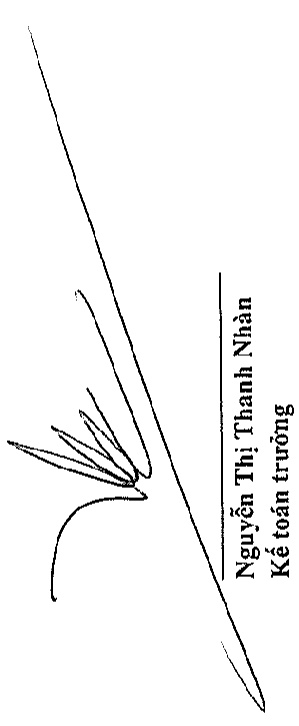
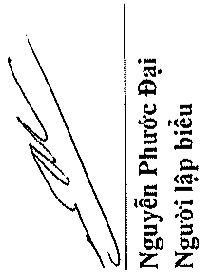
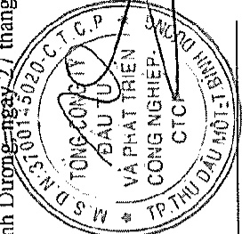

<table border=1 style='margin: auto; word-wrap: break-word;'><tr><td style='text-align: center; word-wrap: break-word;'>Nhà cửa, vật kiến trúc</td><td style='text-align: center; word-wrap: break-word;'>Máy móc và thiết bị</td><td style='text-align: center; word-wrap: break-word;'>Phương tiện vận tải, truyền dẫn</td><td style='text-align: center; word-wrap: break-word;'>Thiết bị, dụng cụ quản lý</td><td style='text-align: center; word-wrap: break-word;'>Tài sản cổ định hữu hình khác</td><td style='text-align: center; word-wrap: break-word;'>Cộng</td></tr><tr><td style='text-align: center; word-wrap: break-word;'>1.042.266.120.563</td><td style='text-align: center; word-wrap: break-word;'>187.252.292.092</td><td style='text-align: center; word-wrap: break-word;'>260.359.758.009</td><td style='text-align: center; word-wrap: break-word;'>34.435.999.367</td><td style='text-align: center; word-wrap: break-word;'>78.786.574.355</td><td style='text-align: center; word-wrap: break-word;'>1.603.100.744.386</td></tr><tr><td style='text-align: center; word-wrap: break-word;'>920.825.361.342</td><td style='text-align: center; word-wrap: break-word;'>475.443.780.786</td><td style='text-align: center; word-wrap: break-word;'>227.802.996.370</td><td style='text-align: center; word-wrap: break-word;'>42.092.029.619</td><td style='text-align: center; word-wrap: break-word;'>46.269.199.676</td><td style='text-align: center; word-wrap: break-word;'>1.712.433.367.793</td></tr></table>

Giá trị còn lại

Số đầu năm

Số cuối năm

Trong đó:

Tạm thời chưa sử dụng

Đang chờ thanh lý

Bình Dương-ngày 27 tháng 3 năm 2020

