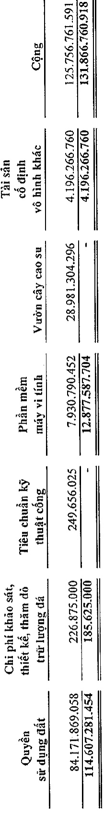
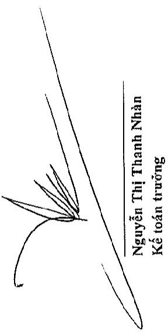
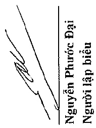
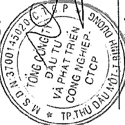

# T

Cho năm tài chính kết thúc ngày 31 tháng 12 năm 2019

Phụ lục 03: Băng tăng, giảm tài sản cổ định vô hình (tiếp theo)

Đơn vị tính: VND

Trong đó:

Tạm thời chưa sử dụng

Đang chờ thanh lý

Bình Dương, ngày 27 tháng 3 năm 2020

Nguyễn Phước Đại

Người lập biểu

Phạm Ngọc Thuận

Tổng Giám độc