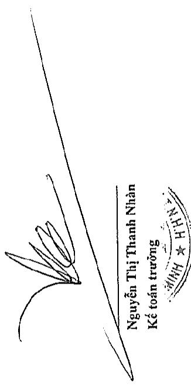
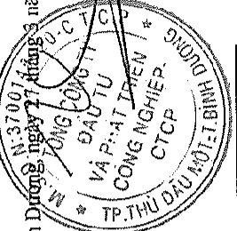
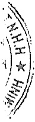

# F

Thuế GTGT hàng bán nội địa

Thuế thu nhập doanh nghiệp

<table border=1 style='margin: auto; word-wrap: break-word;'><tr><td style='text-align: center; word-wrap: break-word;'></td><td style='text-align: center; word-wrap: break-word;'>Phải nộp</td><td style='text-align: center; word-wrap: break-word;'>Phải thu</td><td style='text-align: center; word-wrap: break-word;'>Số phải nộp</td><td style='text-align: center; word-wrap: break-word;'>Số đã nộp</td><td style='text-align: center; word-wrap: break-word;'>thay đổi từ lệ số hữu</td><td style='text-align: center; word-wrap: break-word;'>Giảm khác</td><td style='text-align: center; word-wrap: break-word;'>Phải nộp</td><td style='text-align: center; word-wrap: break-word;'>Phải thu</td></tr><tr><td style='text-align: center; word-wrap: break-word;'></td><td style='text-align: center; word-wrap: break-word;'>224.017.682.418</td><td style='text-align: center; word-wrap: break-word;'>-</td><td style='text-align: center; word-wrap: break-word;'>452.698.432.030</td><td style='text-align: center; word-wrap: break-word;'>(451.582.442.188)</td><td style='text-align: center; word-wrap: break-word;'>(644.154.698)</td><td style='text-align: center; word-wrap: break-word;'>156.858.851</td><td style='text-align: center; word-wrap: break-word;'>224.724.108.232</td><td style='text-align: center; word-wrap: break-word;'>77.731.819</td></tr><tr><td style='text-align: center; word-wrap: break-word;'></td><td style='text-align: center; word-wrap: break-word;'>138.306.482.909</td><td style='text-align: center; word-wrap: break-word;'>408.532.541</td><td style='text-align: center; word-wrap: break-word;'>350.482.180.661</td><td style='text-align: center; word-wrap: break-word;'>(368.559.225.331)</td><td style='text-align: center; word-wrap: break-word;'>(8.546.170.314)</td><td style='text-align: center; word-wrap: break-word;'>230.684.471</td><td style='text-align: center; word-wrap: break-word;'>111.839.729.650</td><td style='text-align: center; word-wrap: break-word;'>334.309.795</td></tr><tr><td style='text-align: center; word-wrap: break-word;'>Để thu nhập doanh nghiệp tạm nộp cho tiến nhân trước từ hoạt động chuyển hướng bất động sản (*)</td><td style='text-align: center; word-wrap: break-word;'>12.856.616.291</td><td style='text-align: center; word-wrap: break-word;'>-</td><td style='text-align: center; word-wrap: break-word;'>12.904.319.437</td><td style='text-align: center; word-wrap: break-word;'>(623.475.691)</td><td style='text-align: center; word-wrap: break-word;'>(140.225.000)</td><td style='text-align: center; word-wrap: break-word;'>15.797.972</td><td style='text-align: center; word-wrap: break-word;'>25.288.403.668</td><td style='text-align: center; word-wrap: break-word;'>275.370.659</td></tr><tr><td style='text-align: center; word-wrap: break-word;'>Thực thu nhập của nhân</td><td style='text-align: center; word-wrap: break-word;'>49.662.110.621</td><td style='text-align: center; word-wrap: break-word;'>125.106.750</td><td style='text-align: center; word-wrap: break-word;'>54.889.659.637</td><td style='text-align: center; word-wrap: break-word;'>(49.652.817.632)</td><td style='text-align: center; word-wrap: break-word;'>263.075.413</td><td style='text-align: center; word-wrap: break-word;'></td><td style='text-align: center; word-wrap: break-word;'>55.891.698.713</td><td style='text-align: center; word-wrap: break-word;'>854.777.424</td></tr><tr><td style='text-align: center; word-wrap: break-word;'>Thực tải nguyên</td><td style='text-align: center; word-wrap: break-word;'>2.431.630.014</td><td style='text-align: center; word-wrap: break-word;'>-</td><td style='text-align: center; word-wrap: break-word;'>4.207.268.532</td><td style='text-align: center; word-wrap: break-word;'>(4.829.444.747)</td><td style='text-align: center; word-wrap: break-word;'>(1.785.157.054)</td><td style='text-align: center; word-wrap: break-word;'>-</td><td style='text-align: center; word-wrap: break-word;'>24.362.160</td><td style='text-align: center; word-wrap: break-word;'>65.415</td></tr><tr><td style='text-align: center; word-wrap: break-word;'>Thực nhà đất</td><td style='text-align: center; word-wrap: break-word;'>-</td><td style='text-align: center; word-wrap: break-word;'>3.866.503.907</td><td style='text-align: center; word-wrap: break-word;'>11.702.041.924</td><td style='text-align: center; word-wrap: break-word;'>(11.702.041.924)</td><td style='text-align: center; word-wrap: break-word;'>1.928.219.406</td><td style='text-align: center; word-wrap: break-word;'>-</td><td style='text-align: center; word-wrap: break-word;'>-</td><td style='text-align: center; word-wrap: break-word;'>1.938.284.501</td></tr><tr><td style='text-align: center; word-wrap: break-word;'>Tiền thuê đất</td><td style='text-align: center; word-wrap: break-word;'>-</td><td style='text-align: center; word-wrap: break-word;'>-</td><td style='text-align: center; word-wrap: break-word;'>-</td><td style='text-align: center; word-wrap: break-word;'>-</td><td style='text-align: center; word-wrap: break-word;'>-</td><td style='text-align: center; word-wrap: break-word;'>-</td><td style='text-align: center; word-wrap: break-word;'>-</td><td style='text-align: center; word-wrap: break-word;'>-</td></tr><tr><td style='text-align: center; word-wrap: break-word;'>Thực môn bài</td><td style='text-align: center; word-wrap: break-word;'>-</td><td style='text-align: center; word-wrap: break-word;'>-</td><td style='text-align: center; word-wrap: break-word;'>-</td><td style='text-align: center; word-wrap: break-word;'>-</td><td style='text-align: center; word-wrap: break-word;'>-</td><td style='text-align: center; word-wrap: break-word;'>-</td><td style='text-align: center; word-wrap: break-word;'>-</td><td style='text-align: center; word-wrap: break-word;'>-</td></tr><tr><td style='text-align: center; word-wrap: break-word;'>Các loại thuế khác</td><td style='text-align: center; word-wrap: break-word;'>138.011.764</td><td style='text-align: center; word-wrap: break-word;'>-</td><td style='text-align: center; word-wrap: break-word;'>1.840.362.268</td><td style='text-align: center; word-wrap: break-word;'>(1.858.044.513)</td><td style='text-align: center; word-wrap: break-word;'>-</td><td style='text-align: center; word-wrap: break-word;'>-</td><td style='text-align: center; word-wrap: break-word;'>120.329.519</td><td style='text-align: center; word-wrap: break-word;'>-</td></tr><tr><td style='text-align: center; word-wrap: break-word;'>Phải, lệ phí và các khoản phải nộp khác</td><td style='text-align: center; word-wrap: break-word;'>1.193.825.920.231</td><td style='text-align: center; word-wrap: break-word;'>363.044.132</td><td style='text-align: center; word-wrap: break-word;'>10.407.218.955</td><td style='text-align: center; word-wrap: break-word;'>(1.203.874.701.457)</td><td style='text-align: center; word-wrap: break-word;'>363.044.132</td><td style='text-align: center; word-wrap: break-word;'>-</td><td style='text-align: center; word-wrap: break-word;'>358.437.729</td><td style='text-align: center; word-wrap: break-word;'>-</td></tr><tr><td style='text-align: center; word-wrap: break-word;'>Cộng</td><td style='text-align: center; word-wrap: break-word;'>1.621.238.454.248</td><td style='text-align: center; word-wrap: break-word;'>4.763.187.330</td><td style='text-align: center; word-wrap: break-word;'>899.131.483.444</td><td style='text-align: center; word-wrap: break-word;'>(2.092.682.193.483)</td><td style='text-align: center; word-wrap: break-word;'>(8.561.368.115)</td><td style='text-align: center; word-wrap: break-word;'>403.341.294</td><td style='text-align: center; word-wrap: break-word;'>418.247.069.671</td><td style='text-align: center; word-wrap: break-word;'>3.480.539.613</td></tr></table>

(°) Thuế thu nhập doanh nghiệp đã tam nộp cho số tiền nhận trước từ hoạt động chuyển nhượng bất động sản được ghi nhận doanh thu trong năm

Bình Dương, ngày 27 tháng 3 năm 2020

Nguyễn Phước Đạ

Phạm Ngọc Thuận

Ảp biết

Tổng Giám đốc