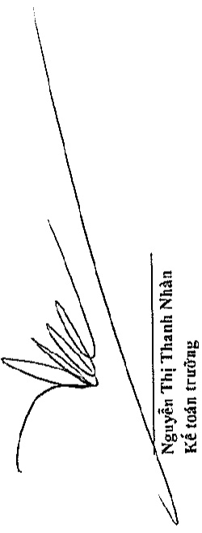
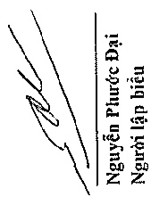
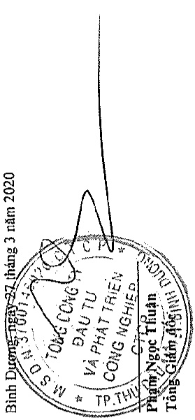
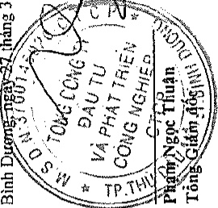

# T

Chỉ tiết số phút sinh về các khoản vay ngắn hạn trong năm:

Đơn vị tính: VND

<table border=1 style='margin: auto; word-wrap: break-word;'><tr><td style='text-align: center; word-wrap: break-word;'></td><td style='text-align: center; word-wrap: break-word;'>Số tiền vay phát sinh trong năm</td><td style='text-align: center; word-wrap: break-word;'>Kết chuyển từ vay và nợ dãi hạn</td><td style='text-align: center; word-wrap: break-word;'>Số tiền vay đã trả trong năm</td><td style='text-align: center; word-wrap: break-word;'>Giảm do thoái vốn</td><td style='text-align: center; word-wrap: break-word;'>Số cuối năm</td></tr><tr><td style='text-align: center; word-wrap: break-word;'>Vay ngắn hạn ngắn hàng</td><td style='text-align: center; word-wrap: break-word;'>4.131.040.721.956</td><td style='text-align: center; word-wrap: break-word;'>6.028.782.179.090</td><td style='text-align: center; word-wrap: break-word;'>-</td><td style='text-align: center; word-wrap: break-word;'>(5.701.921.180.650)</td><td style='text-align: center; word-wrap: break-word;'>(94.323.499.049)</td></tr><tr><td style='text-align: center; word-wrap: break-word;'>Vay ngắn hạn các tổ chức và cả nhân</td><td style='text-align: center; word-wrap: break-word;'>108.136.650.000</td><td style='text-align: center; word-wrap: break-word;'>92.677.000.000</td><td style='text-align: center; word-wrap: break-word;'>-</td><td style='text-align: center; word-wrap: break-word;'>(81.986.650.000)</td><td style='text-align: center; word-wrap: break-word;'>(34.000.000.000)</td></tr><tr><td style='text-align: center; word-wrap: break-word;'>Vay dài hạn đến hạn trả</td><td style='text-align: center; word-wrap: break-word;'>1.088.572.599.997</td><td style='text-align: center; word-wrap: break-word;'>-</td><td style='text-align: center; word-wrap: break-word;'>707.352.994.293</td><td style='text-align: center; word-wrap: break-word;'>(1.073.572.599.997)</td><td style='text-align: center; word-wrap: break-word;'>-</td></tr><tr><td style='text-align: center; word-wrap: break-word;'>Trái phiếu thương dài hạn đến hạn trả</td><td style='text-align: center; word-wrap: break-word;'>5.189.500.000.000</td><td style='text-align: center; word-wrap: break-word;'>-</td><td style='text-align: center; word-wrap: break-word;'>4.087.976.076.570</td><td style='text-align: center; word-wrap: break-word;'>(5.189.500.000.000)</td><td style='text-align: center; word-wrap: break-word;'>-</td></tr><tr><td style='text-align: center; word-wrap: break-word;'>Cộng</td><td style='text-align: center; word-wrap: break-word;'>10.517.249.971.953</td><td style='text-align: center; word-wrap: break-word;'>6.121.459.179.090</td><td style='text-align: center; word-wrap: break-word;'>4.795.329.070.863</td><td style='text-align: center; word-wrap: break-word;'>(12.046.980.430.647)</td><td style='text-align: center; word-wrap: break-word;'>(128.323.499.049)</td></tr></table>

<table border=1 style='margin: auto; word-wrap: break-word;'><tr><td style='text-align: center; word-wrap: break-word;'>Chỉ tiết số phar sunit ve các khoan vay atı nọt trong năm.</td><td style='text-align: center; word-wrap: break-word;'>Số tiền vay phát sinh trong năm</td><td style='text-align: center; word-wrap: break-word;'>Kết chuyển sang vay và nợ ngăn hạn</td><td style='text-align: center; word-wrap: break-word;'>Phân bổ chi phí phát hành trái phiếu</td><td style='text-align: center; word-wrap: break-word;'>Chi phí phát hành trái phiếu</td><td style='text-align: center; word-wrap: break-word;'>Số tiền vay đã trả trong năm</td><td style='text-align: center; word-wrap: break-word;'>Giảm do thoái vốn</td><td style='text-align: center; word-wrap: break-word;'>Số cuối năm</td></tr><tr><td style='text-align: center; word-wrap: break-word;'>Số đầu năm</td><td style='text-align: center; word-wrap: break-word;'>9.392.000.000</td><td style='text-align: center; word-wrap: break-word;'>(699.352.994.293)</td><td style='text-align: center; word-wrap: break-word;'>-</td><td style='text-align: center; word-wrap: break-word;'>-</td><td style='text-align: center; word-wrap: break-word;'>(17.325.706.666)</td><td style='text-align: center; word-wrap: break-word;'>-</td><td style='text-align: center; word-wrap: break-word;'>3.093.546.067.135</td></tr><tr><td style='text-align: center; word-wrap: break-word;'>Vay dài han ngân hàng</td><td style='text-align: center; word-wrap: break-word;'>64.228.500.000</td><td style='text-align: center; word-wrap: break-word;'>11.300.000.000</td><td style='text-align: center; word-wrap: break-word;'>(8.000.000.000)</td><td style='text-align: center; word-wrap: break-word;'>-</td><td style='text-align: center; word-wrap: break-word;'>-</td><td style='text-align: center; word-wrap: break-word;'>(12.528.500.000)</td><td style='text-align: center; word-wrap: break-word;'>55.000.000.000</td></tr><tr><td style='text-align: center; word-wrap: break-word;'>Vay dài han các tồ chức khác</td><td style='text-align: center; word-wrap: break-word;'>5.273.012.130.736</td><td style='text-align: center; word-wrap: break-word;'>1.479.183.000.001</td><td style='text-align: center; word-wrap: break-word;'>(4.087.976.076.570)</td><td style='text-align: center; word-wrap: break-word;'>26.207.247.568</td><td style='text-align: center; word-wrap: break-word;'>(550.000.000.000)</td><td style='text-align: center; word-wrap: break-word;'>-</td><td style='text-align: center; word-wrap: break-word;'>2.140.426.301.735</td></tr><tr><td style='text-align: center; word-wrap: break-word;'>Trải phiếu thường</td><td style='text-align: center; word-wrap: break-word;'>9.138.073.398.830</td><td style='text-align: center; word-wrap: break-word;'>1.499.875.000.001</td><td style='text-align: center; word-wrap: break-word;'>(4.795.329.070.863)</td><td style='text-align: center; word-wrap: break-word;'>26.207.247.568</td><td style='text-align: center; word-wrap: break-word;'>(550.000.000.000)</td><td style='text-align: center; word-wrap: break-word;'>(17.325.706.666)</td><td style='text-align: center; word-wrap: break-word;'>5.288.972.368.870</td></tr><tr><td style='text-align: center; word-wrap: break-word;'>Cộng</td><td style='text-align: center; word-wrap: break-word;'>-</td><td style='text-align: center; word-wrap: break-word;'>-</td><td style='text-align: center; word-wrap: break-word;'>-</td><td style='text-align: center; word-wrap: break-word;'>-</td><td style='text-align: center; word-wrap: break-word;'>-</td><td style='text-align: center; word-wrap: break-word;'>-</td><td style='text-align: center; word-wrap: break-word;'>-</td></tr></table>

Bình Dương ngay 27 tháng 3 năm 2020

