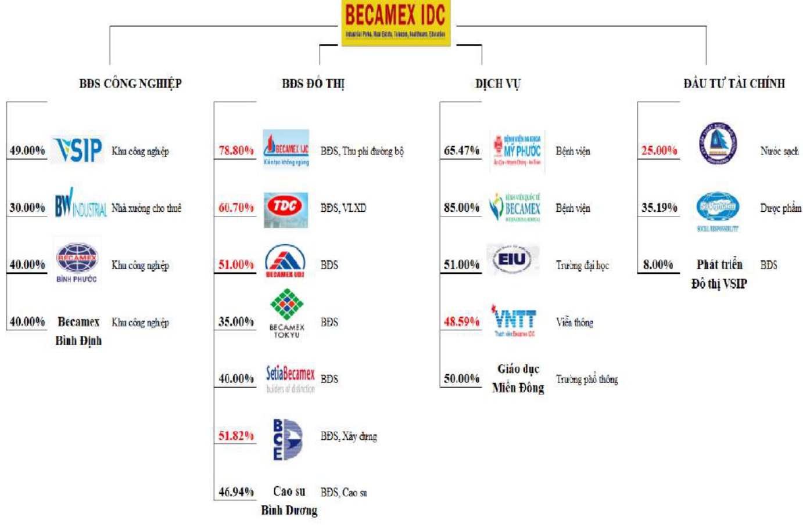

Biểu đồ: Các đơn vị thành viên chia theo lĩnh vực hoạt động

#### Màu đỏ: Các công ty đang niêm yết trên sàn chúng khoán

### 4. Định hướng phát triển

Với phương châm "Liên tục đối mới để phát triển", trong hơn 40 năm qua, Becamex IDC luôn đổi mới, sáng tạo để kiến tạo ra những giá trị mới mang tính bền vững. Trong chiến lược phát triển sắp tới, Becamex IDC sẽ tiếp tục phát triển hai lĩnh lực nòng cốt là Bất động sản công nghiệp và khu đô thị. Trong đó, tại Bình Dương, Tổng công ty sẽ tập trung phát triển các Khu công nghiệp, Khu đô thị dịch vụ và công nghệ cao tại phía Bắc tỉnh Bình Dương (như Bàu Bàng, Cây Trường, Khu Công nghiệp Khoa học công nghệ). Đồng thời, Tổng công ty cũng mở rộng triển khai mô hình Khu công nghiệp – dịch vụ - đô thị sang các tỉnh thành ngoài tỉnh như Bình Phước, Bình Định, Bình Thuận và Long An.