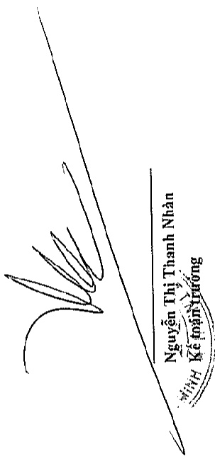
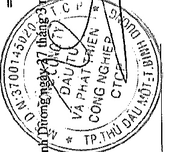
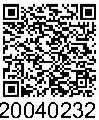

# 1

Cho năm tài chính kết thúc ngày 31 tháng 12 năm 2019

Phụ lục 07: Thông tin về bộ phận theo lĩnh vực kinh doanh (tiếp theo)

Tài sản và nợ phải trả của bộ phận theo lĩnh vực kinh doanh của Tập đoàn như sau:

Tài sản trực tiếp của bộ phận

Các tài sản không phần bồ theo bộ phận

Tổng tài sản

6.137.430.922.095

193.564.410.030

20.145.808.219

18.671.611.107.586

16.711.714.228.434

2.742.723.288.384

Nọ phải trả trực tiếp của bộ phận

Nọ phải trả phân bồ cho bộ phận

Nọ phải trả không phần bồ theo bộ phận

Tổng nọ phải trả

##### Số đấu mẫu

Tài sản trực tiếp của bộ phận

Tài sản phân bồ cho bộ phận

Các tài sản không phân bồ theo bộ phận

Tổng tài sản

21.126.361.173.509

4.569.464.112.212

278.759.115.614

203.838.425.692

433.022.888.060

622.422.949.294

___

Nợ phải trả trực tiếp của bộ phận

Nợ phải trả phân bổ cho bộ phận

Nợ phải trả không phần bổ theo bộ phận

Tông nợ phải trả

Bình Đường ngay 27 tháng 3 năm 2020

Phạm Ngọc Thuận

Tổng Giám đốc

