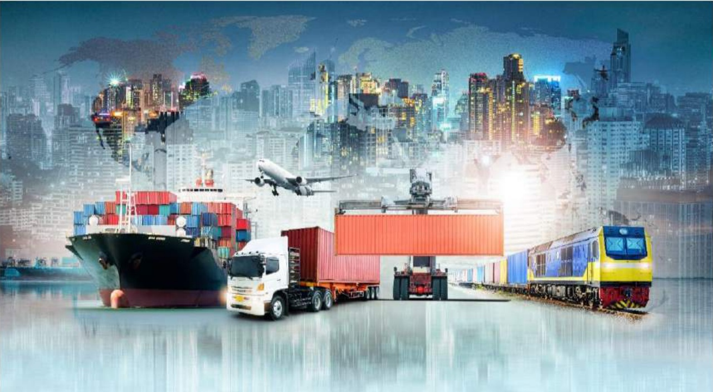

Tiếp tục đầu tư phát triển hạ tầng giao thông vận tải, mở rộng QL13 và hoàn thiện nhiều tuyến đường giao thông quan trọng khác để tạo sự kết nối từ bên trong ra bên ngoài khu vực.

Đối với dự án Thành phố mới Bình Dương, Becamex IDC sẽ tiếp tục dành nguồn lực để tiếp tục đầu tư các công trình tạo lực về thương mại và dịch vụ (như Tòa nhà thương mại-văn phòng tại lô A9, Trung tâm triển lãm WTC và các công trình hạ tầng kết nối khác) nhằm tạo ra nhiều tiện ích và giá trị gia tăng thu hút nhiều nhà đầu tư và cư dân vào đầu tư sinh sống tại đây.

Về đề án Thành phố thông minh Bình Dương, Becamex IDC sẽ cùng với các đối tác tổ chức các diễn đàn hợp tác đầu tư để kết nối, tìm ra các cơ hội hợp tác trong các lĩnh vực mang hàm lượng giá trị gia tăng cao. Trong năm 2019, tại hội nghị Horasis tổ chức tại Thành phố mới Bình Dương, Becamex IDC đã ký MOU với Block 71 (đến từ Đại học quốc gia Singapore) để hợp tác xây dựng vườn ươm khởi nghiệp tại Bình Dương. Bên cạnh đó, Trường Đại học quốc tế Miền Đông (đơn vị thành viên của Becamex IDC) cũng tiếp tục đầu tư cơ sở vật chất để khuyến khích các ý tưởng sáng tạo, khởi nghiệp của sinh viên ngay tại Vườn ươm khởi nghiệp của trường.

5. Các rủi ro