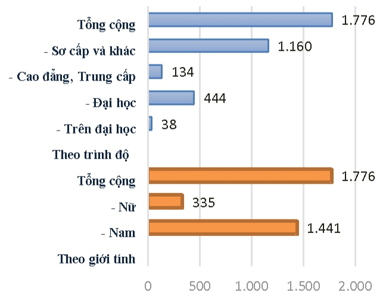

- Sô lượng cán bộ, nhân viên. Tóm tắt chính sách và thay đổi trong chính sách đối với người lao động.

<table border=1 style='margin: auto; word-wrap: break-word;'><tr><td style='text-align: center; word-wrap: break-word;'>Phân loại</td><td style='text-align: center; word-wrap: break-word;'></td></tr><tr><td style='text-align: center; word-wrap: break-word;'>Phân theo giới tính</td><td style='text-align: center; word-wrap: break-word;'></td></tr><tr><td style='text-align: center; word-wrap: break-word;'>- Nam</td><td style='text-align: center; word-wrap: break-word;'>1.441</td></tr><tr><td style='text-align: center; word-wrap: break-word;'>- Nữ</td><td style='text-align: center; word-wrap: break-word;'>335</td></tr><tr><td style='text-align: center; word-wrap: break-word;'>Tổng cộng</td><td style='text-align: center; word-wrap: break-word;'>1.776</td></tr><tr><td style='text-align: center; word-wrap: break-word;'>Phân theo trình độ chuyên môn</td><td style='text-align: center; word-wrap: break-word;'></td></tr><tr><td style='text-align: center; word-wrap: break-word;'>- Trên đại học</td><td style='text-align: center; word-wrap: break-word;'>38</td></tr><tr><td style='text-align: center; word-wrap: break-word;'>- Đại học</td><td style='text-align: center; word-wrap: break-word;'>444</td></tr><tr><td style='text-align: center; word-wrap: break-word;'>- Cao đẳng, Trung cấp</td><td style='text-align: center; word-wrap: break-word;'>134</td></tr><tr><td style='text-align: center; word-wrap: break-word;'>- Sơ cấp và khác</td><td style='text-align: center; word-wrap: break-word;'>1.160</td></tr><tr><td style='text-align: center; word-wrap: break-word;'>Tổng cộng</td><td style='text-align: center; word-wrap: break-word;'>1.776</td></tr></table>

Các chế độ lượng, thường, trợ cấp của người lao động được Tổng công ty tuân thủ đúng quy định của Luật Lao động và hợp đồng lao động đã ký kết với nhân viên Tổng công ty.

Tổng Công ty thực hiện quy chế trả lương theo thời gian và theo công việc nhằm khuyến khích người lao động nâng cao năng suất và chất lượng lao động.

Hàng năm căn cứ vào kết quả hoạt động kinh doanh, Tổng Cộng ty khen thưởng cho người lao động theo mức độ hoàn thành nhiệm vụ được giao tạo động lực cho người lao động luôn phấn đấu trong công việc.

Với chính sách lương thưởng công bằng, linh hoạt; chính sách đào tạo phù hợp, tạo cơ hội thắng tiến cho đội ngũ nhân viên trẻ có năng lực cùng với môi trường làm việc thân thiện đã xây dựng nên văn hóa doanh nghiệp giúp Tổng Cộng ty duy trì và phát triển được nguồn nhân lực có thể đáp ứng được yêu cầu công việc hiện tại và trong tương lai.