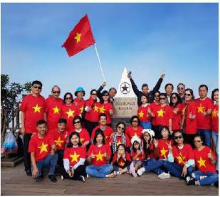
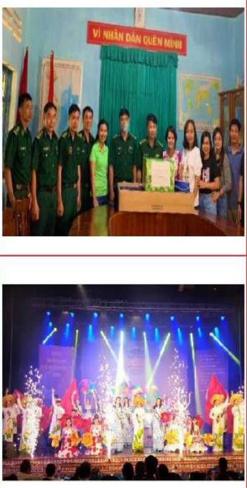
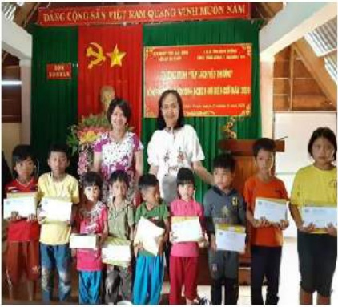
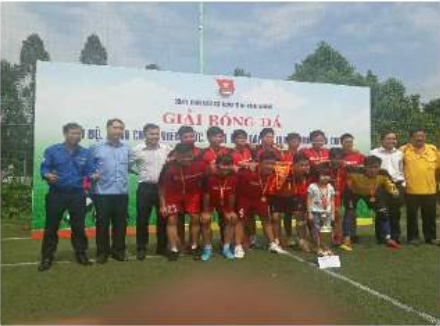
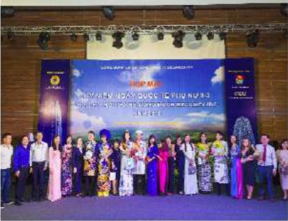

- Tổ chức tham quan du lịch, nghĩ dưỡng cho các bộ công nhân viên hàng năm.

- Tổ chức hợp mặt 300 công đoàn viên nữ đại diện cho hơn 700 lao động nữ trong toàn Tổng công ty.

- Tổ chức hợp mặt nhân ngày Quốc tế thiếu nhi 1-6, tặng quà cho các cháu thiếu nhi con em người lao động. Tổ chức Hội thu chương trình " Tập sách yêu thương" mùa thứ 3: đã tổ chức đoàn đi trao tặng cho các em học sinh tỉnh Bình Phước và tỉnh Đắk Nông. Ngoài số tập sách vận động được, Lãnh đạo Tổng công ty đã hỗ trợ tiền mặt để tặng kèm thêm vào các phần quà.

- Tổ chức thăm hỏi và trao quà cho các chiến sĩ đồn biên phòng Bu Cháp.

- Vệ sinh và thắp hương tại nghĩa trang liệt sĩ Tỉnh nhân dip lễ, tết.

- Tổ chức trao quà cho người thân của Cán bộ nhân viên là thương bình liệt sĩ hàng năm.

