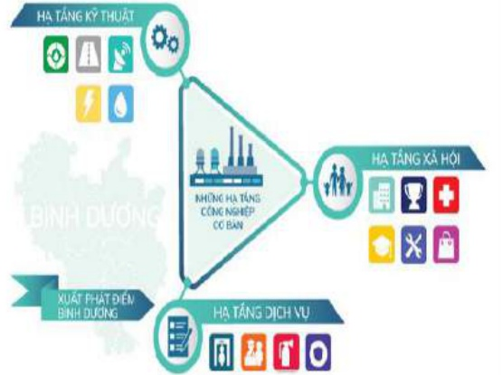

Các hoạt động khác

<table border=1 style='margin: auto; word-wrap: break-word;'><tr><td style='text-align: center; word-wrap: break-word;'>Chỉ tiêu</td><td style='text-align: center; word-wrap: break-word;'>Thực hiện 2019</td></tr><tr><td style='text-align: center; word-wrap: break-word;'>Doanh thu</td><td style='text-align: center; word-wrap: break-word;'>1.490</td></tr><tr><td style='text-align: center; word-wrap: break-word;'>Chỉ phí</td><td style='text-align: center; word-wrap: break-word;'>589</td></tr><tr><td style='text-align: center; word-wrap: break-word;'>Lợi nhuận</td><td style='text-align: center; word-wrap: break-word;'>901</td></tr></table>

Hoạt động khác gồm: Doanh thu hoạt động tài chính, xây dựng và các hoạt động khác.

### 2. Tình hình tài chính:

Tại ngày 31/12/2019, tổng giá trị tài sản theo báo cáo tổng hợp của Tổng Công ty là 35.844 tỷ đồng, trong đó tài sản ngắn hạn là 25.089 tỷ đồng, chiếm 70%, tài sản dài hạn là 10.755 tỷ đồng, chiếm 30% tổng tài sản. Tổng giá trị tài sản của Tổng Công ty giảm 1.306 tỷ đồng tương đương giảm 3,52% so với tổng giá trị tài sản tại ngày 01/01/2019 chủ yếu là do giảm khoản phải thu của khách hàng và nguồn tiền mặt do sử dụng phục vụ cho hoạt động sản xuất kinh doanh.

Tổng công ty đã thực hiện tăng cường các giải pháp bán hàng, thu hồi công nợ để tạo nguồn thu tiếp tục mở rộng đầu tư mở rộng kinh doanh và thực hiện thanh toán khoản nợ vay đến hạn. Trong năm, đã thanh toán các khoản nợ đến hạn từ nguồn thu từ hoạt động cho thuê Khu công nghiệp, chuyển nhượng quyền sử dụng đất các khu dân cư, thu cổ tức lợi nhuận được chia và nguồn vay cơ cấu lại nợ. Kết quả, tổng nợ phải trả giảm 2.627 tỷ đồng so với tổng nợ phải trả tại ngày 01/01/2019, trong đó tổng dư nợ vay tại ngày 31/12/2019 là 12.160 tỷ đồng, giảm 3.392 tỷ đồng so với đầu năm. Đồng thời thực hiện nộp thuê và các khoản phải nộp Nhà nước 1.664 tỷ đồng.

